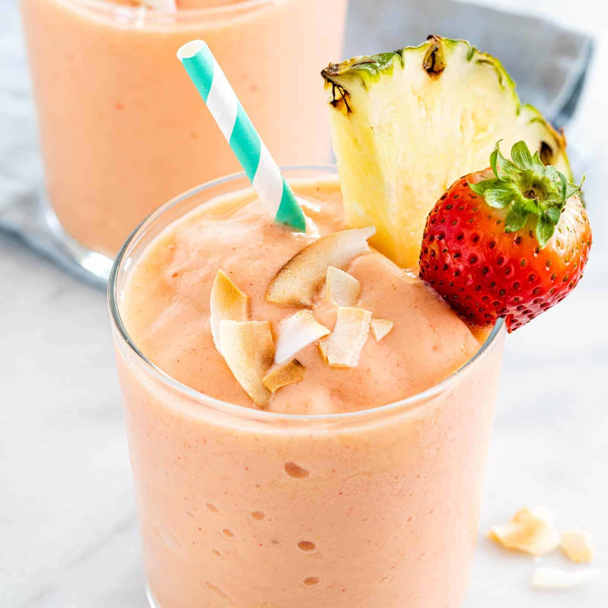

# Tropical Smoothie

*Mango, pineapple, banana and coconut milk: the smoothie that tastes like a holiday someone else paid for.*

**Serves:** 2

**Prep Time:** 5 minutes

**Cook Time:** 0 minutes

## Overview
The smoothie that smells like a beach bar even though you're making it in an English kitchen in February: ripe mango, pineapple and banana all blended into a coconut-milk base, with a squeeze of lime to keep the colour bright and a pinch of salt to make everything else pop. Frozen fruit is the way: it thickens without diluting, and chunks of mango and pineapple from the freezer aisle are picked at ripeness and frozen on the same day, often better than middling fresh fruit out of season. Coconut milk does the creaminess (full-fat tinned is the right kind; the cartoned drinking stuff is thinner and reads watery here). The drink should pour thick and slow, the colour a deep saffron-orange, and taste sweet without needing extra sugar. Pour into a tall glass, drop in a wedge of pineapple on the rim, and pretend.

## Ingredients

### Smoothie
- 200 g frozen mango chunks
- 200 g frozen pineapple chunks
- 1 ripe banana (frozen ideal)
- 200 ml full-fat tinned coconut milk (shake or stir the tin first so the cream and water are combined)
- 1 tablespoon fresh lime juice
- 1 tablespoon runny honey (optional; depends how ripe the fruit was)
- Pinch of fine salt

### To serve
- A wedge of fresh pineapple (for the rim)
- A slice of lime
- A few mint leaves
- Toasted coconut flakes (optional)

## Method

### Stage 1 - Blend
1. Tip the coconut milk, lime juice, honey and salt into the blender first (liquid layer at the bottom helps the blade get going).
1. Add the mango, pineapple and banana.
1. Blend on low for 5 seconds to break the frozen fruit, then ramp up to high for 45 to 60 seconds until completely smooth and silky.

### Stage 2 - Adjust
1. Taste; some mangoes are sharper than others. Add more honey if needed, more lime if too sweet, more coconut milk if too thick to pour.

### Stage 3 - Serve
1. Pour into two tall glasses; the drink should be thick and a deep saffron-orange.
1. Notch the pineapple wedge and slide onto the rim of each glass; add a slice of lime and a few mint leaves on top.
1. Scatter toasted coconut flakes for extra texture.

## Notes
- **Full-fat tinned coconut milk is the right kind.** The drinking cartons are mostly water and end up thin. If using cream from the top of a refrigerated tin, stir it back together first.
- **Frozen fruit thickens; fresh fruit thins.** Fresh ripe mango is wonderful, but the smoothie ends up loose unless you add ice; ice waters it down. Frozen mango is genuinely the better choice here.
- **Salt sharpens.** A small pinch makes the fruit taste fruitier; the smoothie reads flat without it.

## Variations
- **Pina-colada-leaning.** Add 100 ml of pineapple juice in place of the lime, and 2 tablespoons of greek yogurt for tang.
- **Mango lassi crossover.** Swap the coconut milk for full-fat yogurt and milk (250 g yogurt + 100 ml milk); turns this into a tropical lassi with pineapple in the mix.

## Storage
- Drink within 15 minutes; the smoothie separates and the fruit oxidises after that.
- Pour leftovers into ice-pop moulds for 2 months as tropical lollies.
- Don't refrigerate overnight; the coconut milk solidifies in the cold and the texture goes weird.
