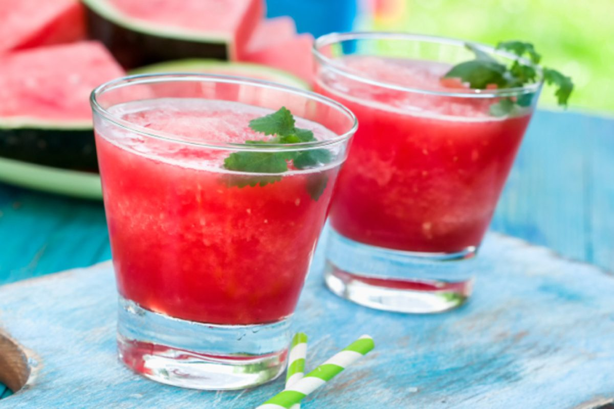

# Watermelon Lime Cooler

*A heatwave drink: ripe watermelon blitzed with lime and a pinch of salt, strained or not depending on the day, poured over a mountain of ice.*

**Serves:** 4

**Prep Time:** 10 minutes

**Cook Time:** 0 minutes

## Overview
This is the drink you make when the watermelon you bought on Saturday is past its peak and the kitchen is too hot to do anything else. You blitz cubed watermelon with lime juice, a small pinch of salt and a spoonful of sugar (only if the melon isn't sweet enough on its own; ripe watermelon usually needs none), then either strain it through a sieve for a clear juice or leave the pulp in for a heavier, more frappé-like drink. Both versions are correct. The salt is the one non-obvious step: a tiny pinch sharpens the watermelon's sweetness without making the drink taste salty, the same trick that makes salted watermelon a Mediterranean and Southeast Asian classic. Pour over a heap of ice in a tall glass, garnish with a wedge of watermelon on the rim and a sprig of mint, and drink it on a hot afternoon at the kind of pace that suggests you have nowhere to be.

## Ingredients

### Cooler
- 1 kg cubed watermelon flesh (about ½ a medium melon, seeds removed if seeded, rind discarded)
- 3 tablespoons fresh lime juice (from about 2 limes)
- 1 to 2 tablespoons caster sugar (only if the melon isn't sweet enough; taste first)
- Pinch of fine salt
- Small handful of fresh mint leaves (optional; for an herbal lift)

### To serve
- Plenty of ice cubes
- Lime wedges
- Small watermelon wedges (rind on, for the rim)
- Fresh mint sprigs

## Method

### Stage 1 - Blend
1. Tip the watermelon, lime juice, salt and mint (if using) into a blender.
1. Blend on high for 30 to 45 seconds until completely smooth and pink-red.
1. Taste; if the watermelon was peak-ripe, the drink is sweet enough on its own. If it needs a lift, add sugar a tablespoon at a time, blending briefly after each addition.

### Stage 2 - Strain (or not)
1. For a clear, bright-coloured cooler: pour through a fine sieve set over a jug, pressing the pulp lightly against the sieve with the back of a spoon to release the juice.
1. For a thicker, more frappé-like drink: skip the sieve and pour straight from the blender. Both versions are good; the unstrained has more body and looks like a drink you'd order in Marrakech.

### Stage 3 - Serve
1. Half-fill four tall glasses with ice cubes.
1. Pour the cooler over the ice.
1. Notch a small wedge of watermelon onto each rim, drop in a wedge of lime, and add a sprig of mint.
1. Serve immediately, ideally outdoors with the sun still up.

## Notes
- **Pinch of salt is the trick.** It sounds wrong; try a sip before and after. The salt sharpens the sweetness without making the drink salty.
- **Ripe melon needs no sugar.** A watermelon that smells faintly sweet through the rind and has a yellow patch from where it sat in the field is the one you want. Out of season or under-ripe, you'll want the sugar.
- **Strain or don't, both correct.** Strained is bar-style; unstrained is street-style. Pulp has more flavour but also more dilution as the ice melts.

## Variations
- **Watermelon and basil.** Swap the mint for fresh basil leaves; the basil adds a herbaceous note that pairs beautifully with the melon's sweetness.
- **Watermelon, lime and chilli.** Add a small pinch of dried chilli flakes or a quarter of a fresh chilli (seeds out) to the blender; sounds odd, works extremely well.
- **Watermelon agua fresca.** Top up with cold sparkling water in the glass instead of ice; turns it into a Mexican-style refresher.

## Storage
- Best within an hour of blending; the watermelon settles and the colour fades.
- Refrigerate up to 24 hours in a sealed jug; whisk or shake to recombine before serving.
- Freezes in ice-pop moulds for 2 months as watermelon lollies.
