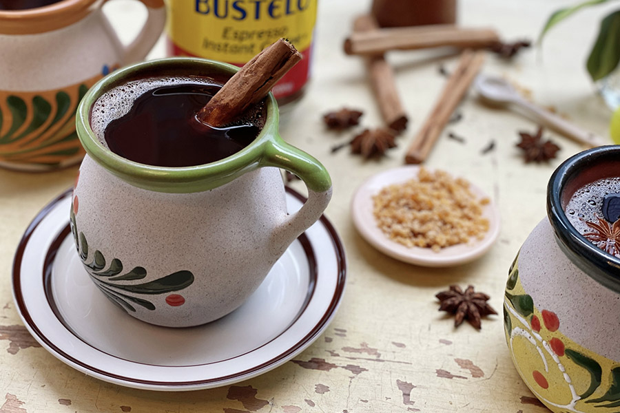

# Café de Olla

*Mexico's traditional clay-pot coffee: coffee simmered in a clay olla with cinnamon, piloncillo (raw cane sugar) and a strip of orange peel, served in small clay mugs (jarritos). Distinctly Mexican in flavour and ritual, very different from the espresso-machine coffee culture of the cities.*

**Serves:** 4 small mugs

**Prep Time:** 3 minutes

**Cook Time:** 12 minutes

## Overview
Café de olla ("coffee from the pot") is the rural and traditional Mexican coffee preparation, dating back to the Mexican Revolution era when the drink was used to fuel soldiers in the field. The technique is foundational: coarsely ground dark-roast coffee is brewed in a clay pot (olla de barro) along with cinnamon sticks, a small piece of piloncillo (Mexican unrefined cane sugar in cone form) and sometimes a strip of orange peel or whole cloves. The pot brews slowly over the fire, the coffee turning dark and the spices infusing. Once ready, it's poured into small clay mugs (jarritos) which add a faint earthy mineral character to the drink. The result is a dark coffee tinged with cinnamon warmth and the molasses-rich sweetness of piloncillo - a properly Mexican drink that no espresso machine can replicate. Served at breakfast in rural Mexico, at family meals after dessert, and in modern Mexico City as a folk-revival drink at "café tradicional" venues.

## Ingredients

- 1 litre water
- 60 g piloncillo (the cone-shaped Mexican raw cane sugar; substitute with 60 g dark muscovado sugar)
- 1 large cinnamon stick (Mexican / Ceylon cinnamon if possible; both work)
- 4 tablespoons coarsely ground dark-roast coffee
- A 5 cm strip of unwaxed orange peel (optional, common)
- 2 whole cloves (optional)
- A tiny pinch of fine salt

### To serve
- 4 small mugs, ideally clay (jarritos) but any thick-walled mug works
- Optional: a small sweet alongside (pan dulce, polvorón, or a churro)

## Method

### Stage 1 - Sweet base
1. Pour the water into a saucepan (a clay olla traditionally; any heavy-bottomed saucepan is fine).
1. Add the piloncillo (broken into chunks if it's a cone), cinnamon stick, orange peel and cloves (if using), and the pinch of salt.
1. Bring to a gentle simmer over medium-low heat, stirring until the piloncillo fully dissolves. About 5 minutes.

### Stage 2 - Brew
1. Add the ground coffee directly to the simmering sweetened water.
1. Reduce to a low simmer for 5 minutes - the coffee infuses into the spiced water but you don't want a hard boil (which extracts bitter compounds).
1. Remove from heat and let stand for 2 minutes; the grounds settle.

### Stage 3 - Strain
1. Strain through a fine sieve (or a coffee filter for extra clarity) into a warm pot or jug. Discard the spent grounds, cinnamon stick, peel and cloves.

### Stage 4 - Serve
1. Pour into small clay mugs.
1. Serve immediately, hot, with a small sweet on the side.

## Notes
- **Piloncillo over white sugar.** The molasses-floral character of Mexican raw cane sugar is half the drink's flavour. White sugar gives a flat result. If you can't find piloncillo, dark muscovado is the closest substitute.
- **Coarse grind.** Espresso grind extracts too quickly and gives a bitter brew; coarse grind (like French-press grind) is right for this simmer method.
- **Don't boil hard.** Gentle simmer is the rule. Hard boiling extracts the harsh tannins.
- **Clay pot if you have one.** A real olla de barro adds a faint earthy character that no metal pot replicates. But a regular saucepan still produces a good café de olla; don't avoid making it just because you don't have a clay pot.

## Variations
- **Without cloves.** Skip; the cleanest, most cinnamon-forward version.
- **With star anise.** Add 1 star anise to the brewing pot. Modern Mexico City variant.
- **With masa harina.** A small spoon of masa harina whisked in at the end turns this towards champurrado territory.
- **Iced café de olla.** Brew double-strength, sweeten, chill, pour over ice. Less traditional but lovely in summer.
- **With milk.** Café de olla con leche - pour into a mug and top with hot frothed milk. Mexican latte territory; popular at breakfast.

## Storage
- Best fresh. Brewed café de olla keeps 1 day in the fridge sealed; reheat gently. The cinnamon and spice fade after 24 hours so brew fresh whenever possible.
