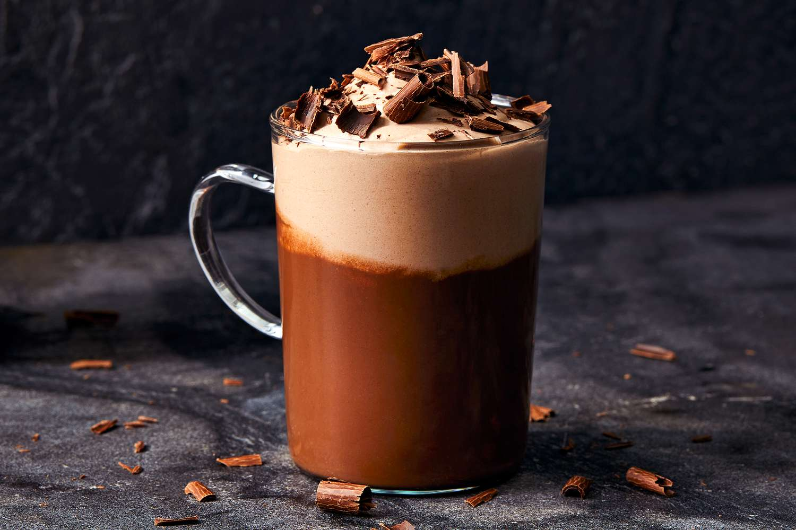

# Classic Hot Chocolate

*Whole milk warmed gently, cocoa whisked in, finished with a small pinch of salt and a marshmallow if you're seven (or pretending not to be).*

**Serves:** 2

**Prep Time:** 2 minutes

**Cook Time:** 5 minutes

## Overview
The hot chocolate of childhood, the one made on the hob from a tin of cocoa rather than a kettle full of milky water poured over instant powder. You warm whole milk gently with cocoa and sugar already whisked into it (the trick that keeps lumps out), and bring it just to the point where the surface trembles before pulling it off the heat. A pinch of salt is the one extra most people skip; it sharpens the cocoa and stops the drink reading flat. The texture is bright and milky rather than thick and brooding, which is the point: this is a school-night drink that wants to be sat in front of a film. Pour into mugs straight from the pan, drop in a couple of marshmallows or a swirl of squirty cream if that's the kind of evening you're having, and drink it warm.

## Ingredients

### Hot chocolate
- 500 ml whole milk (full-fat is the right choice; semi-skimmed makes a thinner drink)
- 3 tablespoons unsweetened cocoa powder (good-quality Dutch-process; not drinking chocolate)
- 2 to 3 tablespoons caster sugar (to taste)
- Pinch of fine salt
- ½ teaspoon vanilla extract (optional, but lifts the cocoa)

### To serve (optional)
- Mini marshmallows
- A swirl of whipped cream
- A dusting of cocoa or grated chocolate

## Method

### Stage 1 - Whisk the cocoa into the cold milk
1. In a small saucepan off the heat, whisk together the cocoa powder, sugar and salt with about 100 ml of the cold milk.
1. Keep whisking until you have a smooth, lump-free paste. This is the step that prevents lumps in the finished drink.
1. Pour in the rest of the cold milk and whisk again to combine.

### Stage 2 - Warm gently
1. Place the pan over medium-low heat.
1. Heat slowly, whisking often, until the milk steams and the surface just trembles. Don't let it come to a boil; boiled milk skins and tastes scorched.
1. This should take 4 to 5 minutes total.
1. Off the heat, whisk in the vanilla if using.

### Stage 3 - Serve
1. Pour into two warmed mugs (rinse with hot water and tip out first if you remember).
1. Top with marshmallows, whipped cream, or a dusting of cocoa or grated chocolate, depending on the audience.
1. Drink warm; second cups are encouraged.

## Notes
- **Make the paste first.** This is the lump-prevention move. Cocoa powder dropped into hot milk clumps and refuses to disperse; bloomed into cold milk first, it dissolves cleanly.
- **Don't boil.** Boiled milk forms a skin and tastes scorched, and the cocoa loses its smooth dispersion. Off the heat the moment the surface trembles.
- **Salt is optional but real.** A small pinch sharpens the cocoa flavour the way it does in baking; without it the drink can read flat.

## Variations
- **Hot chocolate with mint.** Add ½ teaspoon peppermint extract with the vanilla, or steep two sprigs of fresh mint in the milk for 5 minutes while it warms, then strain.
- **Boozy.** A splash of brandy or rum stirred in off the heat turns this into a proper grown-up nightcap.

## Storage
- Drink immediately. Cooled hot chocolate skins and never quite reheats the same.
- The unmixed dry blend (cocoa, sugar, salt) keeps in a jar for weeks; spoon out two heaped tablespoons per mug of milk for a faster reach.
