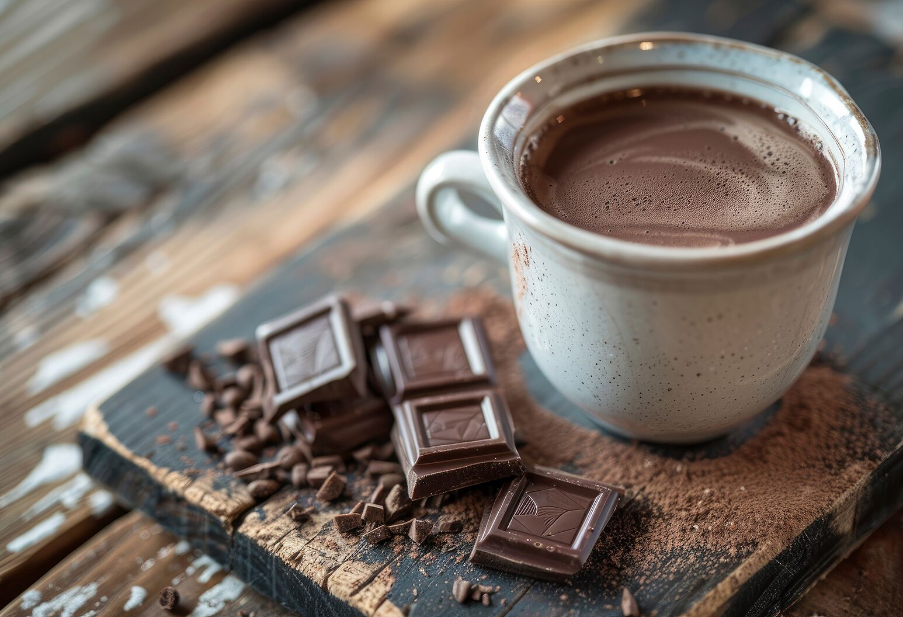

# Dark Chocolate Hot Chocolate

*The Parisian cup: real dark chocolate melted into cream and milk, vanilla through the back, thick enough to coat a spoon.*

**Serves:** 2

**Prep Time:** 5 minutes

**Cook Time:** 8 minutes

## Overview
This is the hot chocolate they serve at Angelina on the Rue de Rivoli: dark chocolate melted into a mixture of cream and milk, vanilla scraped from the pod, thick and glossy and almost too rich to drink in one sitting. You're not whisking cocoa powder into milk here, you're making a loose ganache that happens to be drinkable, which means the chocolate has to be real (couverture or a good 70% dark bar, never compound or cooking chocolate) and the cream has to be there to carry the cocoa butter without the drink tipping into oily. A split vanilla pod steeps in the warming dairy for a few minutes before the chocolate goes in; the seeds add fragrant warmth and the empty pod can be rinsed, dried and stashed in a sugar jar afterwards. Drink it in small cups rather than mugs, served with a glass of cold water on the side; this is not a school-night drink, it's a dessert in a cup.

## Ingredients

### Hot chocolate
- 300 ml whole milk
- 150 ml double cream
- 1 vanilla pod (split lengthways, seeds scraped)
- 150 g dark chocolate (70 percent cocoa solids, finely chopped; or couverture chips)
- 1 to 2 tablespoons caster sugar (taste-dependent; very dark chocolate may want a touch more)
- Pinch of fine salt

### To serve (optional)
- Lightly whipped cream
- A pinch of grated dark chocolate
- A small biscotti or madeleine on the saucer

## Method

### Stage 1 - Infuse the dairy with vanilla
1. Tip the milk and cream into a small saucepan.
1. Split the vanilla pod lengthways, scrape out the seeds with the back of a knife, and drop both the seeds and the empty pod into the pan.
1. Warm gently over medium-low heat for 4 to 5 minutes, until steaming and just trembling at the surface. Don't let it boil.
1. Take off the heat and leave the pod to steep in the warm dairy for 2 to 3 minutes.

### Stage 2 - Melt the chocolate in
1. Lift out the vanilla pod (rinse, dry, and save for a sugar jar).
1. Return the pan to the lowest heat.
1. Tip in the chopped dark chocolate and whisk gently. The chocolate should melt within 30 to 45 seconds; if it's reluctant, take the pan off the heat for 30 seconds, then return and whisk again.
1. Add the sugar and salt and whisk until completely smooth, glossy and thick. The drink should coat the back of a spoon.

### Stage 3 - Serve
1. Pour into two warmed small cups (espresso cups or small handle-less mugs; this drink is concentrated, you don't want a large pour).
1. Spoon a small dollop of lightly whipped cream on top if using, and dust with a pinch of grated dark chocolate.
1. Serve immediately with a small glass of cold water on the side, the way it's done in Paris, to reset the palate between sips.

## Notes
- **Real dark chocolate only.** This recipe depends on it. A 70 percent bar from a brand you trust (Valrhona, Callebaut, Lindt) or proper couverture. Drinking chocolate, cooking compound, or anything with vegetable fats will give you a thinner, less glossy, less interesting drink.
- **Cream is doing real work.** It carries the cocoa butter without curdling and gives the drink its body. Don't substitute milk for the cream; the texture changes completely.
- **Low heat throughout.** Dark chocolate scorches if you push the pan too hard, and milk skins. Patience pays.
- **Vanilla pod, not extract.** Scraped seeds plus the steeped pod give a deeper, more savoury vanilla note than extract; extract is fine in the classic version but here the dairy has time to take on the pod's fragrance.

## Variations
- **Spiced dark hot chocolate.** Steep a 5 cm cinnamon stick, two cracked cardamom pods and a single star anise with the vanilla pod. Strain before adding the chocolate.
- **Coffee dark hot chocolate.** Stir 1 teaspoon of instant espresso powder into the warm dairy before adding the chocolate; coffee makes the chocolate read deeper.
- **Boozy.** A teaspoon of Grand Marnier, Cointreau, brandy or rum per cup stirred in off the heat turns this into a digestif.

## Storage
- Drink at once; this is a drink that wants to be poured fresh.
- Leftovers refrigerate for 24 hours in a sealed jar and can be gently rewarmed over low heat, whisking; the texture won't be quite as glossy on the second go.
- The mixture can also be cooled and used as a thick chocolate sauce over ice cream, which is a happy second life.
