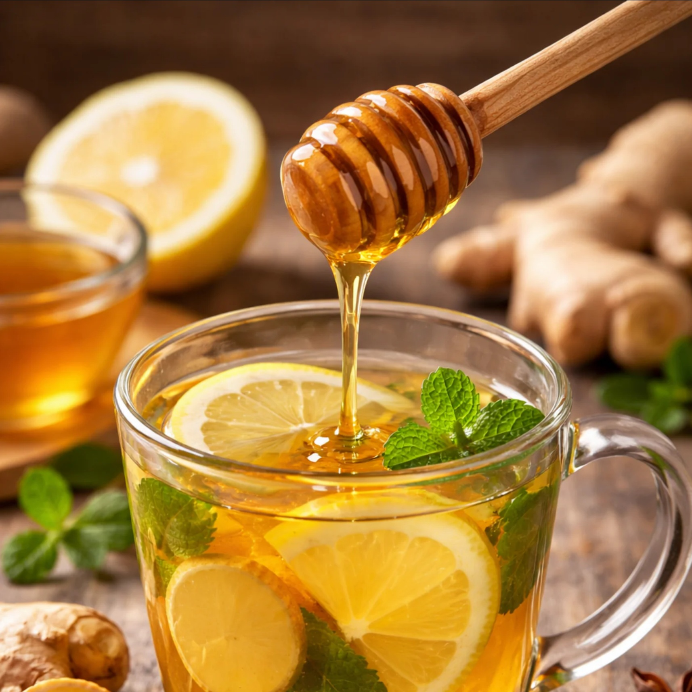

# Honey, Lemon and Ginger

*A thick slice of fresh ginger steeped in just-boiled water, a generous squeeze of lemon, a heaped teaspoon of honey: the drink your nan made when you had a cold.*

**Serves:** 1

**Prep Time:** 3 minutes

**Cook Time:** 7 minutes

## Overview
This is the drink everyone's grandmother made the second a sore throat showed up, and the reason is that it actually does help: ginger has anti-inflammatory compounds, honey coats the throat and is mildly antibacterial, and lemon brings vitamin C and a sharpness that cuts through whatever else you've drunk all day. Steeping is the part most people skip; ginger needs at least five minutes in just-below-boiling water to give up its flavour properly, and the longer you can stand the wait the more punch you'll get. Add the honey only after the water has cooled slightly, because honey heated above 60°C loses its enzymes and most of its delicate flavour (it still tastes sweet but you might as well have used sugar). Lemon goes in last so the vitamin C survives. Serve in a mug, eyes closed, possibly in bed.

## Ingredients

### Per mug
- 3 cm fresh ginger root (peeled, thinly sliced or grated)
- 250 ml just-boiled water
- 1 to 2 teaspoons runny honey (good-quality, ideally local; the better the honey, the better the drink)
- 1 tablespoon fresh lemon juice (from about ¼ lemon)
- 1 slice fresh lemon (for the mug)
- Pinch of cayenne pepper (optional, for the deep-cold version)

### To serve (optional, more elaborate)
- 1 cinnamon stick
- 2 cloves
- 1 tablespoon fresh thyme leaves (excellent for sore throats)

## Method

### Stage 1 - Steep the ginger
1. Tip the ginger slices or grated ginger into a mug.
1. Pour over the just-boiled water.
1. Steep for 5 to 7 minutes; longer if you have time, the flavour deepens.
1. If using cinnamon, cloves or thyme, add them now to steep alongside the ginger.

### Stage 2 - Cool and sweeten
1. Let the mug sit for 2 minutes so the water cools below 60°C; touch the mug with your hand to check (warm enough to be hot but not so hot you can't hold it).
1. Stir in the honey until dissolved; tasting partway is the easiest way to get the sweetness right.

### Stage 3 - Add lemon and serve
1. Stir in the lemon juice.
1. Add a slice of fresh lemon to the mug for the look.
1. If you're going for the deep-cold version with cayenne, sprinkle a small pinch on top; it'll wake your sinuses up properly.
1. Drink while still warm; lean back, breathe in the steam.

## Notes
- **Don't strain unless you want to.** Floating bits of ginger at the bottom are normal and you can eat them at the end; some people prefer to fish them out first.
- **Honey after the water cools.** Boiling water destroys honey's enzymes and delicate flavours; let it cool below 60°C first. Five minutes of steeping plus 2 minutes of sitting is about right.
- **Good honey is worth the spend.** A jar of local raw honey is the upgrade that makes this drink properly medicinal; supermarket squeezy bottles work but taste flatter.
- **Thyme for a real sore throat.** A teaspoon of fresh thyme leaves steeped with the ginger has well-documented antibacterial properties and tastes faintly savoury-floral.

## Variations
- **Turmeric haldi.** Add ½ teaspoon ground turmeric and a few cracks of black pepper (the pepper helps absorption) for a golden version with deeper anti-inflammatory credentials.
- **Whisky toddy.** Add 30 ml of whisky (Scotch, Irish, bourbon) along with the honey; turns this from a sick-day tea into a proper hot toddy. Boozy and excellent on a cold night.
- **Cold-fighter loaded.** Combine all the variations: ginger, turmeric, thyme, a pinch of cayenne. Tastes like an apothecary in a cup but does the job.

## Storage
- Drink immediately; the lemon and honey lose flavour after about an hour.
- The ginger steep without honey or lemon keeps in a thermos for 4 hours hot; add honey and lemon at the cup.
- A jar of honey, lemon and ginger pre-mixed (50 g grated ginger + zest and juice of 2 lemons + 200 g honey, stirred and refrigerated) keeps 4 weeks; one tablespoon stirred into a mug of hot water makes the drink in 30 seconds.
