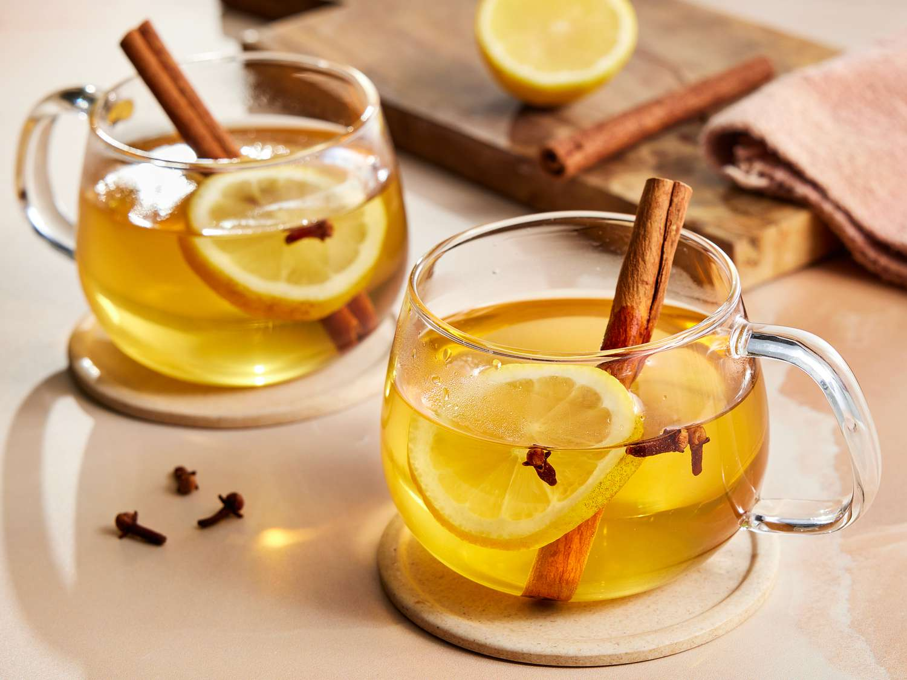

# Hot Toddy

*The classic cold-weather cure: whisky, hot water, honey, a wedge of lemon studded with cloves and a slice of fresh ginger, served in a heavy glass with a long spoon. Warming from first sip to last. The drink that handles a head cold or a properly cold November evening.*

**Serves:** 2 glasses

**Prep Time:** 3 minutes

**Cook Time:** 4 minutes

## Overview
The hot toddy has been a British and Scottish cold-weather drink since at least the 18th century. The base is straightforward: a measure of Scotch or Irish whisky, a generous spoonful of honey, the juice of half a lemon, a wedge of lemon studded with a few cloves, a slice of fresh ginger, and just-boiled water to fill the glass. The drink is sipped slowly while the spices infuse and the warmth spreads. Variations exist across the British Isles, Irish hot whiskey omits the ginger and adds brown sugar instead of honey; the Scottish version is typically heavier on the whisky; the English version may add cinnamon. The hot toddy has a folk-medicine reputation as a cold remedy (the honey soothes a sore throat, the lemon delivers vitamin C, the whisky relaxes you to sleep, the steam clears the sinuses), but it's also just a perfect autumn / winter evening drink.

## Ingredients

- 60 ml Scotch whisky (or Irish whiskey, or bourbon, the choice is yours; a blended Scotch works fine)
- 1/2 lemon, cut into 2 wedges
- 4 whole cloves
- 2 thin slices of fresh ginger (peeled or not, doesn't matter)
- 2 generous tablespoons honey (mountain honey or wildflower; the more characterful the better)
- 400 ml just-off-the-boil water
- 1 small cinnamon stick (optional, traditional in winter)

### To serve
- 2 heavy heatproof glasses (whisky tumblers or footed Irish-coffee glasses); never thin glass, which cracks with boiling water

## Method

### Stage 1 - Stud the lemon
1. Cut the half-lemon into 2 wedges.
1. Press 2 whole cloves into the flesh of each wedge.
1. Squeeze the juice of half a lemon's-worth into a separate small jug (use the other half-lemon for the wedges, or vice versa).

### Stage 2 - Build the glasses
1. Into each heavy heatproof glass, add:
   - 30 ml of whisky
   - 1 tablespoon of honey
   - The juice of the squeezed lemon (split between the two glasses)
   - 1 thin slice of fresh ginger
   - 1 clove-studded lemon wedge
   - The cinnamon stick (if using): split a small one between the two glasses

### Stage 3 - Add hot water
1. Pour the just-off-the-boil water into each glass (about 200 ml per glass), filling to about 2 cm from the rim.
1. Stir gently with a long spoon to dissolve the honey. The aroma will be immediate, ginger, lemon, clove, whisky.

### Stage 4 - Serve
1. Serve immediately, hot. Drink slowly; the toddy is meant to last 15-20 minutes.
1. The drinker can spoon out the lemon wedge and ginger as they go, or let them keep infusing.

## Notes
- **Whisky choice.** Blended Scotch works perfectly; single-malt is wasted in a toddy because the honey and spices dominate. A £15 blend gives the same result as a £40 bottle.
- **Honey quality matters.** Plain supermarket honey is fine, but a characterful honey (mountain, heather, eucalyptus) lifts the drink considerably. The honey isn't drowned by the other ingredients.
- **Heatproof glass only.** Pouring boiling water into a thin glass will crack it. Heavy whisky tumblers or proper Irish-coffee glasses are designed for this.
- **Don't use boiling water.** Just-off-the-boil (about 90°C) is right. Hard-boiling water evaporates the alcohol you want and over-extracts the cloves.

## Variations
- **Without ginger (English style).** Skip the ginger; just whisky, honey, lemon, clove. Lighter, more autumn-evening.
- **With cardamom.** Add 2 lightly crushed cardamom pods. Modern variant; aromatic.
- **With orange.** Replace half the lemon with orange wedges + cloves; sweeter, gentler.
- **Brandy or rum toddy.** Substitute the whisky for brandy or dark rum. Different but valid; common in Caribbean traditions.
- **Hot apple toddy.** Replace half the water with warm apple juice. Sweeter, more autumnal.
- **Non-alcoholic.** Skip the whisky; the result is honey-lemon-ginger water, which is its own great drink (see honey-lemon-ginger recipe).

## Storage
- Doesn't store; build to order.
