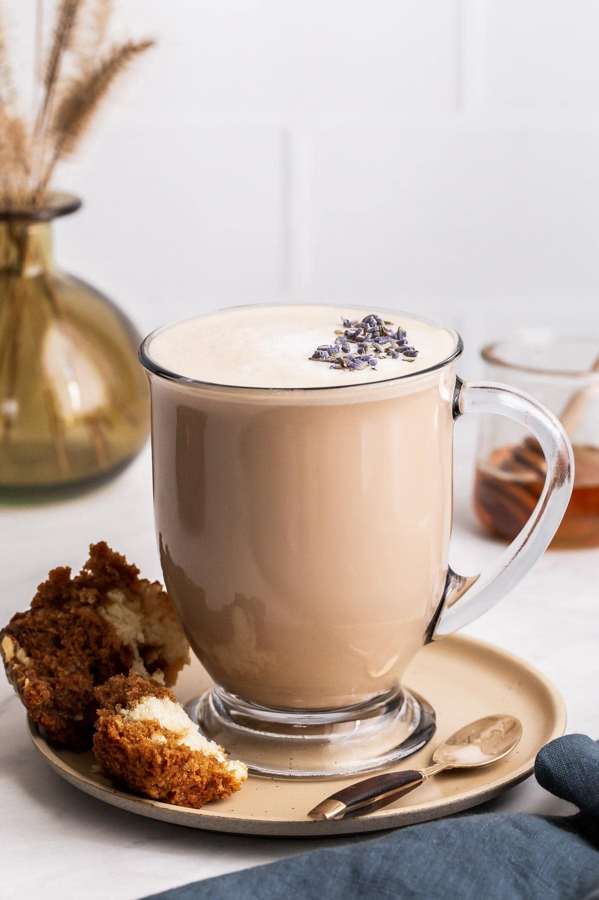

# London Fog

*Earl Grey steeped strong, sweetened with vanilla syrup, finished with steamed milk and foam: a tea latte invented in Vancouver but named for somewhere damper.*

**Serves:** 1

**Prep Time:** 2 minutes

**Cook Time:** 8 minutes

## Overview
The London Fog is a Canadian invention that took the name of a British drizzle: strong Earl Grey, vanilla syrup, and steamed milk topped with foam. Properly made, it tastes like an early autumn walk through a damp garden, with the bergamot pulling toward orange-zesty and the vanilla pulling toward sweetness. The trick is brewing the tea very strong (the milk will lighten it considerably; weak Earl Grey gets washed out completely once the milk goes in), and using a real vanilla syrup or a generous splash of vanilla extract with sugar rather than something synthetic. Cafés use steamed and frothed milk; at home a milk frother or a French press with hot milk plunged a few times gets you most of the way. Pour the tea into a wide mug, sweeten, add steamed milk, top with foam, and dust with a tiny sprinkle of bergamot zest or ground cinnamon. Drink slowly with a book.

## Ingredients

### Per mug
- 1 Earl Grey tea bag (or 1 heaped teaspoon loose leaf; use a good brand, not the supermarket basics)
- 150 ml just-boiled water
- 1 tablespoon vanilla syrup (or ½ teaspoon vanilla extract plus 2 teaspoons sugar)
- 100 ml whole milk (oat milk works fine; almond goes thin and grainy)

### To serve (optional)
- A tiny pinch of bergamot zest or grated lemon zest
- A pinch of ground cinnamon or grated nutmeg

## Method

### Stage 1 - Brew strong
1. Drop the Earl Grey tea bag into a warmed mug.
1. Pour over 150 ml of just-boiled water; steep for 4 to 5 minutes for a properly strong cup.
1. Lift out the tea bag and discard.

### Stage 2 - Steam the milk
1. Pour the milk into a small saucepan over medium-low heat (or a milk-frothing jug if you have a steam wand).
1. Heat gently to about 65°C, the temperature at which the milk steams and the surface trembles but doesn't simmer. Boiled milk skins; under-heated milk tastes flat.
1. For the foam: pour the hot milk into a French press and plunge the press up and down 8 to 10 times until the milk doubles in volume and the top has a thick foam layer. A milk frother is the alternative; a wide jug and a balloon whisk also works.

### Stage 3 - Build
1. Stir the vanilla syrup (or vanilla extract and sugar) into the hot tea until dissolved.
1. Pour in the hot milk slowly down the side of the mug, holding back the foam with a spoon.
1. Spoon the foam on top to crown the drink.

### Stage 4 - Garnish
1. Dust the foam with a pinch of bergamot or lemon zest, or a tiny pinch of ground cinnamon.
1. Serve immediately; the foam settles after about 5 minutes.

## Notes
- **Earl Grey grade matters.** Supermarket-basics Earl Grey is essentially Indian black tea with synthetic bergamot oil; the better ones (Whittard, Twinings Lady Grey, Mariage Frères) use real bergamot citrus oil and have a depth that survives the milk.
- **Steam, don't boil.** Boiled milk skins and tastes scorched. The right temperature is about 65°C, the point where it steams freely but doesn't bubble.
- **Foam holds for 5 minutes.** Drink while the foam is still standing; once it settles the drink is still good but less photogenic.
- **Vanilla syrup vs extract.** Both work. Syrup gives a uniform sweetness and a slightly thicker mouthfeel; extract + sugar is cleaner-tasting.

## Variations
- **Lavender fog.** Add a small pinch of dried culinary lavender to the tea while it steeps; strain out with the bag. Floral and quite girlie, in the best sense.
- **Coffee fog.** Replace the Earl Grey with a strong espresso and add an extra tablespoon of milk; this becomes a vanilla latte in disguise.
- **Iced London Fog.** Brew the tea double-strong and stir the vanilla in while hot; chill, then pour over ice and top with cold milk and cold foam.

## Storage
- Drink immediately; the foam settles and the drink cools fast.
- The vanilla syrup keeps in a sealed bottle in the fridge for a month and works in coffee, hot chocolate, and over ice cream.
