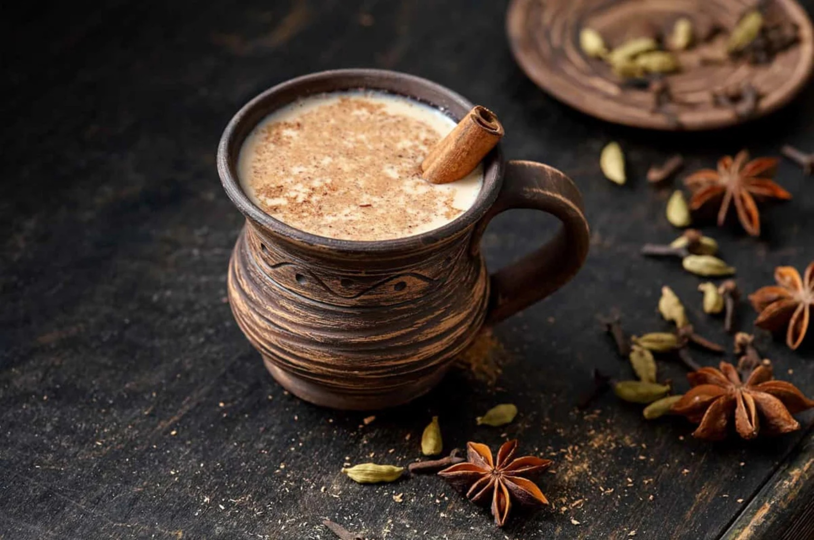

# Masala Chai

*The properly homemade Indian spiced tea: black tea boiled hard with milk, ginger, cardamom, cinnamon, cloves and black peppercorns, sweetened generously, strained into small cups. Sharper, more aromatic and twice as warming as anything sold in a coffee chain.*

**Serves:** 4 small cups

**Prep Time:** 5 minutes

**Cook Time:** 12 minutes

## Overview
Masala chai is the everyday spiced tea of the Indian subcontinent — from the railway-station chai-wallah pouring it into clay cups across India, to the home kitchen at any time a guest sits down. The recipe varies household by household, region by region, but the core is always there: black tea (Assam or Ceylon), whole milk, fresh ginger, green cardamom, cinnamon, cloves, and crushed black peppercorns for the warming finish. Some households add fennel; others nutmeg; some star anise. Sugar is added in serious quantity. The brewing technique is the defining detail: everything goes into a saucepan together, brought to a hard boil, then simmered until the kitchen smells unmistakable. The result is a deep tan tea with a strong spice nose, properly sweet, served in small cups — better as a small intense cup than a large mug. Different in every way from the Western "chai latte" which is mostly syrup and steamed milk.

## Ingredients

- 600 ml water
- 400 ml whole milk
- 4 teaspoons strong black tea (Assam loose-leaf, or 4 strong tea bags)
- 4 cm fresh ginger, sliced thin (skin on)
- 6 green cardamom pods, lightly crushed
- 1 cinnamon stick (about 5 cm)
- 4 whole cloves
- 6 black peppercorns
- 1 star anise (optional)
- 4 to 6 teaspoons sugar, to taste

### To serve
- 4 small porcelain cups or glass tumblers

## Method

### Stage 1 - Bruise the spices
1. Lightly crush the cardamom pods with the side of a knife to expose the seeds inside.
1. Roughly crack the peppercorns with the same technique (or the back of a heavy spoon).

### Stage 2 - Boil the spice base
1. In a small saucepan, combine the water, ginger, cardamom, cinnamon stick, cloves, peppercorns and star anise (if using).
1. Bring to the boil over high heat, then reduce to a strong simmer for 4 minutes. The kitchen will smell of cardamom and ginger.

### Stage 3 - Add tea
1. Add the tea (loose or bags) to the brewing pan.
1. Simmer hard for 2 minutes more — the brew turns very dark, almost mahogany.

### Stage 4 - Add milk and sugar
1. Pour in the whole milk; add the sugar.
1. Bring back to a gentle simmer; watch for it not to boil over (the milk wants to). Stir as the milk integrates.
1. Simmer 3-4 minutes more until the kitchen smells unmistakably of masala chai and the tea is a uniform tan colour.

### Stage 5 - Strain
1. Strain through a fine sieve into the cups.
1. Serve immediately, very hot.

## Notes
- **Boil hard with the spices.** The hard boil extracts the warming oils from the ginger, peppercorns and cardamom. A gentle warming gives a weak chai.
- **Whole milk only.** Skim milk gives a thin sad chai; whole milk is what carries the spice oils.
- **Bruise the cardamom.** Whole un-cracked pods don't release their flavour. The light crush exposes the seeds inside.
- **Sweet by default.** Indian and Pakistani chai is properly sweet — 5-6 teaspoons of sugar across 1 litre of liquid. Adjust to taste but don't underdo.

## Variations
- **Without star anise.** Skip; not in every household. Common to omit.
- **Without peppercorns.** Skip for a milder version; useful for kids.
- **With fennel.** Add 1/2 teaspoon of fennel seeds to the brew. Northern Indian variant.
- **With nutmeg.** Grate a tiny pinch of fresh nutmeg into each cup at serving. Winter-festive.
- **Iced masala chai.** Brew double-strength, sweeten while hot, cool then chill; serve over ice. Modern summer variant.
- **Vegan.** Replace milk with oat milk. Almond milk works but is thinner.

## Storage
- Brewed chai keeps 1 day in the fridge sealed. Reheat gently in a saucepan; the spices fade after 24 hours so fresh is best.
- The pre-made spice blend (cardamom, cinnamon, cloves, peppercorns, star anise) stored in a sealed jar keeps 6 months at room temperature; use 1 teaspoon of the blend per pot.
