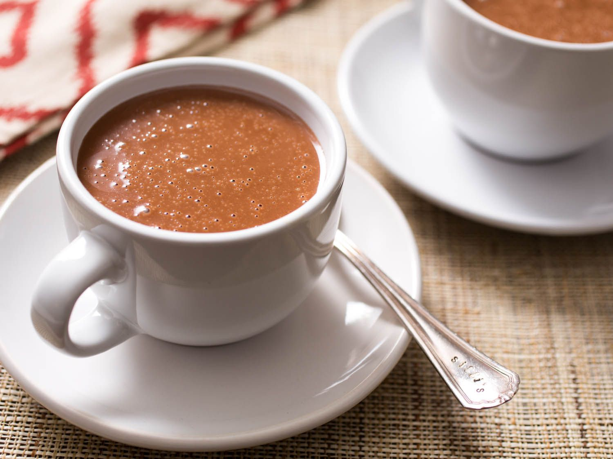

# Mexican Hot Chocolate

*Cinnamon, cardamom, a flicker of chilli, and the foamy whisk-up from a wooden molinillo: hot chocolate the way Mexico has been drinking it for centuries.*

**Serves:** 2

**Prep Time:** 5 minutes

**Cook Time:** 8 minutes

## Overview
Hot chocolate in Mexico predates the European version by centuries and has very little in common with it: instead of cream and sugar smoothing the cocoa down, it leans into spice and texture. The classic build is dark chocolate or a Mexican drinking chocolate disc (Abuelita or Ibarra, both stocked at any Latin grocer) melted into hot milk with a stick of canela cinnamon, a small pinch of dried chilli, and a hit of vanilla. The wooden molinillo whisk is the traditional tool: held between flat palms and rolled, it whips a generous foam onto the top in seconds, but a regular whisk does the job if that's what you have. The drink should taste of cinnamon first, chocolate second, with the chilli only appearing at the back of the throat as a slow gentle warmth, never as actual heat. Serve in clay or earthenware cups with a churro on the side if you're going all in, or alongside a plate of pan dulce for a less ambitious afternoon.

## Ingredients

### Hot chocolate
- 500 ml whole milk
- 100 g Mexican drinking chocolate (Abuelita, Ibarra, or similar; or substitute 80 g dark chocolate plus 2 tablespoons cocoa powder and 2 tablespoons sugar)
- 1 stick Mexican canela cinnamon (or 5 cm regular cinnamon stick; canela is softer and more aromatic)
- 1 cardamom pod (lightly crushed; optional but common)
- ¼ teaspoon ancho or pasilla chilli powder (or a pinch of cayenne for a sharper heat)
- ½ teaspoon vanilla extract
- Pinch of fine salt

### To serve
- A churro or two on the saucer (optional, traditional)
- A dusting of cocoa or cinnamon on top
- Whipped cream (less traditional but welcome)

## Method

### Stage 1 - Infuse the milk
1. Tip the milk into a small saucepan with the cinnamon stick, cardamom pod, chilli powder and salt.
1. Warm over medium-low heat for 4 to 5 minutes, until steaming and just trembling at the surface. Don't let it boil.
1. Take off the heat and leave to steep for 2 minutes so the spices give up their flavour.
1. Lift out the cardamom pod (leave the cinnamon stick in for now).

### Stage 2 - Melt the chocolate in
1. Roughly chop the Mexican drinking chocolate (or measure your substitute).
1. Return the pan to the lowest heat.
1. Add the chocolate and whisk continuously for 1 to 2 minutes until completely melted and smooth.
1. Stir in the vanilla extract.
1. Taste; the heat from the chilli should be a slow back-of-throat warmth, not a punch. Add a touch more chilli only if your palate calls for it.

### Stage 3 - Foam and serve
1. For the traditional finish, hold a molinillo between flat palms and roll it back and forth in the pan for 20 to 30 seconds until a generous foam rises on top. If you don't have one, use a balloon whisk or even an electric milk frother.
1. Pour into two warmed cups, foam and all.
1. Lift the cinnamon stick out of the pan, give it a quick rinse, and drop one stick into each cup for serving (the second stick if you have one; otherwise keep the spent one in the larger cup).
1. Dust with cinnamon or cocoa and serve immediately, with churros on the side if you're committing fully.

## Notes
- **Mexican chocolate is the real one.** Abuelita and Ibarra are grainier and less sweet than European drinking chocolate, with cinnamon and almond already milled in. If you can't find it, the substitute in brackets works, but the drink reads a bit smoother and less rustic.
- **Canela vs cassia.** Mexican canela cinnamon is softer, more delicate and faintly floral; cassia (what the supermarket sells as "cinnamon") is harsher and woodier. The drink works with either; canela is the authentic choice.
- **Chilli should warm, not burn.** Ancho and pasilla are the traditional choices because they're fruity and gentle. Cayenne or hotter chillies work but the line between warming and overpowering is thinner.
- **The molinillo is fun but not essential.** A balloon whisk gets you most of the way there; an electric milk frother all of it.

## Variations
- **Champurrado.** Thicker masa-based version: whisk 2 tablespoons of masa harina into the cold milk before warming. The drink turns silky and porridge-thick, an everyday Mexican breakfast.
- **Atole con chocolate.** Same masa thickener, less chocolate, plus piloncillo (raw cane sugar) for a more rustic, less intense drink.
- **Boozy.** A splash of dark rum or Mexican brandy stirred in off the heat is excellent on a cold night.

## Storage
- Drink immediately; the foam settles within a minute or two.
- Leftovers refrigerate up to 24 hours; reheat gently over low heat, whisking. Won't froth as well the second time.
- The dry blend (cocoa, sugar, ground cinnamon, chilli) keeps in a jar for weeks if you want a faster reach: 4 heaping tablespoons per 500 ml hot milk.
