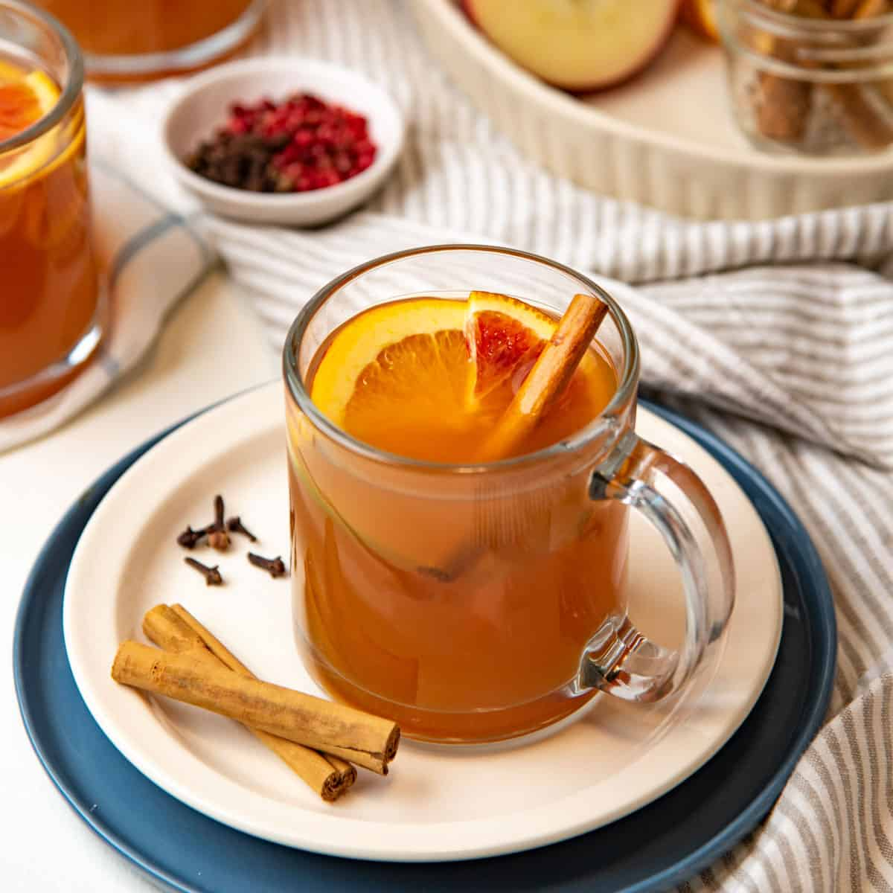

# Mulled Apple Cider

*Cloudy apple juice (or alcohol-free cider) mulled with cinnamon, star anise, cloves and orange: the non-alcoholic mulled wine that does the same job at a winter table.*

**Serves:** 6 to 8

**Prep Time:** 5 minutes

**Cook Time:** 25 minutes

## Overview
Mulled apple cider is mulled wine's alcohol-free counterpart, and a better pour than most non-alcoholic mulled wines because apple juice has its own real personality rather than trying to taste like something it isn't. You want cloudy apple juice (the clear stuff tastes thin) or alcohol-free cider, mulled gently for 20 to 25 minutes with cinnamon, star anise, cloves, cardamom, orange peel and a slice of fresh ginger if you want a slight bite. A tablespoon of dark sugar or maple syrup adds a darker depth than the apple alone; a splash of vanilla at the end rounds the spices out. Serve in heatproof mugs with a slice of orange and a cinnamon stick, alongside or instead of mulled wine at a winter gathering. Smells like a Christmas market in Salzburg; tastes like the version everyone can have.

## Ingredients

### Mull
- 1.2 litres cloudy apple juice (or alcohol-free cider; the proper "scrumpy" style is best)
- 1 orange (zest in wide strips with a vegetable peeler; 1 slice reserved for serving)
- 6 whole cloves
- 2 cinnamon sticks
- 2 star anise
- 4 green cardamom pods (lightly crushed)
- 3 thin slices fresh ginger (optional, for warmth)
- 2 tablespoons dark muscovado sugar or maple syrup (taste-dependent)
- ½ teaspoon vanilla extract (added at the end)

### To serve
- Orange slices
- A cinnamon stick per glass
- A grating of fresh nutmeg (optional)

## Method

### Stage 1 - Build
1. Tip the apple juice into a heavy saucepan over low heat.
1. Add the orange zest strips, cloves, cinnamon sticks, star anise, cardamom pods, ginger (if using) and the sugar or syrup.
1. Stir to dissolve the sugar.

### Stage 2 - Mull
1. Heat gently for 20 to 25 minutes over low heat; the cider should steam, with the surface just trembling, never coming to a boil.
1. Stir occasionally; the kitchen will start smelling like Christmas within five minutes.

### Stage 3 - Finish
1. Off the heat, stir in the vanilla extract.
1. Taste and adjust: more sugar if too tart, a squeeze of fresh lemon if too sweet.

### Stage 4 - Serve
1. Strain through a coarse sieve into a warmed jug; discard the spices.
1. Ladle into heatproof mugs or sturdy glass tumblers.
1. Drop in a fresh slice of orange and a cinnamon stick per glass; grate over a tiny bit of nutmeg if using.
1. Serve immediately.

## Notes
- **Cloudy apple juice is the right kind.** Clear filtered apple juice tastes thin and one-note; the cloudy stuff has body and a tartness that holds up to the spices.
- **Don't simmer.** Apple juice has natural sugars that can scorch and turn bitter if pushed too hard. Low heat all the way.
- **Sugar is a corrective.** Some apple juices are sweeter than others. Taste after 10 minutes and adjust.
- **Strain before serving.** Cloves get aggressive if left in the cider too long; better to pull them at the end and let the residual flavour mellow.

## Variations
- **Mulled cider with cranberry.** Add 200 ml cranberry juice with the apple; turns the colour deep red and gives a sharper edge.
- **Spiced and brandied.** Add 100 ml brandy or dark rum off the heat, for the not-quite-non-alcoholic version.
- **Mulled pear.** Replace the apple juice with cloudy pear juice; lighter, more floral, equally good.

## Storage
- Best within 2 hours of mulling.
- Cool and refrigerate up to 5 days in a sealed jar (strain out the spices first); reheat gently before serving.
- Freezes 3 months in a sealed container; thaw overnight in the fridge before rewarming.
