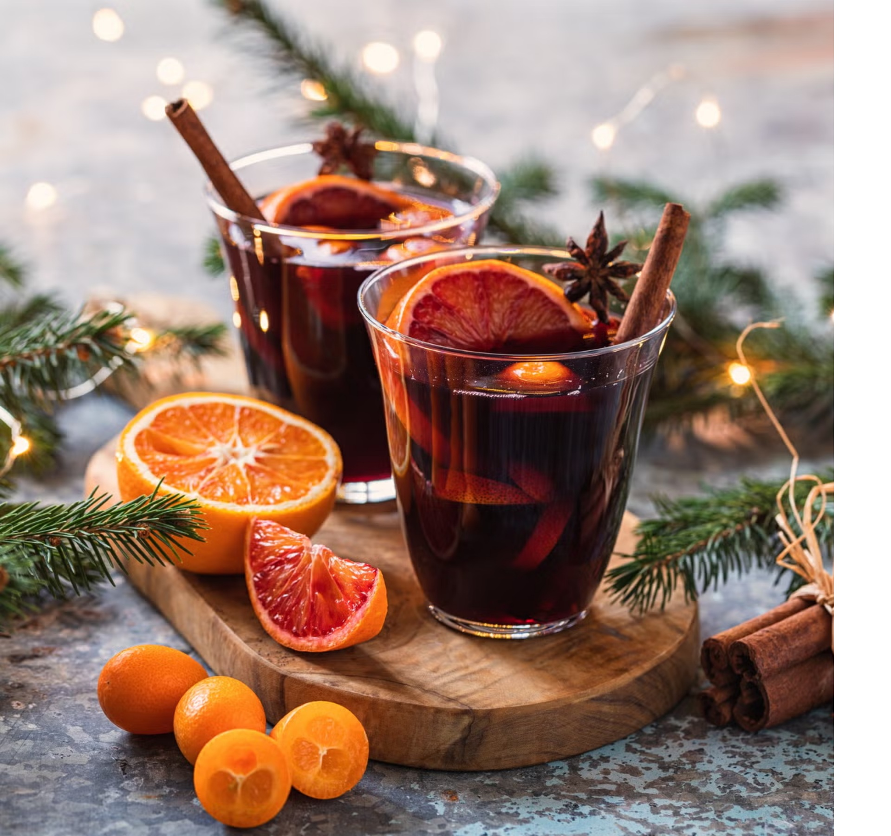

# Mulled Wine

*A bottle of everyday red, oranges studded with cloves, cinnamon, star anise and cardamom, mulled gently for half an hour until the kitchen smells like Christmas.*

**Serves:** 6 to 8

**Prep Time:** 5 minutes

**Cook Time:** 30 minutes

## Overview
Mulled wine is the drink that takes the most ordinary bottle of red in the supermarket and makes it taste expensive. The principle is gentle infusion: a bottle of medium-bodied red (Merlot, Côtes du Rhône, Garnacha, anything fruity rather than tannic), warmed not boiled with whole spices and citrus over 30 minutes so the volatile aromatics in the spices have time to dissolve into the wine without the alcohol cooking off. Cloves studded into orange peel, cinnamon sticks, star anise, green cardamom pods bashed open, a strip of lemon zest, a generous slug of brandy or port (optional but excellent), and just enough sugar or honey to round out the tannins. The smell does most of the work; by the time the wine is ready to drink, half the room will be in the kitchen. Ladle into heatproof mugs or glasses, drop in a slice of orange and a cinnamon stick if you have spares, and serve as the dark winter afternoon goes properly dark.

## Ingredients

### Mull
- 1 bottle (750 ml) medium-bodied red wine (Merlot, Côtes du Rhône, Garnacha; fruity, not tannic)
- 1 orange (skin scrubbed; you'll use both the zest and the slices)
- 1 lemon (one strip of zest pared off with a vegetable peeler)
- 8 whole cloves
- 2 cinnamon sticks (or 1 long one snapped in half)
- 2 star anise
- 4 green cardamom pods (lightly crushed)
- 1 bay leaf (optional, adds depth)
- 4 tablespoons caster sugar (or 3 tablespoons honey; taste-dependent on the wine)
- 100 ml brandy, port or dark rum (optional but classic)

### To serve
- Extra orange slices
- A cinnamon stick per glass (optional, theatrical)

## Method

### Stage 1 - Prep the orange
1. Cut 4 thin slices from the orange and set aside for serving.
1. Stud 4 of the cloves into the peel of the remaining half of the orange; you can also poke them straight into the orange flesh.
1. Pare off a strip of lemon zest with a vegetable peeler.

### Stage 2 - Build and warm
1. Pour the wine into a heavy-based saucepan; place over low heat.
1. Add the clove-studded orange half, the orange slices, the lemon zest, the remaining 4 cloves, cinnamon sticks, star anise, cardamom pods, bay leaf and sugar.
1. Stir to dissolve the sugar.

### Stage 3 - Mull gently
1. Heat slowly over low to medium-low. The wine should steam, never simmer. You want the temperature around 75°C, which is hot enough to release the spice aromatics but well below the alcohol boiling point.
1. Let it warm gently for 25 to 30 minutes; the longer it sits, the deeper the spice infusion.
1. Stir occasionally; taste partway and adjust sugar if too tart, more spice if needed.

### Stage 4 - Add brandy and serve
1. Off the heat, stir in the brandy or port if using.
1. Taste again; the brandy gives the wine a richer mouthfeel and a small alcoholic punch.
1. Ladle into heatproof mugs or sturdy glass tumblers (don't use thin glassware; thermal shock).
1. Drop in a slice of fresh orange and add a cinnamon stick per glass for the theatre. Serve immediately.

## Notes
- **Don't boil.** Boiling drives the alcohol off and the wine ends up tasting cooked. Steam, not bubble.
- **Everyday wine is fine.** A bottle of £6 supermarket red turns into something genuinely good once mulled. Don't waste a nice bottle on this.
- **Adjust sugar last.** Different wines need different amounts; some are bone-dry, some are jammy. Taste after 15 minutes and dial in.
- **Make ahead works.** Mull, cool, refrigerate for up to 3 days; gently rewarm to serve. The flavour deepens overnight.

## Variations
- **White mulled wine (glögg-style).** Use a bottle of fruity white (Pinot Grigio, Gewürztraminer) and add 100 ml brandy plus a handful of raisins and slivered almonds. Scandinavian-Swedish version, served with ginger biscuits.
- **Non-alcoholic mulled.** Use alcohol-free red wine (the better brands taste close to the real thing) or follow the [Mulled Apple Cider](mulled-apple-cider.md) recipe.
- **Mulled with pomegranate.** Add 100 ml pomegranate juice; gives a deeper colour and a brighter tartness.

## Storage
- Best within an hour of mulling.
- Cool and refrigerate up to 3 days in a sealed jar with the spices still in; rewarm gently before serving.
- The strained mull (spices removed) holds for 5 days in the fridge.
