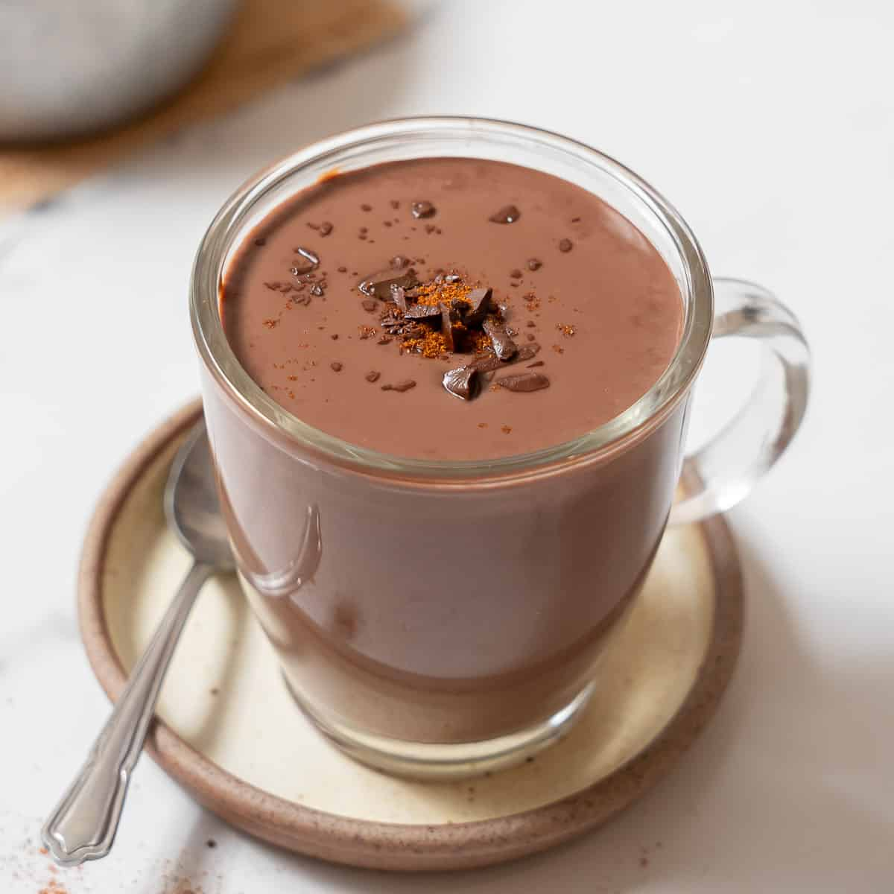

# Spanish Hot Chocolate (Chocolate a la Taza)

*Spain's churro-dipping chocolate: dark chocolate melted into hot milk, thickened with a touch of cornflour into a velvet pudding-thin consistency you can scoop with a churro. Far thicker, richer and less sweet than its British or American cousins; the famous chocolate of any Spanish breakfast or post-club early-morning churreria.*

**Serves:** 4 small cups

**Prep Time:** 2 minutes

**Cook Time:** 10 minutes

## Overview
Chocolate a la taza ("chocolate of the cup") is Spain's signature winter and breakfast drink - and the partner to churros, the long fried dough sticks you dip into the thick chocolate. The defining property is thickness: Spanish hot chocolate is properly close to a chocolate pudding in consistency, thicker than its Italian cousin (cioccolato caldo) and far thicker than American or British hot chocolates. The thickening is achieved with a small amount of cornflour whisked in with the milk; some traditional preparations use the natural starch in semolina or just rely on reducing the milk hard. The chocolate is high-quality dark - at least 60% cocoa, ideally 70% - and the sweetness is restrained. Made properly, the drink takes a spoon as much as a sip. Served in small cups, usually with a long churro on the saucer for dipping. The Spanish breakfast and the post-disco 5am ritual.

## Ingredients

- 500 ml whole milk
- 100 g dark chocolate (60-70% cocoa; Lindt, Callebaut, or any good dark)
- 1 tablespoon cornflour (cornstarch)
- 50 g caster sugar (less than you might expect - the chocolate carries the drink)
- A pinch of fine salt
- 1/2 teaspoon vanilla extract (optional)
- A small piece of cinnamon stick (optional, common in Madrid versions)

### To serve
- 4 small cups (about 150 ml capacity)
- Optional but traditional: 8-12 churros for dipping
- Optional: a sprinkle of cocoa powder on top

## Method

### Stage 1 - Slurry the cornflour
1. In a small bowl, whisk the cornflour with 100 ml of the cold milk until completely smooth and lump-free.

### Stage 2 - Warm and dissolve
1. Pour the remaining 400 ml of milk into a small saucepan with the sugar, salt and cinnamon stick (if using).
1. Warm over medium-low heat, stirring, until the sugar dissolves and the milk is steaming (about 65°C). Don't boil.
1. Chop the chocolate into small chunks for faster melting; add to the warm milk.
1. Whisk continuously until the chocolate is completely melted and the mixture is smooth. About 3-4 minutes.

### Stage 3 - Thicken
1. While whisking the milk-chocolate mixture continuously, pour in the cornflour slurry in a steady stream.
1. Increase the heat to medium and continue whisking. The mixture will thicken noticeably in 3-4 minutes, going from a milky brown liquid to a thick, velvety chocolate pudding consistency. It should coat the back of a spoon heavily.
1. Add the vanilla extract (if using) just before removing from heat.

### Stage 4 - Serve
1. Remove the cinnamon stick.
1. Pour into small warm cups.
1. Optionally dust the top with cocoa powder.
1. Serve immediately with churros on the side for dipping - the proper Spanish way.

## Notes
- **Quality chocolate.** Good dark chocolate (60-70% cocoa) makes or breaks this drink. Cheap "cooking chocolate" gives a flat, sad chocolate; quality chocolate gives a deep complex flavour. Lindt or Callebaut are reliable; the Spanish brand Valor specifically makes "chocolate a la taza" tablets for this purpose.
- **Cornflour slurry first.** Sprinkling cornflour directly into hot milk produces lumps that never dissolve. Always slurry with cold milk first.
- **Don't over-thicken.** The right consistency is thick enough to coat a churro but still pourable. Cornflour continues thickening as it cools, so stop just before you think it's right.
- **Less sweet than expected.** Spanish hot chocolate is meant to be deeply chocolate rather than sweet - the sugar in churros provides the sweetness contrast. 50 g sugar per litre is about right; resist the urge to add more.

## Variations
- **With cinnamon.** Add 1 small cinnamon stick to the milk warming phase. Common Madrid variant.
- **With orange.** Add a strip of orange peel to the warming milk. Catalan style.
- **With chilli.** Add a tiny pinch of cayenne or ground guajillo chilli. A modern fusion riff (closer to Mexican hot chocolate territory).
- **Valor style.** Use a Spanish "chocolate a la taza" tablet (Valor brand) which includes the sugar and starch pre-incorporated. Even thicker and less work.

## Storage
- Best fresh. Keeps 1 day in the fridge; reheat gently with a splash of milk to loosen. The thickness intensifies dramatically on cooling.
