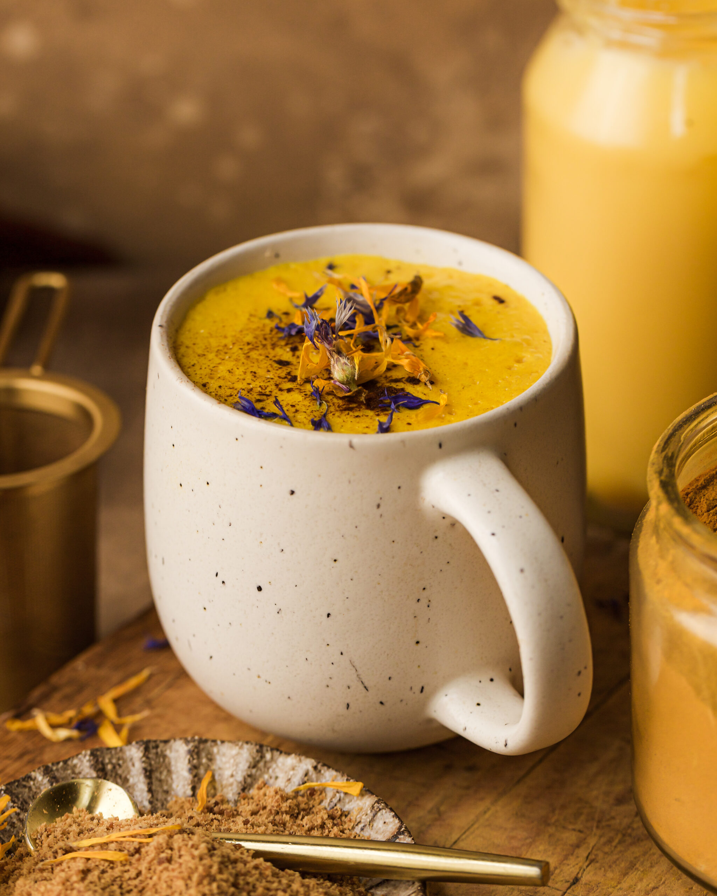

# Turmeric Latte (Golden Milk)

*The "golden milk" of South Asia, modernised for the espresso-machine generation: warm milk infused with fresh turmeric, ginger, cinnamon and black pepper, sweetened with honey, frothed and poured into a mug. Bright gold, faintly earthy, deeply warming.*

**Serves:** 2 mugs

**Prep Time:** 3 minutes

**Cook Time:** 7 minutes

## Overview
Turmeric latte (called golden milk, haldi doodh, or simply "turmeric milk" depending on where you are) has been a household remedy across South Asia for centuries - turmeric stirred into warm milk and given to anyone with a cold, sore throat, fever, or just trouble sleeping. The Western café version of the last decade modernised it: barista-frothed milk, ginger and cinnamon alongside the turmeric, a pinch of black pepper (which dramatically increases the bioavailability of curcumin, the active compound in turmeric), sweetened with honey rather than refined sugar, sometimes finished with a drop of vanilla. The result is a bright golden drink, slightly earthy, gently warming, served in mugs as a coffee alternative for late afternoon or before bed. Modern coffee shops globally now offer it; the homemade version is cheaper, brighter and easier to control for sweetness.

## Ingredients

- 600 ml whole milk (or oat milk for a vegan version)
- 2 teaspoons ground turmeric OR 4 cm fresh turmeric root, peeled and grated (fresh is brighter)
- 2 cm fresh ginger, peeled and grated
- 1/2 teaspoon ground cinnamon
- A small pinch of black pepper (critical - boosts turmeric's bioavailability)
- 2 to 3 tablespoons honey (or maple syrup for vegan)
- 1/4 teaspoon vanilla extract (optional)
- A small pinch of fine salt
- A tiny pinch of saffron strands (optional, for a deeper colour)

### To serve
- 2 mugs, warmed
- Optional: a small dusting of ground cinnamon on top
- Optional: a few crushed pistachios

## Method

### Stage 1 - Combine and warm
1. Pour the milk into a small saucepan.
1. Add the turmeric, ginger, cinnamon, black pepper, salt and saffron (if using).
1. Warm over medium-low heat, whisking continuously to disperse the spices and prevent the turmeric from clumping at the bottom.

### Stage 2 - Simmer
1. Bring the mixture to just below the boil (steaming, small bubbles at the edge - about 75°C).
1. Hold at that temperature, whisking, for 4 to 5 minutes. The milk turns a vivid golden orange.

### Stage 3 - Sweeten and finish
1. Off the heat, whisk in 2 tablespoons of honey and the vanilla extract.
1. Taste: it should be lightly sweet, distinctly turmeric, with a gentle ginger-cinnamon warmth. Add more honey if too earthy.

### Stage 4 - Froth and serve
1. For a café-style finish: pour back into the pan, briefly froth with a milk frother or hand whisk for 20 seconds until light foam forms on top.
1. Pour into warmed mugs.
1. Dust with extra cinnamon if you like; scatter a few crushed pistachios on top.
1. Serve immediately, hot.

## Notes
- **Black pepper is non-negotiable.** The piperine in black pepper increases curcumin (turmeric's active compound) bioavailability by up to 2000%. A tiny pinch - you won't taste it.
- **Fresh vs ground turmeric.** Fresh turmeric root has a brighter, more vibrant flavour and a more dramatic golden colour. Ground turmeric is more convenient and works fine; use 2 teaspoons per 600 ml milk.
- **Whisk continuously.** Turmeric powder clumps and sinks to the bottom of the pan if you don't whisk. The whisking also prevents milk skin from forming.
- **Don't boil.** Just below boil is right. Boiling can scorch the milk and dulls the spice aromatics.

## Variations
- **Spicy.** Add a tiny pinch of cayenne or a small piece of fresh chilli. Common in Indian households.
- **With cardamom.** Add 2 lightly crushed cardamom pods to the warming pan. More complex.
- **Iced turmeric latte.** Make the warm version, chill, blend with ice cubes for the summer café version.
- **Vegan.** Use oat milk (best foaming) or almond milk; replace honey with maple syrup. The colour will be slightly different but the drink works.
- **With coconut.** Replace 100 ml of milk with full-fat coconut milk. Tropical, slightly richer.

## Storage
- Best fresh; serve immediately for the best colour and aroma.
- Brewed turmeric latte keeps 24 hours in the fridge sealed; reheat gently. The colour deepens slightly and the spice aromatics fade with each day.
