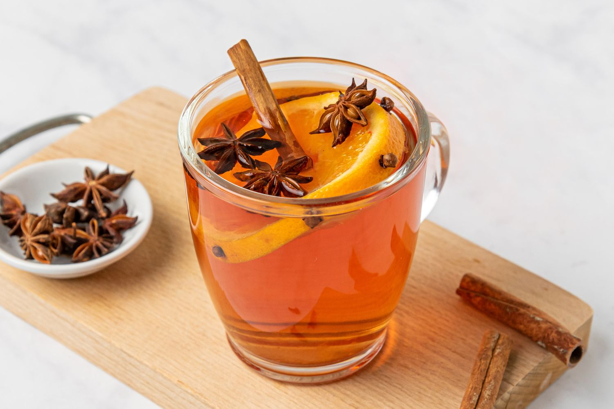

# Wassail

*The old English Christmas punch: dry cider warmed with apples studded with cloves, brown sugar, cinnamon, allspice and nutmeg, sometimes fortified with brandy or sherry. Served from a giant punch bowl with a ladle, with the apples bobbing on top. The Twelfth Night drink, dating back to the 12th century.*

**Serves:** 8 mugs (makes 2 litres)

**Prep Time:** 10 minutes

**Cook Time:** 30 minutes

## Overview
Wassail (from Old Norse "ves heill", meaning "be of good health") is one of England's oldest Christmas drinks, dating back to the 12th-century when bands of singers carried decorated bowls of spiced apple punch from house to house during the Twelve Days of Christmas. The traditional version is rough English cider - proper dry farmhouse cider, not commercial sweet stuff - warmed slowly with whole apples, cloves, cinnamon, allspice, nutmeg and brown sugar, sometimes with a generous splash of brandy or sherry added at the end. The wassail is served from a large bowl on the table, ladled into mugs, with apple pieces floating on top. Some traditions add the apple-tree-blessing ritual ("wassailing" the apple trees in the orchard) on Twelfth Night (5 January) to ensure a good harvest. The drink itself is warming, slightly tart from the cider, aggressively spiced, and contains enough alcohol to feel festive after one mug.

## Ingredients

- 1.5 litres dry English cider (proper farmhouse cider - Aspall, Sheppy's, Westons Vintage; NOT sweet commercial cider)
- 4 small dessert apples (Bramley, Cox or any English variety), studded with cloves
- 8 to 12 whole cloves (for studding the apples)
- 2 large cinnamon sticks
- 4 whole allspice berries
- 1 small whole nutmeg, lightly cracked
- 80 to 100 g dark muscovado sugar, to taste
- A strip of unwaxed orange peel
- 250 ml brandy or sherry (optional, traditional)

### To serve
- A large warm punch bowl or a heatproof jug
- 8 mugs or heatproof glasses, warmed
- A ladle
- Optional: extra clove-studded apple pieces for garnish

## Method

### Stage 1 - Stud the apples
1. Wash and dry the apples.
1. Press 2-3 whole cloves into the skin of each apple, evenly spaced.

### Stage 2 - Warm the spices
1. Pour the cider into a large heavy saucepan.
1. Add the studded apples, cinnamon sticks, allspice berries, cracked nutmeg and orange peel.
1. Warm over medium-low heat. The cider should slowly come up to a gentle simmer over about 8 minutes - don't bring to a hard boil (boiling cooks off the alcohol and can split the cider).

### Stage 3 - Sweeten
1. Once the cider is steaming gently, stir in 80 g of the muscovado sugar.
1. Hold at a gentle simmer (just below boil) for 20 minutes. The apples slowly soften and the spices infuse.
1. Taste: it should be warmly spiced, sweet but not cloying, with the cider's tartness coming through. Add more sugar (up to 100 g total) if too dry.

### Stage 4 - Fortify (optional)
1. Off the heat, stir in the brandy or sherry. Don't add while hot-simmering - heat drives off the alcohol you're trying to drink.

### Stage 5 - Serve
1. Transfer to a warm punch bowl or jug for the table.
1. Float a couple of the cooked apples on top as a garnish.
1. Ladle into warm mugs, optionally giving each drinker a small piece of cooked apple to spoon up.
1. Serve hot, with mince pies or Christmas pudding alongside.

## Notes
- **Real English farmhouse cider.** Sweet commercial cider (like Strongbow or Bulmers) gives an over-sweet, syrupy wassail. Dry farmhouse cider is the traditional base - Aspall Suffolk, Sheppy's, Westons Vintage. The English ciderhouse tradition is the point.
- **Don't boil.** Gentle simmer is the rule. Hard boiling drives off alcohol and gives a bitter spice extraction.
- **Add the brandy after the heat.** Same logic - heat evaporates alcohol.
- **The clove studding.** Studding the apples with cloves (instead of dropping loose cloves) means the cloves stay contained and the apples carry their spice into the drink without anyone getting a mouthful of clove. Old English trick.

## Variations
- **Without alcohol (kinderpunsch-style).** Replace the cider with cloudy apple juice; skip the brandy. Same spices, same method. The children's version.
- **With orange wine.** Replace half the cider with red wine (a Côtes du Rhône or a French country red). Closer to mulled wine; not traditional English wassail but a common variant.
- **With ginger.** Add a 5 cm piece of fresh ginger to the simmering pot. Modern variant; warming.
- **Lambswool wassail.** The medieval version included roasted apple pulp (whole baked apples mashed) and ale instead of cider. Far thicker, almost a porridge-drink. Mostly historical curiosity now.

## Storage
- Sealed in a jug in the fridge, wassail keeps 5 days easily and the spice flavour deepens over the first 2 days.
- Reheat gently in a saucepan; don't microwave.
- The cooked apples can be eaten separately - they're excellent over vanilla ice cream.
