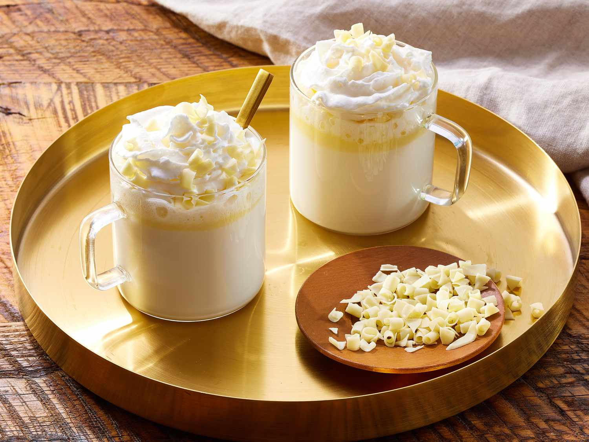

# White Hot Chocolate

*Cream and milk warmed gently with vanilla and a tonka bean, white chocolate stirred in to a pale and creamy pour.*

**Serves:** 2

**Prep Time:** 5 minutes

**Cook Time:** 8 minutes

## Overview
The third in the lineup, and the one most people sleep on: hot chocolate made with white chocolate instead of dark. It's a different drink entirely, neither bitter nor rich-roasted but creamy and floral, the cocoa butter doing the work the cocoa solids do in the others. You start the same way as the dark version, warming milk and a splash of cream gently with a split vanilla pod, but here you also add a grated tonka bean or a wide strip of orange zest to give the drink some character beyond pure cream. Good white chocolate matters: anything labelled "white confectionery" is mostly sugar and vegetable fat and will give you a one-note sweet drink. Real white chocolate (Valrhona Ivoire, Callebaut, or any bar that lists cocoa butter as the first ingredient) melts into something nuanced. Pour into small cups, dust with grated nutmeg, and drink it as dessert in a cup, possibly with a shortbread biscuit on the saucer.

## Ingredients

### Hot chocolate
- 350 ml whole milk
- 150 ml double cream
- 1 vanilla pod (split lengthways, seeds scraped)
- ¼ grated tonka bean (or a wide strip of orange zest, or 1 cardamom pod cracked)
- 120 g good white chocolate (cocoa butter as the first ingredient; finely chopped)
- Pinch of fine salt

### To serve (optional)
- Lightly whipped cream
- Grated nutmeg or tonka bean
- A shortbread biscuit on the saucer

## Method

### Stage 1 - Infuse the dairy
1. Tip the milk and cream into a small saucepan.
1. Split the vanilla pod lengthways, scrape out the seeds with the back of a knife, and add both the seeds and the empty pod to the pan.
1. Add the grated tonka bean (or your alternative aromatic) and the pinch of salt.
1. Warm over medium-low heat for 4 to 5 minutes, until steaming and just trembling at the surface. Don't let it boil.
1. Off the heat, leave to steep for 3 minutes.

### Stage 2 - Melt the white chocolate in
1. Lift out the vanilla pod (rinse and dry for the sugar jar) and the orange zest if you used it.
1. Return the pan to the very lowest heat. White chocolate is more delicate than dark and will split or seize if pushed too hard.
1. Tip in the chopped white chocolate and whisk gently and continuously for 1 to 2 minutes until completely melted and smooth.
1. If the mixture looks at all grainy or split, take the pan off the heat for 30 seconds and whisk hard; it should come back together.

### Stage 3 - Serve
1. Pour into two warmed small cups (this drink, like the dark version, is concentrated and best in small pours).
1. Spoon a small dollop of lightly whipped cream on top if using.
1. Grate over a tiny bit of nutmeg or fresh tonka bean.
1. Serve immediately, ideally with a buttery shortbread biscuit.

## Notes
- **White chocolate is the gatekeeper.** Anything that doesn't list cocoa butter as its first ingredient is white confectionery, not white chocolate, and the drink will be cloyingly sweet and one-note. Spend on the bar; you don't need much.
- **Tonka, orange or cardamom?** Tonka bean is the classic patisserie pairing, a faintly almond-and-vanilla flavour with a long finish. Orange zest pulls the drink toward the citrus-cream end of the spectrum. Cardamom takes it to Iran. All three are good; pick one rather than mixing.
- **Lowest heat once the chocolate goes in.** White chocolate is mostly cocoa butter, and cocoa butter splits if you push it. Patience.
- **Salt does real work here.** White chocolate is so sweet without it that a pinch sharpens the whole drink considerably.

## Variations
- **White hot chocolate with raspberry.** Add a tablespoon of raspberry purée stirred in off the heat for a pink-tinged pour, the white-and-raspberry combination that turns up in patisserie all the time.
- **Caramelised white.** Replace the white chocolate with caramelised "blond" white chocolate (Valrhona Dulcey, or your own home-toasted version) for a deeper, more caramelly drink.
- **Coffee white.** A teaspoon of instant espresso powder stirred in with the chocolate gives a white mocha worth the upgrade.

## Storage
- Drink immediately; the cocoa butter sets fast as the drink cools and the texture loses its silkiness.
- Leftovers refrigerate for 24 hours; rewarm gently over the lowest heat, whisking. Won't be quite as glossy.
- The cooled mixture also works as a white chocolate sauce over ice cream or stirred into hot coffee.
