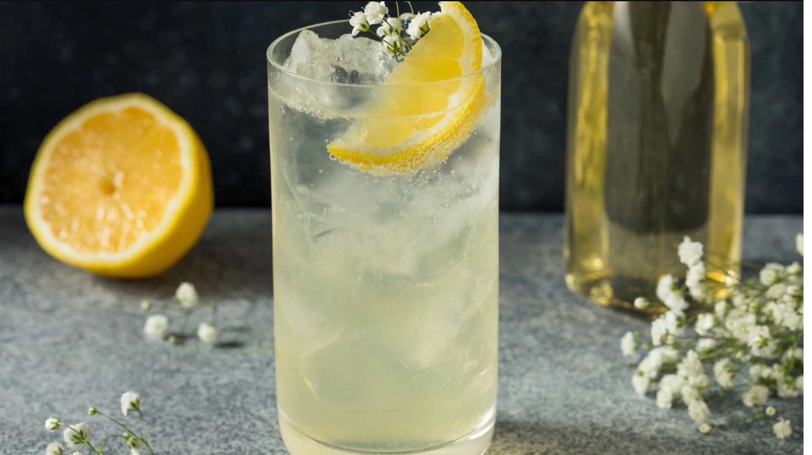

# Cucumber Elderflower Fizz

*A grown-up alcohol-free pour: elderflower cordial, fresh cucumber, lemon, tonic and a sprig of mint, mixed in a tall glass so it looks like the gin and tonic it's pretending to be.*

**Serves:** 2

**Prep Time:** 5 minutes

**Cook Time:** 0 minutes

## Overview
The mocktail you serve to grown-ups who'd rather not drink, designed to read as the same drink as everyone else's gin and tonic so nobody feels singled out at the table. The build is elderflower cordial (homemade or shop-bought, both fine; see the [Elderflower Cordial](../classic/elderflower-cordial.md) recipe if you want to make your own), thin slices of fresh cucumber muddled gently in the glass, a squeeze of lemon, a generous pour of tonic water (use a proper one with quinine bitterness; Fever-Tree, Schweppes Indian Tonic), plenty of ice and a sprig of mint. The cucumber gives the drink its grown-up botanical character; the elderflower brings the sweetness and florality; the tonic carries the dryness that lifts the whole thing from "sweet cordial" to "actual drink". Serve in a balloon-style copa glass if you have one, or any tall tumbler will do.

## Ingredients

### Per glass
- 4 thin cucumber slices (plus 1 longer ribbon for garnish)
- 1 tablespoon fresh lemon juice
- 2 tablespoons elderflower cordial (homemade or shop-bought)
- Plenty of ice cubes (the bigger, the better; large cubes melt slower)
- 150 ml chilled tonic water (good quality, not flat lemonade)

### To serve
- A long ribbon of cucumber (peeled in one strip with a vegetable peeler)
- A fresh mint sprig
- A wedge of lemon

## Method

### Stage 1 - Muddle the cucumber
1. Put 4 cucumber slices and the lemon juice into a tall glass.
1. Press gently with the back of a wooden spoon or muddler to bruise the cucumber and release its watery, herbaceous juices. Don't pulverise; you want fragrance, not pulp.

### Stage 2 - Build
1. Pour in the elderflower cordial; stir briefly to combine with the cucumber juice and lemon.
1. Fill the glass with ice cubes; the more, the better.
1. Top with chilled tonic water, pouring slowly down the side of the glass to preserve the fizz.

### Stage 3 - Garnish
1. Use a vegetable peeler to draw one long ribbon of cucumber from a fresh piece; curl it inside the glass against the ice for the showy look.
1. Slap a fresh mint sprig once between your palms to wake its oils; tuck into the top.
1. Notch a wedge of lemon onto the rim.
1. Serve immediately with a long stirring spoon.

## Notes
- **Use proper tonic.** Quinine bitterness is what makes this taste like a grown-up drink rather than a sweet refresher. Mass-market tonics taste of sugar; the better ones (Fever-Tree, Franklin & Sons, 1724) taste of bitterness and citrus oils.
- **Cucumber muddling, not pulverising.** Bruise gently; if you mash the cucumber the drink becomes pulpy and grassy.
- **Lemon balances the sweetness.** Without it the elderflower can read cloying; the lemon and the tonic's bitterness keep the sweetness in check.
- **Ribbon-cut cucumber for the photo.** A long peeled strip curled inside the glass is the look. Eat it after the drink.

## Variations
- **Cucumber gin and tonic.** Add 30 ml of dry gin per glass (Tanqueray, Hendrick's). The drink it was designed to look like.
- **Strawberry-elderflower.** Muddle 3 sliced strawberries with the cucumber; pink and a touch sweeter.
- **Rose-elderflower.** Replace the cucumber with 2 teaspoons of rose water and add a few rose petals; turns floral and feminine.

## Storage
- Drink immediately; the tonic goes flat within 10 minutes and the cucumber wilts.
- The pre-mix of elderflower cordial, lemon juice and muddled cucumber holds in a sealed jar in the fridge for 24 hours; top with ice and tonic at serving time.
