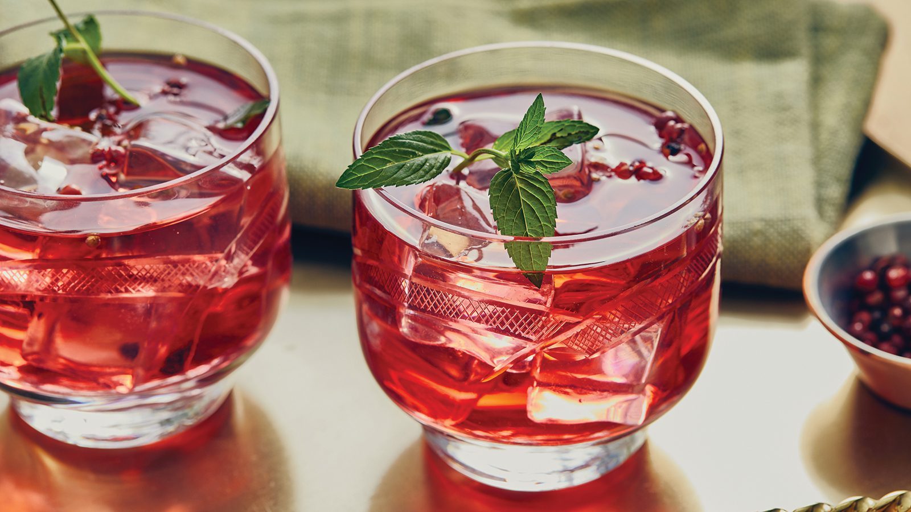

<!-- TODO: hero image undersized, refresh from Pexels or hand-curate -->
# Pomegranate Spritzer

*Pomegranate juice and lime over ice, topped with sparkling water and a scatter of jewel-red pomegranate seeds: a mocktail that looks like a cocktail and works on a holiday table.*

**Serves:** 2

**Prep Time:** 5 minutes

**Cook Time:** 0 minutes

## Overview
A pomegranate spritzer is the sober drink that looks the most like it belongs at a wedding: deep ruby in the glass, fresh pomegranate seeds floating up through the bubbles, a wedge of lime hooked on the rim. The trick to keeping it from being too sweet is to use real pomegranate juice (look for 100% juice; the "pomegranate cocktail" stuff on the supermarket shelf is mostly apple juice with colour) and to lean hard on the lime. A spoonful of honey or simple syrup is optional; pomegranate is naturally sharp enough that most palates don't need it. Sparkling water is the right topper rather than tonic (tonic's quinine doesn't pair as well with pomegranate as it does with cucumber or grapefruit). Pour into a tall glass over plenty of ice, scatter fresh seeds across the top for the jewel look, and you have a drink that doesn't feel like a downgrade.

## Ingredients

### Per glass
- 60 ml pure pomegranate juice (100% juice; not pomegranate cocktail)
- 1 tablespoon fresh lime juice
- 1 teaspoon honey or simple syrup (optional)
- 1 small sprig fresh rosemary or 4 mint leaves (optional, for the herbal note)
- Plenty of ice cubes
- 150 ml chilled sparkling water

### To serve
- 2 tablespoons fresh pomegranate seeds
- A wedge of lime
- A fresh rosemary sprig or mint sprig

## Method

### Stage 1 - Build the base
1. Pour the pomegranate juice and lime juice into a tall glass.
1. Add the honey or syrup if using; stir briefly to dissolve.
1. Slap the rosemary or mint between your palms once to wake the oils; drop into the glass.

### Stage 2 - Top and garnish
1. Fill the glass with ice cubes to the brim.
1. Top with chilled sparkling water, pouring slowly down the side to keep the fizz.
1. Scatter a generous tablespoon of fresh pomegranate seeds across the surface; they'll sink and rise as the bubbles release.

### Stage 3 - Serve
1. Notch a wedge of lime onto the rim of each glass.
1. Add a fresh sprig of rosemary or mint tucked into the ice.
1. Serve immediately with a long stirring spoon for the obligatory first stir.

## Notes
- **Real pomegranate juice is the gatekeeper.** The bottled "pomegranate juice cocktail" stuff is mostly apple juice with colour and sugar; the proper 100% pomegranate juice has the right tart-sweet edge.
- **Fresh seeds are the visual.** A drink with pomegranate seeds rising through the bubbles looks far more interesting than one without; spoon them out of a fresh fruit (hold a halved pomegranate cut-side down over a bowl and whack the back with a wooden spoon).
- **Rosemary or mint, not both.** Rosemary tilts the drink toward a savoury-cocktail register; mint keeps it lighter and more refreshing. Both are good; pick one.

## Variations
- **Pomegranate and ginger.** Use chilled ginger ale or homemade [Ginger Beer](../classic/ginger-beer.md) in place of sparkling water; warming and a bit more festive.
- **Pomegranate spritz.** Add 60 ml of chilled non-alcoholic sparkling wine (or proper Prosecco for a boozy version); turns it into a proper aperitivo.
- **Pomegranate and grapefruit.** Use 30 ml pink grapefruit juice with the pomegranate; sharper and more grown-up.

## Storage
- Drink immediately; the sparkling water goes flat within 10 minutes.
- The pre-mix of pomegranate juice, lime and honey holds in a sealed jar in the fridge for 3 days; top with ice and sparkling water at serving time.
- Pomegranate seeds keep in a sealed container in the fridge for 5 days; freeze for 3 months in a single layer on a tray.
