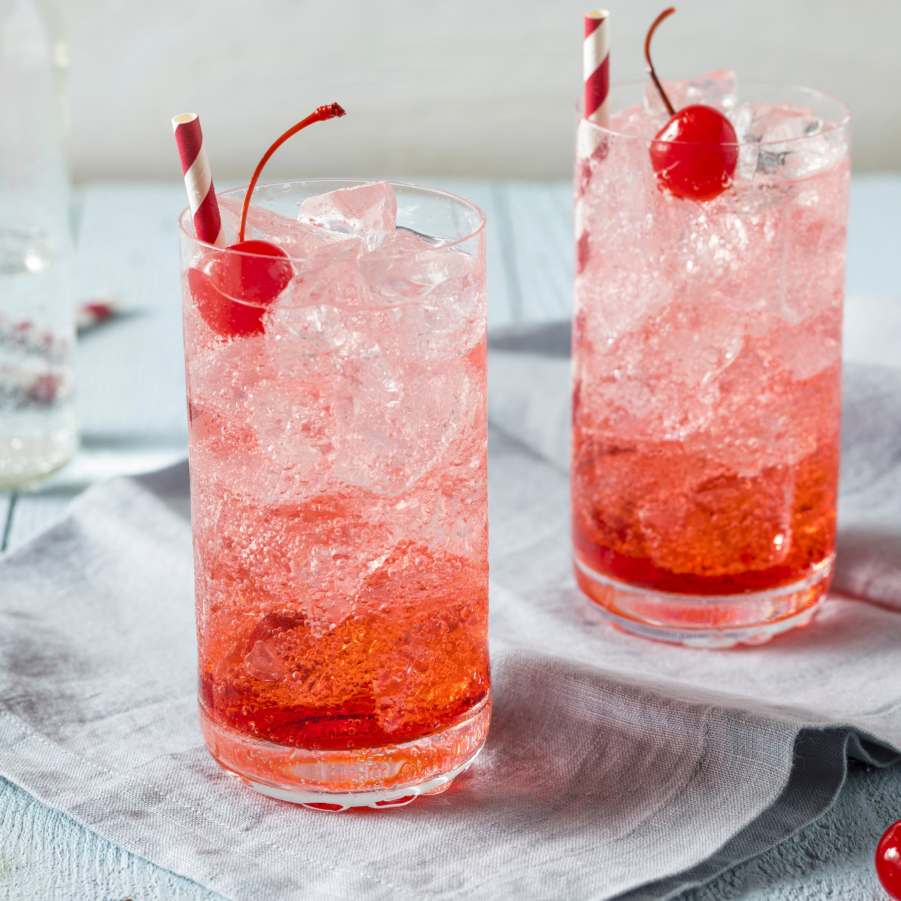

# Shirley Temple

*Ginger ale, a splash of grenadine, a wedge of lime and a maraschino cherry on the toothpick: the mocktail named for a child film star and ordered by every kid at the bar.*

**Serves:** 2

**Prep Time:** 3 minutes

**Cook Time:** 0 minutes

## Overview
Invented for Shirley Temple at the Brown Derby in Hollywood in the 1930s, when the child actor wanted something more festive than orange juice at the bar, and now the universal "kid at a wedding" drink. The original is the simplest possible build: cold ginger ale poured over ice, a generous splash of grenadine sinking through it to make a sunset gradient, a wedge of lime and a maraschino cherry on a cocktail stick. Some bars add a squeeze of fresh lime to cut through the sweetness; the grenadine should be the real stuff (pomegranate-based, not just red sugar syrup) for the drink to taste of anything beyond fizz. Sugar level depends entirely on whether your ginger ale is the sweet kind (Schweppes, Canada Dry) or the dry adult kind (Fever-Tree). Both work. Serve in a tall glass with a paper straw and the cherry on a stick balanced across the rim.

## Ingredients

### Per glass
- 200 ml cold ginger ale (sweet or dry; both work)
- 1 tablespoon grenadine (proper pomegranate-based, not coloured syrup)
- 1 teaspoon fresh lime juice (optional; for the slightly more grown-up version)
- Plenty of ice cubes

### To serve
- A maraschino cherry on a cocktail stick
- A wedge of lime
- A paper straw

## Method

### Stage 1 - Build
1. Fill two tall glasses with ice cubes (more ice slows the dilution; aim for the rim).
1. Pour 200 ml of cold ginger ale over the ice in each glass.
1. Add the lime juice if using; stir very briefly with a long spoon.

### Stage 2 - Pour the grenadine
1. Hold the spoon upside down just above the surface of the drink with the rounded back touching the ice.
1. Slowly pour the grenadine over the back of the spoon; it will sink straight through the ginger ale and pool at the bottom, creating the signature sunset gradient.
1. For the gradient to last, don't stir; serve immediately. For a uniform pink drink, give one quick stir before garnishing.

### Stage 3 - Garnish
1. Notch a lime wedge onto the rim of each glass.
1. Balance a maraschino cherry on a cocktail stick across the top of the glass; alternatively drop the cherry into the drink with the stick poking out.
1. Add a paper straw if serving to children; serve immediately.

## Notes
- **Real grenadine, not red syrup.** Proper pomegranate grenadine has a bittersweet edge that holds up to the sugar of the ginger ale; bottom-shelf red syrup is just sweetness on sweetness. Either look for a pomegranate-based brand or make your own (1:1 pomegranate juice and sugar simmered for 5 minutes, cooled).
- **Grenadine sinks, so layer don't stir.** The sunset gradient is the visual signature of the drink. One quick stir at the table mixes the lot to pink.
- **Maraschino cherry is non-negotiable.** Without the cherry it's just pink ginger ale. With the cherry it's a Shirley Temple.

## Variations
- **Dirty Shirley.** Add 30 ml of vodka per glass; the alcoholic version was apparently Shirley Temple's own teenage adaptation when she got old enough.
- **Roy Rogers.** Swap the ginger ale for cola; equally classic, also a 1930s invention.
- **Sparkling lemonade version.** Use chilled lemon-lime soda or sparkling lemonade in place of the ginger ale; sharper, less rooty.

## Storage
- Drink immediately; the ginger ale goes flat in 10 minutes and the grenadine mixes in.
- Don't make ahead; the gradient is the whole point.
