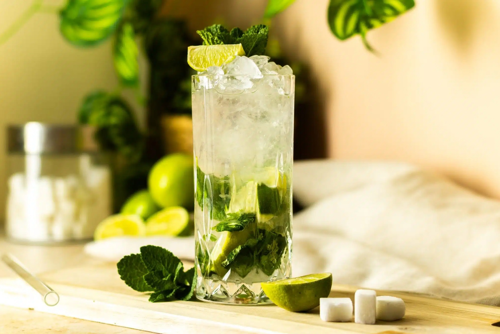

# Virgin Mojito

*A Cuban mojito with the rum pulled out: muddled mint and lime, sugar syrup, soda water over crushed ice, the kind of drink that earns the word "refreshing".*

**Serves:** 2

**Prep Time:** 5 minutes

**Cook Time:** 0 minutes

## Overview
A virgin mojito is a real drink in its own right, not a sad cocktail with the alcohol removed. You muddle fresh mint and lime wedges hard in the bottom of a tall glass with a teaspoon of caster sugar (or a splash of simple syrup), which bruises the mint enough to release its oils without shredding it. Then you fill the glass with crushed ice (cubed works but crushed is the proper version, slowing the dilution while keeping the drink properly cold), top with soda water, and stir from the bottom to lift the sugar back through. The mint and lime do all the heavy lifting; getting them fresh is the only thing that matters. Garnish with a fat sprig of mint slapped against your palm first to wake it up, and a wedge of lime hooked onto the rim.

## Ingredients

### Per glass
- 8 fresh mint leaves (plus a fat sprig for garnish)
- ½ lime (cut into 4 wedges)
- 1 teaspoon caster sugar (or 1 tablespoon simple syrup; see [Lemonade](../classic/lemonade.md))
- Crushed ice (a small mountain per glass)
- 180 ml soda water (chilled)

### To serve
- A fat sprig of mint per glass
- A lime wedge

## Method

### Stage 1 - Muddle
1. Put the mint leaves, lime wedges and sugar (or syrup) into a tall sturdy glass.
1. Press down with a muddler or the end of a wooden spoon and twist, lightly bruising the mint and pressing some juice out of the lime.
1. Don't pulverise; you want the mint torn enough to release its oils but not shredded into the drink.

### Stage 2 - Build
1. Fill the glass to the brim with crushed ice.
1. Top with cold soda water (about 180 ml).
1. Stir from the bottom upwards with a long spoon to lift the sugar through the drink; the mint will rise too, which is what you want.

### Stage 3 - Garnish and serve
1. Slap the fat mint sprig once between your palms to release its oils; tuck into the top of the ice.
1. Notch a lime wedge onto the rim of the glass.
1. Serve immediately with a straw if you like.

## Notes
- **Crushed ice for chill.** Crushed ice packs tightly in the glass and chills the drink down fast (it does melt sooner than a big cube, but the dish wants to be very cold quickly). Wrap cubes in a tea towel and bash with a rolling pin if you don't have a crusher.
- **Slap the mint, don't tear it.** Slapping it between your palms wakes the volatile oils; tearing or chopping bruises the leaves so they go dark and slimy in the glass.
- **Fresh mint is non-negotiable.** Dried doesn't work; tired refrigerator mint barely works. Buy a bunch the day of.
- **Adjust the sugar.** Some limes are sharper than others; taste before topping with soda and add a touch more sugar if needed.

## Variations
- **Virgin raspberry mojito.** Muddle 4 fresh raspberries with the mint and lime; the drink turns pale pink and gains a berry note.
- **Virgin cucumber mojito.** Add 4 thin cucumber rounds with the mint; cooling and slightly grassy. Drop the sugar to ¾ teaspoon.
- **Virgin ginger mojito.** Replace the soda water with cold homemade [Ginger Beer](../classic/ginger-beer.md); turns it into a non-alcoholic Dark and Stormy crossover.

## Storage
- Drink immediately; the soda goes flat in 10 minutes.
- Don't make ahead; mint discolours and lime juice oxidises within an hour of muddling.
- Pre-mix the mint, lime and sugar in the glasses up to an hour ahead if you're entertaining; top with ice and soda at the moment of serving.
