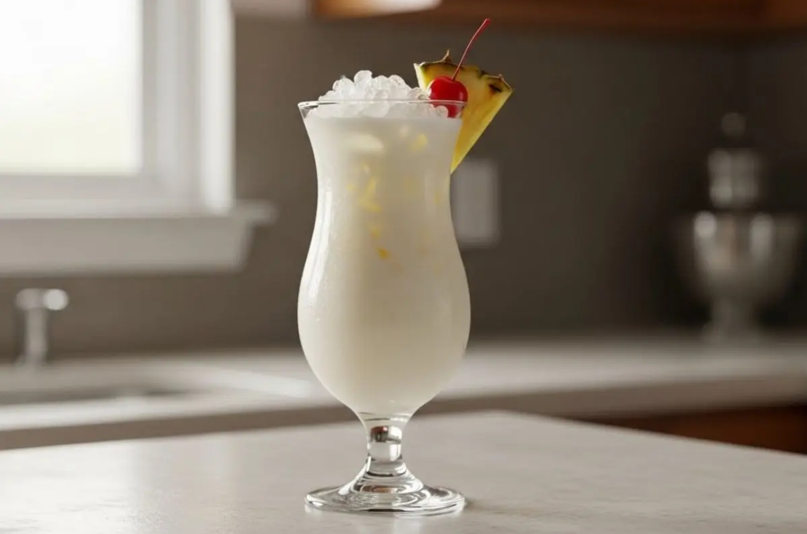

# Virgin Piña Colada

*Pineapple and coconut blended thick over ice, finished with a wedge of pineapple on the rim and a paper umbrella: the Puerto Rican classic with the rum left out.*

**Serves:** 2

**Prep Time:** 5 minutes

**Cook Time:** 0 minutes

## Overview
The piña colada was invented at the Caribe Hilton in San Juan in 1954, and the alcohol-free version of it carries the same DNA: pineapple, coconut, and a blender with too much ice. The trick to a good one is the coconut: cream of coconut (the sweetened thick stuff, Coco Lopez or similar) is the traditional ingredient and is what gives the drink its frosty, snow-cone-like body, but a mix of full-fat tinned coconut milk and a tablespoon of sugar makes a perfectly good less-sweet alternative if you can't find cream of coconut. Frozen pineapple chunks beat ice for the bulk because they thicken without diluting, the way frozen banana does for a smoothie. The result should be thick enough that the straw stands up, properly cold, properly sweet, and proudly absurd in a tall hurricane glass. A wedge of fresh pineapple on the rim and a maraschino cherry on a stick are the right amount of theatre.

## Ingredients

### Drink
- 300 g frozen pineapple chunks
- 100 ml cream of coconut (Coco Lopez or similar; or 100 ml full-fat tinned coconut milk + 1 tablespoon sugar)
- 100 ml pineapple juice (from a carton is fine)
- 50 ml coconut milk (drinking-style or the watery layer of a tinned coconut; for the right viscosity)
- 1 tablespoon fresh lime juice
- 6 ice cubes (skip if using more frozen pineapple)

### To serve
- 2 wedges of fresh pineapple (rind on, for the rim)
- 2 maraschino cherries on cocktail sticks
- A paper umbrella per glass (optional, traditional)

## Method

### Stage 1 - Blend
1. Tip the cream of coconut, pineapple juice, coconut milk and lime juice into the blender (liquids first).
1. Add the frozen pineapple and the ice cubes if using.
1. Blend on low for 5 seconds to break the frozen fruit, then high for 45 to 60 seconds until smooth and thick.

### Stage 2 - Adjust
1. The drink should be thick like a smoothie or a thin milkshake; if it's too liquid, add more frozen pineapple (50 g at a time) and blitz again.
1. If it's too thick to pour, add a tablespoon of pineapple juice or coconut milk.
1. Taste; some pineapples are sharper than others. Add a teaspoon of sugar if needed; a squeeze more lime if too sweet.

### Stage 3 - Serve
1. Pour into two tall hurricane glasses or tall tumblers.
1. Notch a wedge of pineapple onto each rim; perch a maraschino cherry on a stick on the rim too.
1. Add a paper umbrella; serve with a wide straw because thinner straws clog.

## Notes
- **Cream of coconut vs coconut milk.** Cream of coconut is heavily sweetened and gives the proper piña colada texture; if you can't find it, full-fat tinned coconut milk with a tablespoon of sugar works. Don't substitute the cartoned drinking-style coconut milk for both; it's mostly water.
- **Frozen pineapple is the thickener.** Fresh ripe pineapple plus ice works, but the drink will be more diluted. Frozen pineapple from the freezer aisle is genuinely good for this.
- **Drink in five minutes flat.** A piña colada that sits melts into something thin and sweet; the texture only works frosted.

## Variations
- **Strawberry colada.** Add 200 g frozen strawberries to the blender; turns the drink pink and balances some of the coconut sweetness.
- **Mango colada.** Swap half the pineapple for frozen mango; richer and more tropical.
- **Boozy.** Add 100 ml of white rum for two glasses (50 ml per drink); the original recipe.

## Storage
- Drink immediately; the texture goes within 15 minutes.
- Pour leftovers into ice-pop moulds for 2 months as colada lollies (the boozy version doesn't freeze well; the virgin one does).
- Don't refrigerate overnight; the coconut milk solidifies and the texture turns weird.
