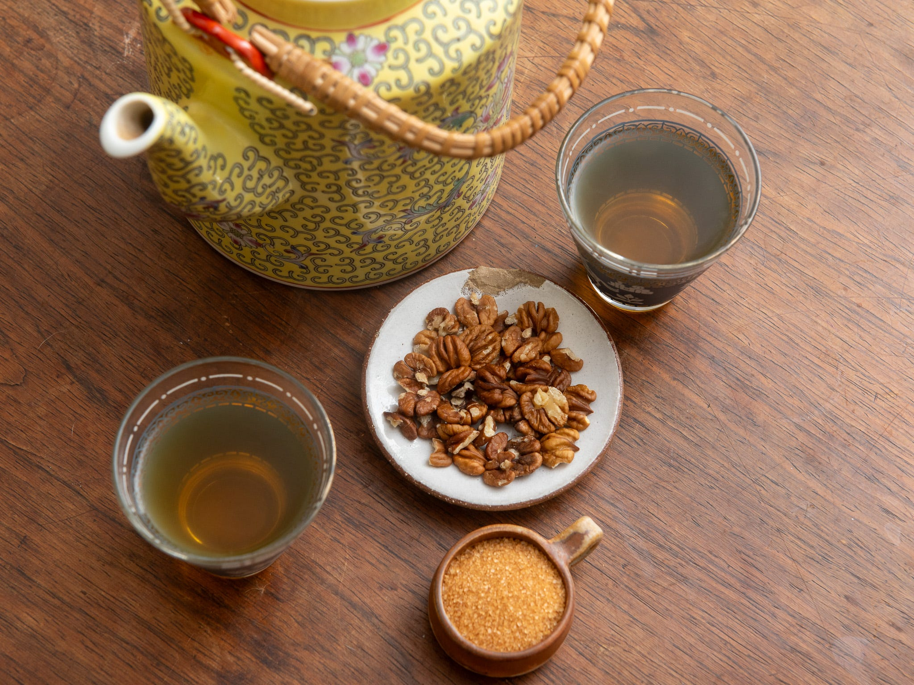

# Chai Sabz

*The Afghan green tea: cardamom-scented, lightly sweetened, poured from a battered teapot at every gathering from breakfast to last thing at night.*

**Serves:** 4

**Prep Time:** 2 minutes

**Cook Time:** 8 minutes

## Overview
Green tea is the everyday Afghan drink, served in small handleless glasses with a saucer of sugar cubes or rock candy on the side. You bring water to a boil, drop in good loose-leaf green tea (jasmine or plain), bash a few green cardamom pods and add them along with a touch of sugar, then let it simmer briefly before pouring. The result is pale gold, faintly aromatic, gentle enough to drink five cups of in an afternoon without thinking about it. Sweetened to taste at the glass; the proper Afghan way is to hold a sugar cube between your teeth and sip the tea through it.

## Ingredients

### Per pot
- 700 ml cold water
- 2 tablespoons loose-leaf green tea (jasmine or Chinese gunpowder)
- 4 green cardamom pods (lightly crushed)
- 1 tablespoon sugar (optional; or serve sugar cubes at the table)

### To serve
- Small handleless tea glasses
- A saucer of sugar cubes or rock candy

## Method

### Stage 1 - Brew
1. Bring the water to a rolling boil in a saucepan.
1. Add the green tea, crushed cardamom pods and sugar (if using).
1. Reduce heat to low; simmer gently for 4 to 5 minutes. The water should turn pale gold, never dark amber.

### Stage 2 - Serve
1. Strain through a fine sieve into a warmed teapot, then pour into small glasses.
1. Serve with sugar cubes alongside so each drinker can sweeten to taste.

## Notes
- **Green tea, not black.** Afghan chai sabz is specifically the green-tea pour; the black equivalent (chai siyah) is a separate drink.
- **Don't over-brew.** Five minutes maximum, or the tea turns bitter and tannic.
- **Cardamom is non-negotiable.** It's what makes this an Afghan drink rather than a generic green tea.

## Storage
- Drink within an hour of brewing; the tea oxidises and goes dull after that. The cardamom-and-sugar dry mix keeps in a jar indefinitely for a fast next pot.
