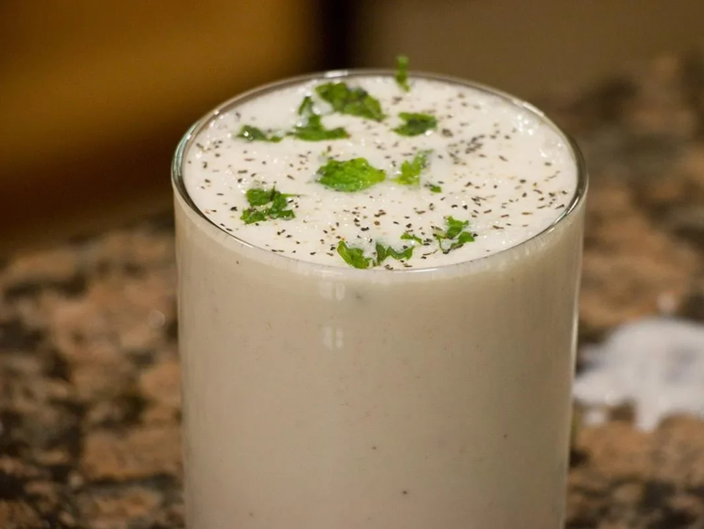

# Doogh

*Afghan yogurt drink: thick plain yogurt thinned with cold water, salted, sharpened with dried mint, drunk alongside kabuli pulao on the hottest afternoons.*

**Serves:** 4

**Prep Time:** 5 minutes

**Cook Time:** 0 minutes

## Overview
Doogh is the savoury yogurt drink that does for an Afghan plate what ayran does for Turkish kebabs: cuts the fat, cools the spice, settles the meal. The build is full-fat yogurt thinned with cold water, salted properly, sharpened with dried mint and (in many households) a pinch of fresh chopped mint plus a sprinkle of sumac on top. Some serve it carbonated by using sparkling water instead of still; both are correct. Drink it with kabuli pulao, with mantu, with anything heavy.

## Ingredients

### Per jug (4 glasses)
- 500 g thick full-fat plain yogurt
- 500 ml very cold water (still or sparkling)
- 1 teaspoon fine salt
- 1 teaspoon dried mint
- 1 tablespoon chopped fresh mint
- Pinch of dried sumac (optional, for the top)

### To serve
- Tall glasses
- Ice cubes
- Fresh mint sprigs

## Method

### Stage 1 - Blend
1. Tip the yogurt, water, salt, dried mint and fresh mint into a blender (or a deep jug, whisking by hand).
1. Blend or whisk hard for 30 to 45 seconds until smooth and frothy.

### Stage 2 - Serve
1. Pour over ice into tall glasses.
1. Sprinkle a small pinch of sumac across the foam; tuck a sprig of fresh mint into each glass.
1. Serve immediately, alongside something hot and spicy.

## Notes
- **Salty enough to taste savoury.** Westerners often under-salt; doogh is meant to taste properly seasoned, not bland.
- **Dried mint and fresh mint together.** Dried gives the woody backbone, fresh the cooling top note. Both, not either.
- **Sparkling water is acceptable.** Many Afghan houses use carbonated water for a fizzier doogh; both still and sparkling are traditional.

## Storage
- Refrigerate up to 24 hours in a sealed jug; whisk to re-froth before serving. Don't freeze.
