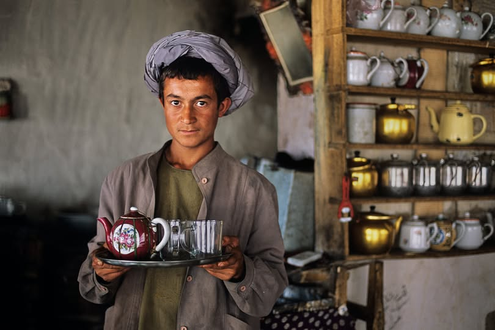

# Drinks of Afghanistan

Sheer chai (the pink salted milk tea with cardamom and pistachio), kahwa (green tea with cloves and saffron), and doogh (the salted yogurt-mint drink) at every meal. Strong, sweet, spiced. Pomegranate juice from the markets of Kabul rounds out the warm-weather pours.
