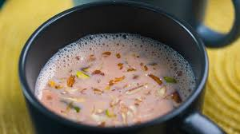

# Shir Chai

*The Afghan pink salted tea: green tea simmered with milk and a pinch of bicarbonate of soda that turns the brew rose-pink, served at breakfast with naan and dried fruit.*

**Serves:** 4

**Prep Time:** 5 minutes

**Cook Time:** 15 minutes

## Overview
Shir chai (also called noon chai in Pakistan and Kashmir) is the most distinctive tea in central Asian kitchens: green tea is simmered hard in water with a pinch of bicarbonate of soda, then "shocked" with cold water and aerated by ladling repeatedly until it turns a deep rose-pink. Milk goes in next, with salt rather than sugar in the Afghan tradition, and a pinch of crushed cardamom. The result is creamy, faintly mineral, salty in the way some Tibetan butter teas are, and the breakfast drink of Kabul and the Hindu Kush valleys. Often served alongside dried fruit and naan; chopped pistachios float on top for the dressed-up version.

## Ingredients

### Per pot
- 700 ml cold water
- 2 tablespoons loose-leaf green tea (Chinese gunpowder works well)
- ¼ teaspoon bicarbonate of soda (the colour reaction depends on this)
- 200 ml cold water (for the colour shock)
- 500 ml whole milk
- 1 teaspoon fine salt
- 4 green cardamom pods (lightly crushed, seeds only)

### To serve
- 2 tablespoons chopped pistachios (optional)
- A sprinkle of crushed almonds

## Method

### Stage 1 - Boil hard with bicarb
1. Bring the 700 ml of water to a rolling boil in a heavy saucepan.
1. Add the green tea and bicarbonate of soda; reduce to medium heat and simmer for 10 minutes. The water will turn deep red-brown.

### Stage 2 - The colour shock
1. Add the 200 ml of cold water; bring back to a simmer.
1. Use a ladle to lift the tea high and pour it back into the pan repeatedly for 2 to 3 minutes. The aeration develops the pink colour; you'll see it shift from red-brown to a deep rose.

### Stage 3 - Add milk
1. Pour in the milk, add the salt and crushed cardamom seeds.
1. Bring back to a simmer for 3 to 4 minutes; the tea should turn a pale rose-pink as the milk goes in.

### Stage 4 - Serve
1. Strain into small cups or glasses.
1. Top with a scatter of chopped pistachios or almonds.
1. Serve immediately, ideally alongside breakfast naan.

## Notes
- **Bicarb is the colour reagent.** Without it the tea stays brown. The chemistry: alkaline conditions plus oxygenation through the lift-and-pour stage produce the rose-pink shade.
- **Lift-and-pour is non-negotiable.** This is the step westerners skip and end up with brown tea. Two to three minutes of aeration with the ladle does it.
- **Salt, not sugar (Afghan).** Pakistani noon chai is also salted; only the Kashmiri version sometimes goes sweet.

## Storage
- Drink immediately; once cold the tea separates and the colour fades.
