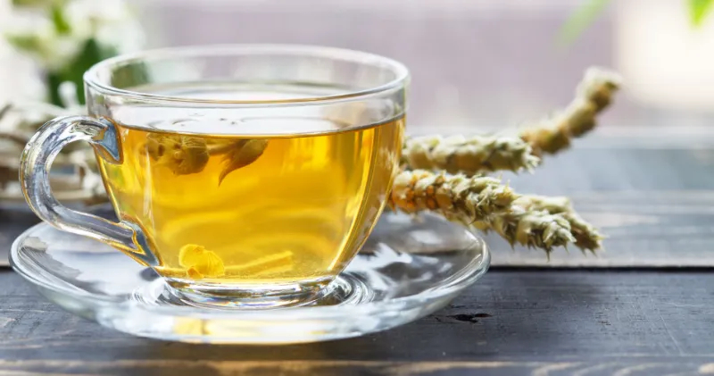

# Çaj Mali

*Albanian mountain tea: dried sideritis flowers gathered from the highland slopes, steeped in just-off-the-boil water to a pale honey-yellow brew. The digestive evening cup of every Albanian household and the home remedy for every winter cough.*

**Serves:** 2 cups

**Prep Time:** 2 minutes

**Cook Time:** 8 minutes

## Overview
Çaj mali (literally "mountain tea") is the Albanian infusion of sideritis, the pale silver-leaved wild herb that grows on the rocky slopes of the northern Alps, the Tomorr massif and the southern highlands above Përmet. Harvested in midsummer, dried in bunches hanging from kitchen rafters, and stored in linen bags through the year, the dried flower-and-stem mix gives a clear honey-yellow infusion with a faintly resinous, slightly sweet flavour, somewhere between camomile and dried straw. The cup goes down after dinner as the digestive of choice and is the Albanian grandmother's answer to every winter cold, sore throat or upset stomach. Honey and a slice of lemon go in by preference; the cup is held with both hands while the steam rises. Drink slow in the evening.

## Ingredients

- 3 g dried sideritis (about 2 sprigs or 1 heaped tablespoon dried flowers and stems)
- 500 ml just-off-the-boil water (95°C)
- 1-2 tsp honey, to taste
- 2 thin slices lemon
- Optional: 1 small cinnamon stick
- Optional: 2 cloves

## Method

### Stage 1 - Bring the water just off the boil
1. Bring 500 ml of fresh cold water to a boil in a kettle.
2. Turn off the heat; let it sit for 30 seconds (so the water drops to about 95°C; boiling water scorches the herb).

### Stage 2 - Steep
1. Place the dried sideritis in a teapot (with a strainer) or directly in a heatproof jug.
2. Pour the hot water over.
3. Cover the teapot with a lid (the steam carries the aromatic oils, do not let it escape).
4. Steep for 6-8 minutes; the brew turns pale honey-yellow.

### Stage 3 - Sweeten and serve
1. Strain into two cups.
2. Add 1/2 to 1 teaspoon honey to each cup; stir to dissolve.
3. Float a thin slice of lemon on top of each.
4. Drink hot.

## Notes
- **The herb:** Sideritis syriaca or Sideritis raeseri are the Albanian and Balkan species. The dried mix should smell faintly resinous and herbal, not musty.
- **Water temperature:** Just off the boil, not boiling. Boiling water turns the brew bitter.
- **The steep time:** 6-8 minutes is right. Longer steeping draws out tannins and goes bitter.

## Variations
- **With cinnamon and clove:** Add 1 small cinnamon stick and 2 cloves for a winter version.
- **With sage:** Add 2 fresh sage leaves to the steep for an extra herbal note.
- **With rosehip:** Combine equal parts sideritis and dried rosehip for a vitamin-C-rich version.
- **Cold-brew version:** Steep 5 g sideritis in 1 litre cold water for 8 hours in the fridge; serve over ice with mint.
- **With ginger:** Add 3 thin slices fresh ginger for a winter sore-throat brew.

## Serving
As the digestive after dinner · in the evening before bed · for a winter cold with extra honey and lemon · with bakllava or trileçe · cold from the fridge in summer · as the everyday afternoon cup of an Albanian household.

## Storage
- Dried sideritis keeps 2 years in an airtight tin in a cool dark place.
- Brewed tea should be drunk fresh; the flavour fades within 2 hours.
- Cold-brew keeps 2 days refrigerated.
