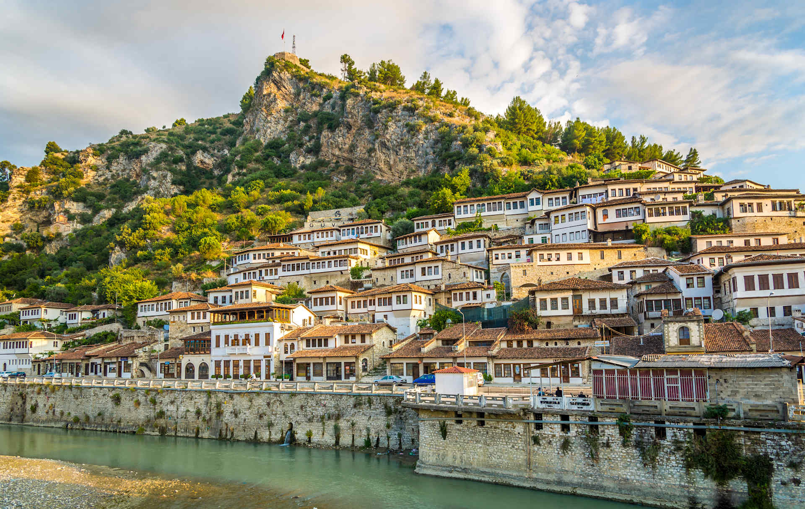

# Albanian Drinks

Albania's drinks track its mountains, its Ottoman past and its rural rhythm of work and rest. Raki, the clear grape brandy distilled in the country's villages from late-summer pomace, is the morning shot poured for guests at the door and the welcome glass at every wedding; the proper raki is served slightly chilled and matched with a sliver of cheese, never sipped on its own. Çaj mali (mountain tea) is the pale-yellow infusion of dried sideritis flowers gathered in the highlands of the north and the south, drunk hot in the evening as a digestive and the home remedy for every winter cold. Boza, the warm-weather Tirana street drink of fermented millet, is shared with the wider Balkan tradition, served in tall glasses from kerbside carts with a dusting of cinnamon on top. And after the small dark Albanian coffee comes the glass of cold water, the slow Mediterranean pause that closes every drink and starts every conversation.
