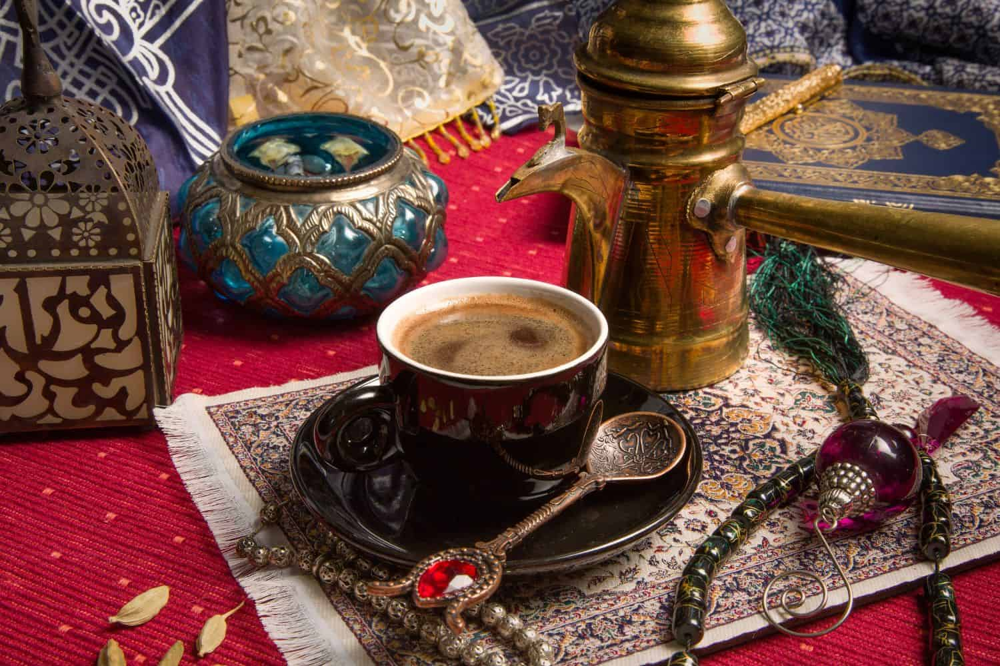

# Algerian Qahwa

*Strong cardamom-spiced black coffee, brewed long and slow in a brass pot and poured into small cups; the close to every heavy Algerian meal.*

**Serves:** 4

**Prep Time:** 5 minutes

**Cook Time:** 10 minutes

## Overview
Qahwa is the strong Arabic-style coffee of Algeria, drunk in small cups after meals, at family visits, and through Ramadan nights when the household is awake until sahur. It is made in a long-handled brass pot called a tassa or rakwa, with very finely ground coffee (much finer than espresso), water and a generous pinch of cardamom; sometimes a little sugar is added in the pot, sometimes served on the side. The brew is brought slowly to a foam three times, never to a full boil, which builds the layer of fawn-coloured "wesh" (face) that every host wants on the top of the cup. A glass of cold water is served alongside, to be sipped before the coffee so the palate is fresh. In rural Algeria the qahwa is sometimes scented with cloves or orange-blossom water; in Algiers cardamom is the only spice. The grounds settle in the bottom; the cup is drained but not finished.

## Ingredients

- 4 small cups water (about 200 ml total)
- 4 heaped tsp very finely ground coffee (Arabic-grind, finer than espresso)
- 4 green cardamom pods, lightly crushed (or 0.5 tsp ground cardamom)
- 2 tsp sugar (optional; some prefer it black)
- 1 clove (optional, more common in the south)

## Method

### Stage 1 - First brew
1. Pour the water into a small brass tassa or a small saucepan.
1. Add the cardamom pods, clove if using and sugar if using.
1. Bring to a near-boil over medium heat, watching closely. As soon as the surface trembles, take off the heat.

### Stage 2 - Add the coffee
1. Sprinkle the ground coffee over the surface; do not stir.
1. Return to the heat over a low flame.
1. After about 30 seconds, a foam rises; the moment it threatens to overflow, lift the pot off the heat.
1. Let it settle 10 seconds, return to the heat; let it rise again.
1. Repeat once more for a third rise. This is the rhythm; three rises is right.

### Stage 3 - Rest and pour
1. Take the pot off the heat; let it sit 30 seconds for the grounds to settle.
1. Spoon a small amount of foam ("wesh") into each cup first.
1. Pour the coffee slowly into the cups, holding back the grounds with the spout.

### Stage 4 - Serve
1. Serve immediately with a glass of cold water alongside.
1. Drink in small sips; do not stir up the grounds at the bottom.

## Notes
- **The grind.** Arabic-grind coffee is very fine, powdery, almost like flour. A standard espresso grind is too coarse. Look for "Arabic" or "Turkish" labelled coffee.
- **Three rises, not a boil.** Boiling the coffee is the cardinal sin; it kills the aroma and the foam. Three rises off and on the heat is right.
- **Cardamom always.** Algerian qahwa without cardamom is unrecognisable. Crush the pods just before brewing for the brightest perfume.

## Serving
- Serve at the end of a heavy meal (a couscous Friday, an Aid lunch, a wedding feast), or to a guest at any hour of a Ramadan night. A small dish of dates or makroud alongside. The cold water glass is sipped first, then the coffee.

## Storage
- Drink immediately; qahwa does not store
- Whole green cardamom pods keep 6 months in a sealed jar at room temperature
- Pre-ground Arabic coffee loses aroma fast; buy in small amounts and keep airtight

