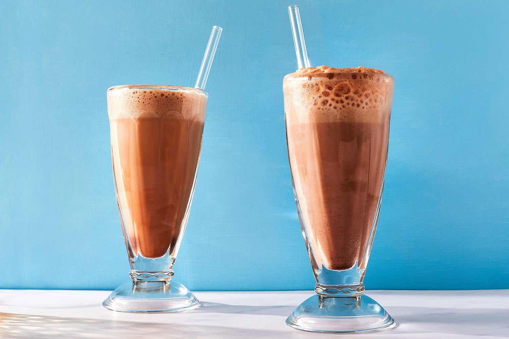

# Egg Cream

*The New York soda-fountain classic that contains neither egg nor cream: cold milk, chocolate syrup, and seltzer poured aggressively for the white foamy head.*

**Serves:** 1

**Prep Time:** 2 minutes

**Cook Time:** 0 minutes

## Overview
The egg cream is the great Brooklyn working-class drink, ordered from soda-fountain counters since the 1880s and named for nobody's clear reason (the leading theories: the foam looks like egg whites; the original recipe used eggs in the syrup; the name is a corruption of the Yiddish "echt creme"). The build is three things: cold whole milk poured first, U-Bet chocolate syrup spooned in second, seltzer (carbonated water) sprayed in hard last. The aggressive seltzer pour froths up the chocolate and milk into a thick white head that earns the "cream" half of the name. Pure New York, served in a tall heavy glass with a paper straw.

## Ingredients

### Per glass
- 60 ml cold whole milk
- 2 tablespoons chocolate syrup (Fox's U-Bet is the traditional NY choice; Hershey's works)
- 150 ml chilled seltzer water (proper soda water from a siphon if you have one)

### To serve
- A paper straw
- A tall heavy glass

## Method

### Stage 1 - Layer
1. Pour the cold milk into a tall glass.
1. Add the chocolate syrup; do not stir yet.

### Stage 2 - Spray the seltzer
1. Hold the seltzer bottle (or siphon) just above the glass.
1. Spray it in aggressively, aiming at the back of a spoon held just above the milk and syrup; the spray hits the spoon, breaks into bubbles, and foams up the chocolate.
1. Stir once briskly with the long spoon as the foam rises to the rim.

### Stage 3 - Serve
1. Top with a paper straw.
1. Drink immediately while the foam is standing.

## Notes
- **U-Bet syrup if you can find it.** Brooklyn's Fox's U-Bet chocolate syrup is the traditional brand; the recipe has been the same since 1900. Hershey's is the everyday substitute.
- **Cold milk, cold seltzer.** Both ingredients have to be properly cold or the foam falls flat. Refrigerate everything ahead.
- **Aggressive pour is the whole point.** A gentle pour gives a flat milky drink; the aggressive seltzer is what creates the foam.

## Storage
- Drink immediately; the foam settles in 90 seconds, the seltzer goes flat in 5 minutes.
