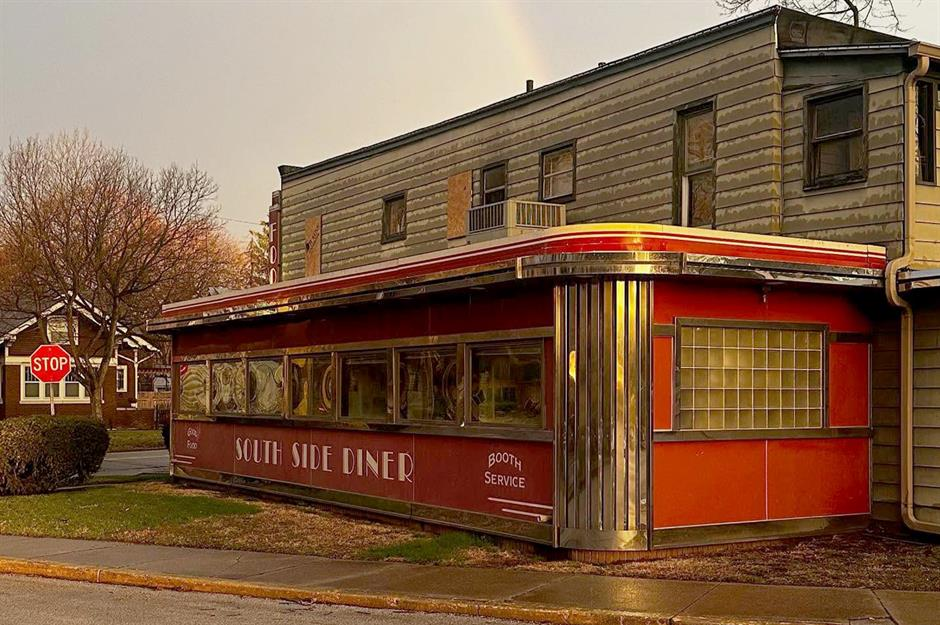

# Drinks of America

Iced tea sweetened by the gallon in the South, root beer floats in roadside diners, egg cream in a New York deli, coffee in every shape and size. Milkshakes thick enough to bend the straw, lemonade pressed from real lemons, and the soda-fountain Coke that still tastes better than any can.
