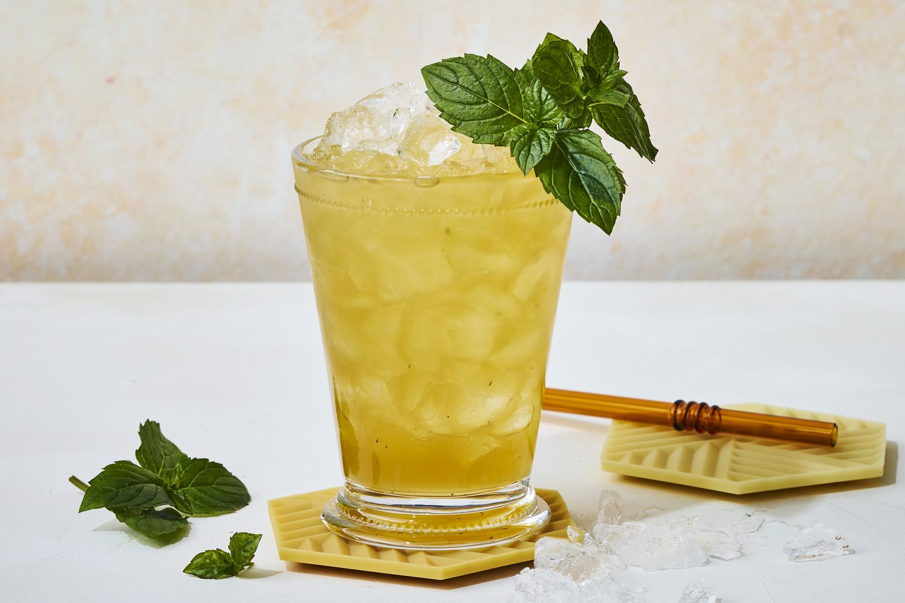

# Mint Julep

*Bourbon, fresh mint, sugar, crushed ice in a frosted silver cup: the Kentucky Derby drink and the unofficial cocktail of the American South.*

**Serves:** 1

**Prep Time:** 4 minutes

**Cook Time:** 0 minutes

## Overview
The mint julep is the official drink of the Kentucky Derby and the elder of the American spirit cocktails (the recipe appears in print as early as 1803). The build is fresh mint muddled gently with sugar in the bottom of a silver julep cup, filled with crushed ice, topped with a generous pour of Kentucky bourbon, stirred until the cup frosts over on the outside, and garnished with a fat sprig of mint slapped to release its oils. The frosted silver is the visual signature; a heavy rocks glass works fine but doesn't frost the same way. Drink slowly through a short straw with the sprig brushing your nose so the mint and the bourbon both register.

## Ingredients

### Per glass
- 10 fresh mint leaves (plus a fat sprig for garnish)
- 1 teaspoon caster sugar (or 1 tablespoon simple syrup)
- 60 ml Kentucky bourbon (Maker's Mark, Buffalo Trace, Woodford Reserve, Knob Creek)
- Crushed ice (a small mountain per cup)

### To serve
- A silver julep cup (or heavy rocks glass)
- A short straw
- A fat sprig of fresh mint

## Method

### Stage 1 - Muddle
1. Place the mint leaves and sugar in the bottom of a silver julep cup.
1. Press gently with a muddler or the back of a barspoon; the goal is to bruise the leaves, not shred them.
1. If using simple syrup instead of sugar, just add it and stir briefly.

### Stage 2 - Build
1. Fill the cup to the brim with crushed ice.
1. Pour the bourbon over the ice.
1. Stir gently with a long spoon for 20 to 30 seconds; the outside of the cup should frost.

### Stage 3 - Garnish
1. Add more crushed ice to dome the top of the cup.
1. Slap the mint sprig once between your palms to release its oils; tuck into the top of the ice so the leaves brush your nose as you drink.
1. Add a short straw, cut so it sits just below the mint leaves.

## Notes
- **Crushed ice, not cubed.** The crushed ice is what frosts the silver and dilutes the drink slowly. Wrap cubes in a tea towel and bash with a rolling pin if needed.
- **Silver cup is the show, not the recipe.** The drink works fine in a heavy rocks glass; the silver cup frosts spectacularly when cold metal meets the ice, which is part of the experience.
- **Slap, don't tear.** Same rule as the mojito: slapping releases the volatile oils; tearing makes the mint go dark.

## Storage
- Drink immediately while the cup is frosted.
