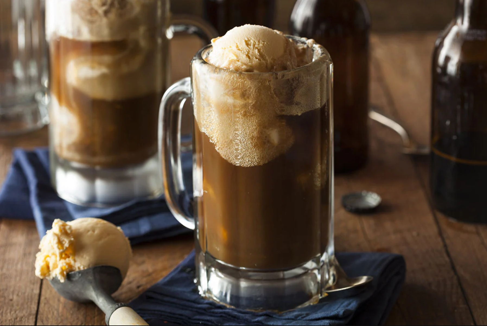

# Root Beer Float

*Vanilla ice cream dropped into a tall glass of cold root beer: the American summer drink that's also a dessert.*

**Serves:** 1

**Prep Time:** 1 minute

**Cook Time:** 0 minutes

## Overview
The root beer float was invented in 1893 by Frank Wisner in Cripple Creek, Colorado, when he was looking at a snowy moonlit peak and decided his root beer needed something white floating in it. The build is two ingredients: a scoop of good vanilla ice cream dropped into a tall chilled glass of cold root beer. The ice cream releases its butterfat into the soda and creates a thick foam crown; the root beer's sweet sarsaparilla bite cuts through the cream. American diner classic, served with a long spoon and a paper straw because you need both. A&W and Barq's are the traditional American root beers; if you're outside the US, Mexican Sangrita root beer or any sarsaparilla soda works.

## Ingredients

### Per glass
- 350 ml cold root beer (A&W, Barq's, Sprecher, Virgil's; or any sarsaparilla-style soda)
- 2 generous scoops vanilla ice cream
- A tall chilled glass (frozen for 10 minutes ideal)

### To serve
- A long spoon
- A paper straw

## Method

### Stage 1 - Build
1. Pour the cold root beer into a chilled tall glass; fill about three-quarters of the way.
1. Use an ice cream scoop to drop two generous scoops of vanilla ice cream into the glass.
1. The root beer will foam up dramatically as it hits the ice cream; let it settle for 10 seconds before topping up.
1. Add a little more root beer if the foam left room.

### Stage 2 - Serve
1. Add a long spoon (for eating the ice cream) and a paper straw (for drinking the foam-laced root beer).
1. Drink while the ice cream is still in scoop form; the longer it sits, the more it dissolves.

## Notes
- **Quality vanilla ice cream.** This is the simplest two-ingredient drink; the ice cream has to be properly creamy. A real-vanilla ice cream beats a generic.
- **Chilled glass matters.** A room-temperature glass melts the ice cream too fast and gives you slurry rather than scoops.
- **Spoon and straw, not either.** You eat the ice cream and drink the soda; doing only one misses the point.

## Storage
- Drink immediately; the ice cream dissolves within 5 minutes.
