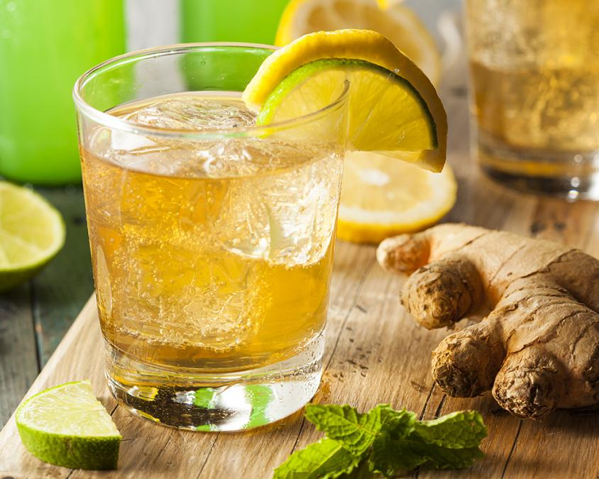

# Antiguan Ginger Beer

*A fierce, cloudy, citrus-spiked ginger drink built from fresh root, sugar and lime juice, sharper and hotter than any commercial version, the home brew of Christmas Eve and Sunday lunch.*

**Serves:** 2 litres

**Prep Time:** 20 minutes

**Cook Time:** 0 minutes (plus 24-48 hour rest)

## Overview
Antiguan ginger beer is non-alcoholic, fiercely gingery and made by the gallon at Christmas. Fresh ginger root is the only acceptable starting point: peeled, grated, and steeped with boiling water for an hour, then squeezed hard through a muslin cloth to release every drop of ginger oil. The strained liquor is sweetened with brown sugar, sharpened with lime juice, perfumed with a couple of cloves and a stick of cinnamon, then left to rest in the fridge overnight so the flavour rounds out. The result is cloudy, golden, intensely warm, with a burn at the back of the throat that lingers. Served over ice in a tall glass, with a sprig of mint and a wedge of lime, it is the drink the Antiguan kitchen turns out for every celebration.

## Ingredients

- 200 g fresh ginger root, peeled
- 1.5 litres boiling water
- 300 g dark brown sugar (adjust to taste)
- Juice of 4 limes (around 100 ml)
- 4 whole cloves
- 1 cinnamon stick
- 1/2 tsp vanilla extract
- Cold sparkling water to top up (optional)

## Method

### Stage 1 - Steep
1. Grate the peeled ginger on the fine side of a box grater. You should have about 200 g of grated ginger.
2. Place in a large heatproof jug or bowl with the cloves and cinnamon stick.
3. Pour over the boiling water. Stir.
4. Cover and leave to steep 1 hour at room temperature.

### Stage 2 - Strain and sweeten
1. Strain through a muslin cloth or fine sieve into a clean jug, squeezing the ginger pulp hard to extract every drop.
2. While still warm, stir in the brown sugar until dissolved.
3. Add the lime juice and vanilla. Taste; adjust sugar or lime to balance.

### Stage 3 - Rest and serve
1. Refrigerate at least 4 hours, ideally overnight, for the flavours to settle.
2. Lift out the cinnamon stick.
3. Serve over plenty of ice in tall glasses.
4. Top up with cold sparkling water for a lighter, fizzier version if you prefer.

## Notes
- **The ginger:** Older, knobbly ginger has more heat than smooth young root. Buy the most fibrous-looking pieces.
- **The squeeze:** Pressing the pulp hard through muslin is what makes the drink properly fierce. A weak squeeze gives a weak ginger beer.
- **The rest:** Give it overnight if you can. The flavour rounds out and the lime softens against the ginger heat.

## Variations
- **Spiked version:** Add 60 ml dark Antiguan rum per glass for a Caribbean dark and stormy.
- **Honey sweetened:** Use 200 g honey in place of half the sugar for a smoother sweetness.
- **Pineapple ginger beer:** Add 200 ml fresh pineapple juice to the strained liquor.
- **Fermented ginger beer:** Add a teaspoon of dried yeast after sweetening and bottle, leave 24 hours at room temperature, refrigerate; for a lightly fizzy fermented version.

## Serving
Serve over ice in tall glasses · with a sprig of mint and a slice of lime · alongside a plate of saltfish cakes · at Christmas dinner in place of fizzy drinks.

## Storage
- Keeps 1 week refrigerated in a sealed bottle
- The flavour deepens over the first 3 days
- Fermented version: drink within 5 days, vent the cap daily to release pressure
