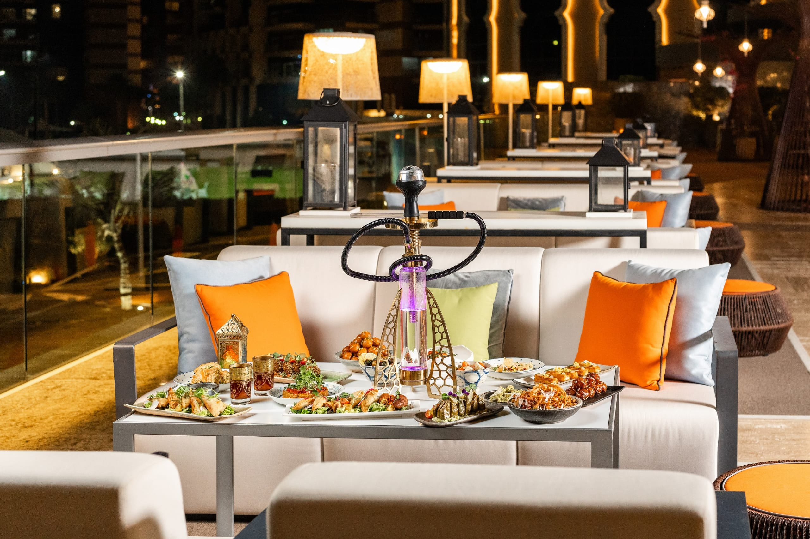

# Drinks of Arabia

Gahwa (Arabic coffee with cardamom and saffron) poured from a long-spouted brass dallah into tiny handleless cups, served with a date or three. Karkadeh (cold hibiscus) and laban (salted buttermilk) for the heat; sweet teas with mint or sage to close the meal.
