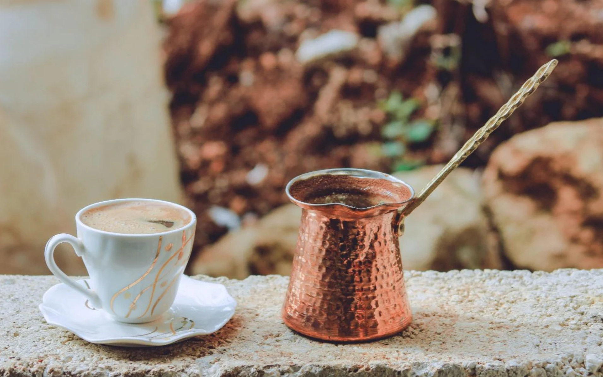

# Qahwa

*Arabic coffee: lightly roasted beans ground fresh, simmered with cardamom and a thread of saffron, poured from a long-spouted dallah into tiny handleless cups, sipped alongside dates.*

**Serves:** 4 to 6 (makes about 600 ml)

**Prep Time:** 5 minutes

**Cook Time:** 15 minutes

## Overview
Qahwa is the coffee of Gulf hospitality: pale golden rather than dark, lightly roasted Arabica ground coarsely with green cardamom and a strand of saffron, simmered in water rather than brewed under pressure, served in small handleless porcelain cups called finjan alongside a saucer of dates and dried fruit. The pour is from a long-spouted brass coffee pot, the dallah, and refusing the second cup is polite once the host has filled three rounds; you tilt the empty cup back and forth to signal "enough". Far more aromatic than European coffee, much less bitter, and a centrepiece of Saudi, Emirati and Qatari hospitality.

## Ingredients

### Per dallah (600 ml)
- 750 ml cold water
- 3 tablespoons lightly roasted Arabica coffee (coarsely ground; the proper Gulf blend is pale gold-brown, not dark)
- 1 tablespoon green cardamom pods (lightly crushed)
- 4 to 6 strands saffron
- 2 cloves (optional; some recipes use them, others don't)
- 1 teaspoon rose water (optional, added off heat)

### To serve
- Small handleless cups (finjan)
- A saucer of Medjool dates
- A small bowl of dried fruit or nuts

## Method

### Stage 1 - Simmer
1. Bring the water to a boil in a small saucepan.
1. Add the ground coffee and the saffron strands.
1. Reduce to low heat and simmer gently for 10 minutes; do not stir aggressively, let the grounds settle naturally.

### Stage 2 - Add cardamom and finish
1. Add the cardamom pods (and cloves if using).
1. Simmer for another 3 to 5 minutes.
1. Off the heat, stir in the rose water if using.
1. Let the grounds settle for 2 minutes.

### Stage 3 - Serve
1. Pour through a fine sieve into a warmed dallah (or any small jug with a spout).
1. Pour into the small cups; fill only one-third (this is the Gulf custom; refilling is the host's pleasure).
1. Serve alongside dates and dried fruit.

## Notes
- **Light-roast coffee is the right kind.** Gulf qahwa uses pale-roasted beans, not the dark-roast espresso style. If you can only find dark roast, the drink works but reads less authentic.
- **Don't fill the cup.** One-third is standard; filling all the way is considered rude in Saudi hospitality custom.
- **Three cups, then tilt to refuse.** Tilting the empty cup gently from side to side is the polite signal that you've had enough.

## Storage
- Best within an hour of brewing; the cardamom flavour fades after that.
