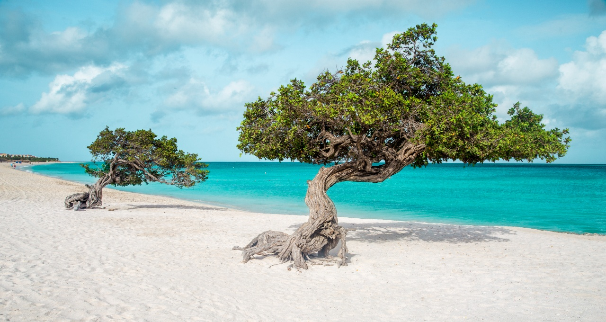

# Aruban Drinks

Aruba's drinks calendar runs around one famous cocktail and a small set of Papiamento daily refreshers. The Aruba Ariba, invented at the Aruba Caribbean Hotel bar in the early 1960s, is the national cocktail: aged rum, vodka, the local cactus-fruit liqueur coecoei, orange juice and grenadine, served tall in a hurricane glass on every Palm Beach terrace at sunset. The everyday cup is pega-pega, dark Aruban-roast coffee with sweet condensed milk, served from breakfast onwards and again after lunch. Awa di lamunchi (the small green Aruban key-lime version of limeade) is the dry-season cooler poured at every family table. Balashi lager is the national beer, brewed on the island since 1999 with the desalinated water that gives Aruba its self-deprecating "Balashi cocktail" nickname for plain tap water.
