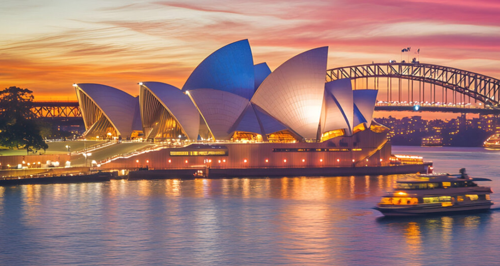

# Drinks of Australia

The flat white (invented in Sydney or Auckland, depending on who you ask), the long black, lemon lime and bitters at the pub, and Milo on a winter morning. A serious wine country with light reds and sharp whites; beer culture leans cold and clean.
