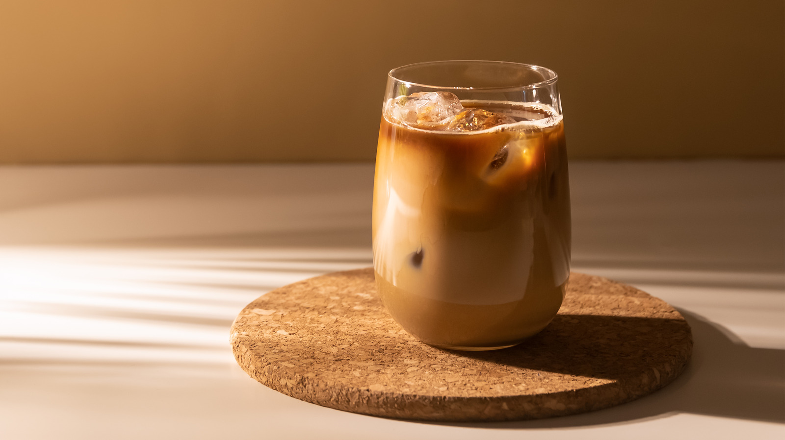

# Aussie Iced Coffee

*Cold strong coffee, cold full-cream milk and a scoop of vanilla ice cream in a tall glass, sometimes with whipped cream and chocolate sprinkles: the Australian iced coffee that bears no resemblance to the American watery kind.*

**Serves:** 1

**Prep Time:** 3 minutes

**Cook Time:** 0 minutes

## Overview
Australian iced coffee is its own thing - bigger, richer and more dessert-adjacent than the American Starbucks-style iced coffee. The build is cold espresso (or strong-brewed cold coffee) poured into a tall glass over a generous scoop of vanilla ice cream, topped with very cold full-cream milk, with optional whipped cream and a dusting of chocolate or cocoa on top. Sold from refrigerator cases in milky 600ml cartons (Big M, Oak, Dare) at every Australian petrol station and corner shop; also a milkbar and café institution. The ice cream is non-negotiable - without it you have iced coffee in the American sense; with it you have the Aussie version.

## Ingredients

### Per glass
- 60 ml strong cold coffee (2 espresso shots cooled, or 60 ml of cafetière-brewed coffee chilled)
- 1 to 2 teaspoons caster sugar (optional, dissolved in the hot coffee before chilling)
- 1 generous scoop vanilla ice cream
- 250 ml cold full-cream milk (whole milk; semi-skimmed gives a thinner drink)
- 2 tablespoons whipped cream (optional, for the topped variant)
- A pinch of cocoa powder or chocolate flakes (for dusting)

### To serve
- A tall glass (chilled if possible)
- A long spoon
- A wide straw

## Method

1. If using espresso, pull the shots and let cool (3 minutes). If using cafetière, brew strong and chill briefly.
1. Drop the scoop of vanilla ice cream into the bottom of the tall glass.
1. Pour the cold coffee over the ice cream; it'll start melting at the edges.
1. Top up with the cold milk.
1. Optional: spoon whipped cream onto the top.
1. Dust with cocoa powder or chocolate flakes.
1. Serve with a long spoon (for the ice cream as it goes) and a wide straw (for the milk + coffee).

## Notes
- **Strong coffee, not weak.** A thin coffee gets buried under the milk and ice cream. Two-shot espresso strength is the floor.
- **Full-cream milk is the right choice.** Skimmed gives a watery drink; full milk has the body to stand up to the ice cream.
- **The order matters.** Ice cream first means the coffee melts the edges and the cream slowly diffuses; the other order gives a less luxurious result.

## Variations
- **Mocha iced coffee.** Add 1 tablespoon chocolate syrup to the coffee before pouring; turns it into a chocolate-coffee-cream affair.
- **Hot weather variant.** Skip the milk; top up with extra ice cream scoops and serve with a long spoon (essentially an affogato).
- **Long black.** Skip the milk and ice cream entirely; cold espresso over ice. Different drink.

## Storage
- Drink immediately; the ice cream melts within 5 minutes and the drink turns lukewarm fast.
