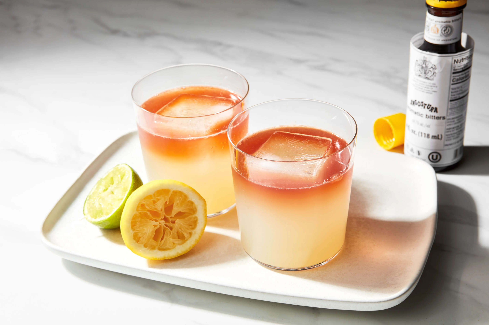

# Lemon, Lime and Bitters

*Lime cordial, lemonade, four dashes of Angostura, ice and a wedge of lemon: the non-alcoholic pub drink every Australian designated driver knows.*

**Serves:** 1

**Prep Time:** 2 minutes

**Cook Time:** 0 minutes

## Overview
LLB is the alcohol-free Australian pub drink, in particular the designated-driver order and the pre-dinner refresher of summer barbecues. The build is the simplest possible: a few dashes of Angostura bitters in the bottom of a tall glass (the bitters technically make it not-quite-alcohol-free, but the dash is too small to matter), a generous pour of lime cordial, topped with cold lemonade (the Australian-style clear sparkling lemonade, i.e. Sprite or Schweppes lemonade rather than the cloudy US-style), plenty of ice, finished with a wedge of lemon. The bitters give a herbal complexity that lifts the drink above just sweet citrus.

## Ingredients

### Per glass
- 4 dashes Angostura bitters
- 15 ml lime cordial (Rose's is the Australian standard)
- 250 ml cold clear lemonade (Sprite, Schweppes, or any clear sparkling lemonade)
- Plenty of ice cubes

### To serve
- 1 wedge of fresh lemon
- A paper straw

## Method

### Stage 1 - Build
1. Fill a tall highball glass with ice cubes.
1. Add the 4 dashes of Angostura bitters; the drops will create swirling pink streaks through the ice.
1. Pour in the lime cordial.

### Stage 2 - Top
1. Top with cold clear lemonade, pouring slowly down the side to preserve the fizz.
1. Stir very gently once with a long spoon.

### Stage 3 - Garnish
1. Notch a lemon wedge onto the rim.
1. Add a paper straw; serve immediately.

## Notes
- **Clear lemonade, not cloudy.** The Australian version is the Sprite-style clear sparkling lemonade; US-style cloudy lemonade gives a different drink (still good, but not LLB).
- **Bitters are the lift.** Without them, this is just lime-and-lemonade.
- **Rose's lime cordial is the canon.** Other brands work; Rose's is what most Australian pubs pour.

## Storage
- Drink immediately; the lemonade goes flat fast.
