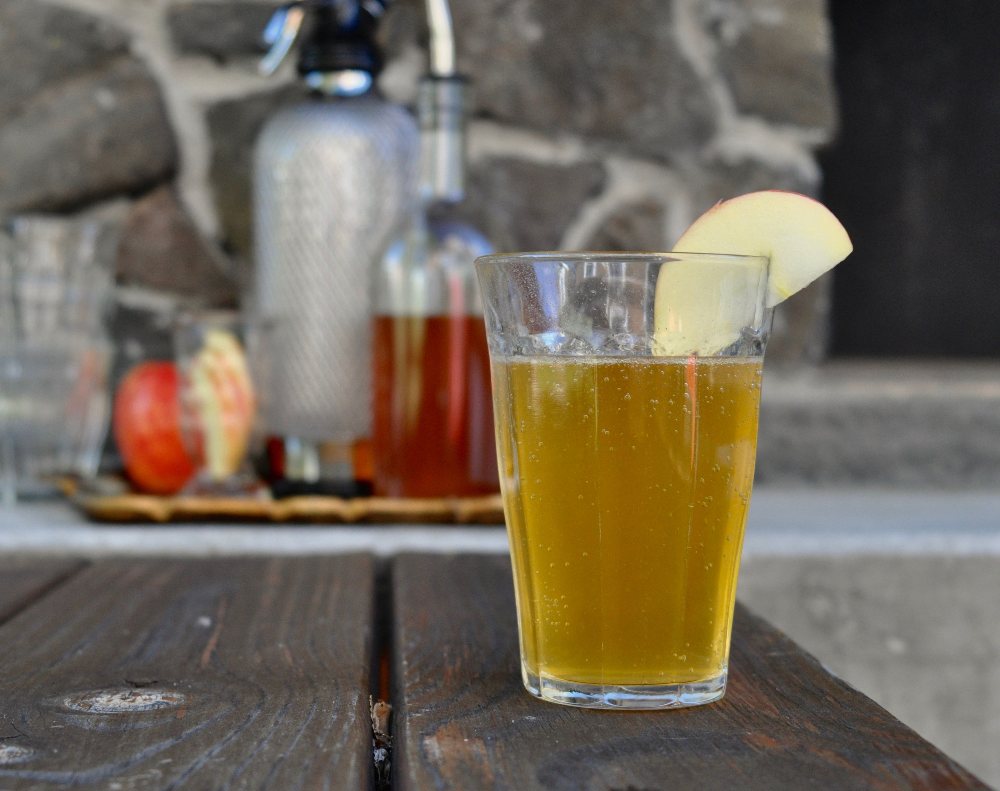

# Almdudler

*The Austrian alpine herbal lemonade soda: lemon, alpine herbs, sugar and carbonation, drunk at every ski-lodge and Christmas market in the country.*

**Serves:** 4

**Prep Time:** 5 minutes

**Cook Time:** 10 minutes (for the herb infusion)

## Overview
Almdudler is Austria's national soft drink, invented in 1957 by Erwin Klein who named it after the alpine yodelling tradition (Almdudler = "yodel in the alpine pasture"). The commercial bottle is iconic; the homemade version is easier than it sounds: a strong infusion of alpine herbs (sage, peppermint, lemon balm, lemon verbena) with lemon zest and juice, sweetened, then mixed with cold sparkling water. The drink lands somewhere between a herbal lemonade and a light cordial, golden in colour, served cold with a slice of lemon. Excellent alongside Wiener schnitzel; the herbal lift cuts through the breadcrumb-and-butter.

## Ingredients

### Herb syrup
- 500 ml cold water
- 200 g caster sugar
- 1 tablespoon dried alpine herbs (sage, peppermint, lemon balm, lemon verbena, in any mix)
- Zest of 2 unwaxed lemons (in wide strips)
- 100 ml fresh lemon juice
- 1 tablespoon honey

### To serve
- 1 litre chilled sparkling water
- Plenty of ice cubes
- Lemon slices
- Fresh mint or lemon-balm sprigs

## Method

### Stage 1 - Make the syrup
1. Combine the water and sugar in a saucepan; heat gently, stirring, until the sugar dissolves.
1. Bring to a low simmer; add the dried herbs and lemon zest.
1. Cover and simmer 5 minutes, then take off the heat and steep for 10 more minutes.
1. Strain through a fine sieve; stir in the fresh lemon juice and honey. Cool to room temperature.

### Stage 2 - Serve
1. Pour 4 tablespoons of the syrup into a tall glass full of ice.
1. Top with chilled sparkling water; stir gently to combine.
1. Garnish with a slice of lemon and a sprig of fresh mint or lemon balm.

## Notes
- **Use real alpine herbs.** Dried sage, peppermint, lemon balm and lemon verbena are easy to find; pre-blended "alpine tea" mixes work too.
- **Adjust ratio to taste.** Some palates want the syrup heavier (5 tablespoons per glass); some lighter.

## Storage
- The herb syrup keeps in the fridge for 3 weeks in a sealed bottle; mix with sparkling water per glass.
