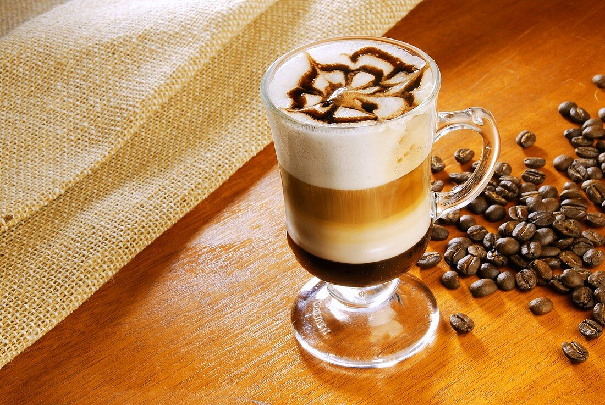

# Wiener Melange

*The Viennese coffee-house drink: a single espresso topped with hot foamed milk, served in a glass cup on a silver tray with a glass of cold water and a small biscuit.*

**Serves:** 1

**Prep Time:** 2 minutes

**Cook Time:** 3 minutes

## Overview
The Wiener Melange (Vienna blend) is the coffee that anchors the city's coffee-house culture, UNESCO-listed since 2011 and serious enough that ordering one comes with a small silver tray, a glass of cold water (always alongside coffee in Vienna; you sip it between coffees to reset the palate), and a small biscuit. The drink is gentler than an espresso, less milky than a latte: a single shot of espresso topped with equal parts hot milk and milk foam, served in a tall glass cup so the layers are visible. Order it at Café Central or Café Sacher and the ritual takes 90 minutes; make it at home and you can pretend.

## Ingredients

### Per cup
- 1 single espresso shot (30 ml; pulled fresh)
- 100 ml whole milk (steamed; half hot milk, half foam)

### To serve
- A glass coffee cup (180 to 200 ml)
- A small glass of cold still water on a saucer alongside
- A small almond biscuit or biscotti (optional, traditional)

## Method

### Stage 1 - Pull the espresso
1. Pre-warm the glass cup with hot water; pour out.
1. Pull a single espresso shot into the cup.

### Stage 2 - Steam the milk
1. Steam the milk to a soft microfoam (not the silk-smooth flat-white texture but slightly drier, more visible foam).
1. Pour the hot milk in first, filling the cup to about three-quarters; the espresso and milk should mix into a pale caramel layer.

### Stage 3 - Spoon the foam
1. Spoon the remaining milk foam on top to crown the drink with a 1 cm white head.

### Stage 4 - Serve
1. Place the cup on a small silver tray (or any small plate).
1. Set a glass of cold still water alongside; add a small biscuit on the saucer.
1. Serve immediately.

## Notes
- **Always with water on the side.** Viennese coffee custom; the cold water resets the palate between sips.
- **Drier foam than a flat white.** The Wiener Melange uses a more old-school steamed-milk texture with a visible foam crown, distinct from the silk microfoam of a third-wave flat white.

## Storage
- Drink immediately while the espresso is hot and the foam is standing.
