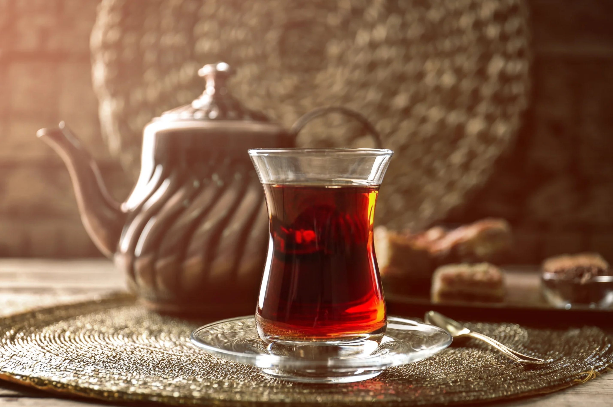

# Azerbaijani Chai

*Strong black tea poured from a samovar into pear-shaped armudu glasses, served with a small spoonful of cherry or fig preserve and a sugar cube to bite between sips.*

**Serves:** 6

**Prep Time:** 5 minutes

**Cook Time:** 10 minutes

## Overview
Tea in Azerbaijan is the centrepiece of every gathering, brewed strong from black leaf in a two-tier samovar (cold water below, concentrated tea above) and poured into the iconic pear-shaped armudu glasses that hold the tea in their hourglass middle. The way of drinking is specific: a small saucer of cherry preserve (gilas mürəbbəsi) or fig jam sits alongside; you take a small spoonful, hold it briefly under your tongue, then sip the unsweetened tea through it. Sugar cubes are the alternative, held between the teeth as you drink. The pear glass keeps the bottom of the tea hot while the rim stays cool enough to sip from; classic engineering.

## Ingredients

### Per pot
- 1 litre boiling water (divided)
- 3 tablespoons loose-leaf strong black tea (Azerbaijani or Indian Assam)
- 4 green cardamom pods (optional, sometimes added for a lighter aromatic version)

### To serve
- Pear-shaped armudu glasses (or any small clear tea glass)
- Cherry preserve, fig preserve, or rose-petal jam in a small saucer
- Sugar cubes in a small bowl
- A small spoon per glass for the preserve

## Method

### Stage 1 - Brew strong concentrate
1. Bring 600 ml of water to a rolling boil; pour into a teapot to warm it; tip out.
1. Add the loose-leaf tea to the warm pot.
1. Pour over 300 ml of just-boiled water (you want the tea concentrated, not flooded).
1. Steep covered for 8 to 10 minutes; the tea should be very dark, almost black.

### Stage 2 - Serve in two parts
1. Pour an inch of concentrated tea into each armudu glass (about a third full).
1. Top up with the remaining boiling water; the proportions can be adjusted per drinker's preference (more concentrate = stronger).
1. Serve with a small saucer of cherry preserve and a bowl of sugar cubes.

### Stage 3 - The Azerbaijani way
1. Take a spoonful of preserve; hold it under the tongue.
1. Sip the unsweetened tea through it.
1. The cherry sweetens each sip; the spoonful lasts 3 to 4 sips.

## Notes
- **Armudu glasses are worth tracking down.** The pear shape keeps the tea hot at the base; ordinary glasses work but lose heat fast.
- **Cherry preserve is the Azerbaijani favourite.** Fig, rose petal, walnut, and quince preserves all turn up too; cherry is the most common.
- **Sugar cubes are the alternative.** Hold between the teeth and sip through; same principle, simpler.

## Storage
- The concentrate keeps in the pot for an hour before going bitter; reheat fresh water and top per glass.
