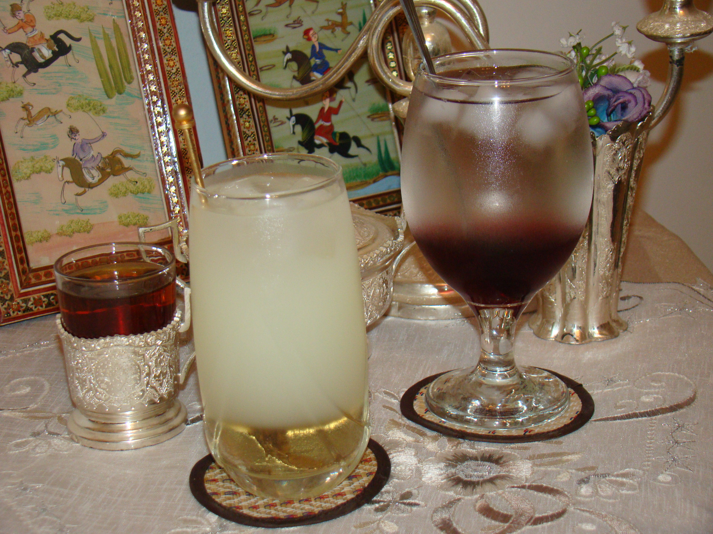

# Azerbaijani Sherbet

*Cold fruit-and-rose sherbet poured at every Azerbaijani wedding, holiday and summer afternoon: dried fruit, lemon, rose water and saffron, simmered down and chilled.*

**Serves:** 6

**Prep Time:** 5 minutes

**Cook Time:** 25 minutes (plus 4 hours chilling)

## Overview
Sherbet in the Caucasus and across the wider Turkic world is the cold fruit drink that doubles as the traditional wedding pour: dried apricots and dried plums simmered with sugar and water until they release their colour and sweetness, sharpened with fresh lemon juice, perfumed with rose water and a thread of saffron, served cold in tall glasses with floating slivers of fresh fruit and crushed pistachios on top. Different from a syrup or a cordial; the body is real, almost like a thin compote you drink rather than spoon. Especially common at Novruz (Persian New Year) and at Azerbaijani weddings.

## Ingredients

### Sherbet
- 1.5 litres cold water
- 100 g dried apricots (roughly chopped)
- 100 g dried plums (pitted, roughly chopped)
- 150 g granulated sugar
- 4 to 6 strands saffron
- 60 ml fresh lemon juice
- 1 teaspoon rose water
- ½ teaspoon ground cardamom

### To serve
- Plenty of ice cubes
- 2 tablespoons chopped pistachios
- A few rose petals (dried or fresh, unsprayed)
- Slices of fresh apricot or plum

## Method

### Stage 1 - Simmer
1. Combine the water, dried apricots, dried plums, sugar and saffron in a saucepan.
1. Bring to a boil; reduce to a simmer.
1. Cook gently for 20 to 25 minutes; the fruit will plump and release colour and sweetness into the water.

### Stage 2 - Cool and flavour
1. Take off the heat; stir in the lemon juice, rose water and cardamom.
1. Cool to room temperature, then refrigerate for at least 4 hours.

### Stage 3 - Strain and serve
1. Strain through a fine sieve, pressing the fruit gently to release the last of the juice.
1. Pour over plenty of ice in tall glasses.
1. Scatter chopped pistachios and rose petals on top; tuck a slice of fresh apricot or plum into each glass.
1. Serve immediately.

## Notes
- **The chill is non-negotiable.** Sherbet served warm is just syrup; the temperature is half the point.
- **Saffron threads, not powder.** Strands give a clear amber colour; powdered saffron muddies the drink.
- **Eat the rehydrated fruit after straining.** Don't waste it; spoon into yogurt or porridge.

## Storage
- Refrigerate up to 5 days in a sealed jug. The flavour deepens slightly on day 2.
