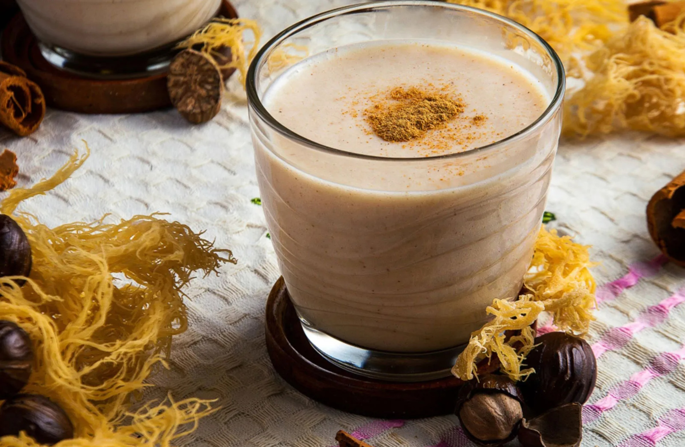

# Sea Moss Drink

*Caribbean sea moss (irish moss) blitzed into a thick spiced milk drink with cinnamon, nutmeg and condensed milk: the Bahamian "natural Viagra" everyone half-jokes about.*

**Serves:** 4

**Prep Time:** 10 minutes (plus 24 hours soaking the moss)

**Cook Time:** 10 minutes

## Overview
Sea moss drink is the Bahamian (and broader Caribbean) thick spiced beverage made from soaked-and-blended sea moss (Irish moss seaweed), which gels into a creamy base when warmed with water. Combined with evaporated and condensed milk, sweetened with sugar, perfumed with cinnamon, nutmeg, vanilla and sometimes a splash of stout, it produces a milky-tan drink with the consistency of a thin milkshake. Bahamians swear by it as a tonic; it appears at street stalls and in family kitchens across the islands. Drink ice-cold in tall glasses.

## Ingredients

- 30 g dried sea moss (irish moss; soaked in cold water with a tablespoon of lime juice for 24 hours, rinsed clean)
- 500 ml cold water (for blending)
- 400 ml evaporated milk
- 250 ml sweetened condensed milk
- 1 teaspoon vanilla extract
- 1 cinnamon stick (or ½ teaspoon ground cinnamon)
- ¼ teaspoon ground nutmeg
- Pinch of fine salt
- 100 ml stout or porter (optional, Caribbean tradition)

### To serve
- Plenty of ice cubes
- Grated fresh nutmeg

## Method

### Stage 1 - Make the sea moss gel
1. Combine the soaked sea moss with 250 ml of water in a blender; blend until completely smooth and gel-like (2 to 3 minutes on high).

### Stage 2 - Build the drink
1. Pour the gel into a saucepan with the remaining 250 ml water, the cinnamon stick and nutmeg.
1. Warm gently over low heat for 5 minutes, whisking, until smooth.
1. Off heat, whisk in the evaporated milk, condensed milk, vanilla and salt.
1. Stir in the stout if using.
1. Refrigerate at least 2 hours until cold.

### Stage 3 - Serve
1. Pour over ice in tall glasses; grate fresh nutmeg on top.

## Notes
- **Soak the moss properly.** 24 hours of cold-water soak with a touch of lime juice softens the moss and removes any salt or seaweed funk.
- **Don't boil.** Sea moss thickens at low heat; boiling makes it rubbery.

## Storage
- Refrigerate up to 5 days in a sealed bottle; shake before serving.
