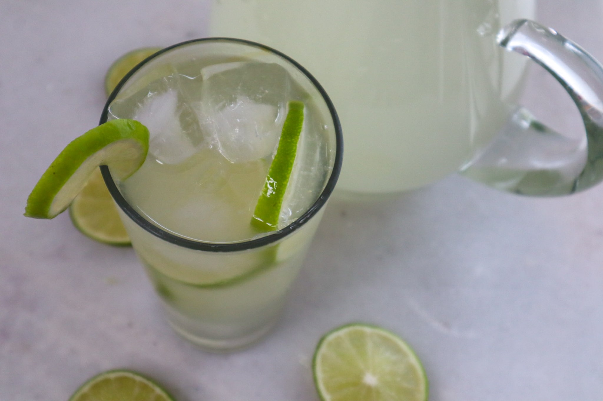

# Switcha

*Bahamian limeade: fresh-squeezed limes, sugar, water and ice, served from a pitcher on a porch with the sea air doing the work.*

**Serves:** 4 to 6

**Prep Time:** 5 minutes

**Cook Time:** 3 minutes

## Overview
Switcha is the Bahamian everyday cold drink: limes squeezed hard, sugar dissolved in a small amount of hot water (the same simple-syrup trick the [Lemonade](../../classic/lemonade.md) uses), then combined with cold water and ice. Sharper and brighter than American-style lemonade because Bahamian limes are smaller and more aromatic; serve it ice-cold from a glass pitcher on the porch and refill until the pitcher's empty. Sometimes spiked with rum to become the Goombay base, but the everyday switcha is alcohol-free.

## Ingredients

- 250 ml fresh lime juice (from 8 to 12 small limes; West Indian or key limes if you can find them)
- 200 g caster sugar
- 200 ml hot water (for the syrup)
- 1.2 litres cold water
- Plenty of ice cubes

### To serve
- Lime wheels
- Fresh mint sprigs (optional)

## Method

1. Stir the sugar into the hot water in a small saucepan over low heat until completely dissolved; cool slightly.
1. In a large jug, combine the cooled syrup, fresh lime juice and cold water; stir well.
1. Pour over plenty of ice in tall glasses; garnish with a lime wheel and a sprig of mint.

## Notes
- **Small Bahamian limes are the right kind.** Key limes or West Indian limes have a more aromatic perfume than Persian limes; both work but the small kind is closer to the original.
- **Adjust to taste.** Different limes have different acidity; tweak sugar in 2-tablespoon increments.

## Storage
- Refrigerate up to 24 hours in a sealed jug. Don't freeze.
