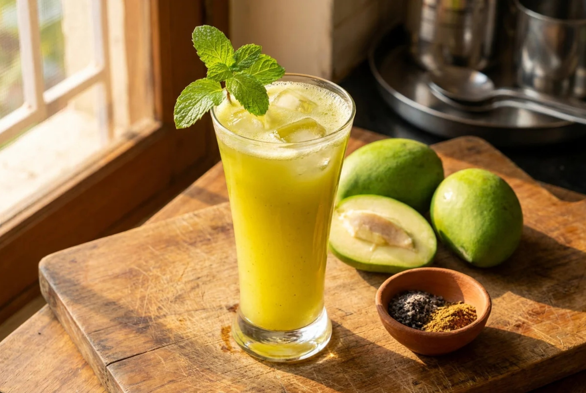

# Aam Panna

*Raw green-mango cooler with toasted cumin, black salt, mint and a touch of sugar: the Bengali summer drink that brings unripe mangoes to life.*

**Serves:** 4

**Prep Time:** 15 minutes

**Cook Time:** 15 minutes

## Overview
Aam panna is the Bengali summer drink (also famous across Indian kitchens) that turns hard, sour, green unripe mangoes into a tart-savoury-sweet thirst-quencher. The mangoes are boiled or roasted whole until the flesh softens, then scooped out and blended into a thick paste with toasted cumin, black salt, fresh mint, a touch of sugar and water. The result is a pale green, slightly thick cooler with a sour-savoury edge that's especially welcome in the punishing Bengali pre-monsoon heat. Serve ice-cold; doubles as a folk remedy for heat exhaustion (the cumin and salt help with electrolyte balance).

## Ingredients

- 500 g green unripe mangoes (2 medium; raw, hard, sour)
- 1 teaspoon cumin seeds
- 2 teaspoons black salt (kala namak)
- ½ teaspoon fine salt
- ¼ teaspoon black pepper
- 4 to 6 tablespoons caster sugar (taste-dependent on mango sharpness)
- 15 fresh mint leaves
- 1 litre cold water
- Plenty of ice cubes

### To serve
- Fresh mint sprigs
- A pinch of toasted cumin powder

## Method

### Stage 1 - Soften the mangoes
1. Place the whole mangoes (skin on) in a saucepan; cover with water and bring to a boil. Simmer 12 to 15 minutes until the flesh feels soft when pressed.
1. Drain; cool until you can handle them.

### Stage 2 - Build the paste
1. Peel the cooled mangoes; scrape the flesh off the stones with a spoon.
1. Toast the cumin seeds in a dry pan for 60 seconds; crush in a pestle and mortar.
1. Tip the mango flesh, half the cumin, both salts, pepper, sugar and mint leaves into a blender; blend smooth.

### Stage 3 - Dilute and serve
1. Whisk the paste into the cold water in a jug; taste and adjust salt and sugar.
1. Pour over ice in tall glasses; sprinkle reserved cumin on top and tuck in a mint sprig.

## Notes
- **Properly green mangoes.** Hard, sour, no give to the touch; yellow-ripe mangoes won't work for this drink.
- **Black salt makes the drink.** Without kala namak, aam panna reads as just sour lemonade.

## Storage
- The mango paste keeps in a sealed jar in the fridge for 5 days; dilute to taste per glass.
