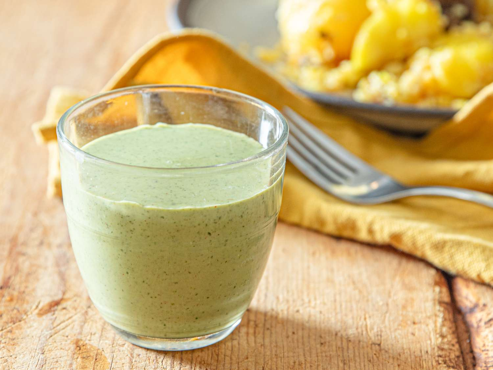

# Borhani

*Bangladeshi savoury yogurt drink: thick yogurt blended with mint, coriander, green chilli, black salt and toasted cumin, served alongside biryani at every wedding in Dhaka.*

**Serves:** 4

**Prep Time:** 10 minutes

**Cook Time:** 2 minutes

## Overview
Borhani is the savoury yogurt drink that anchors the Bangladeshi wedding table, served in tall glasses alongside kacchi biryani as the cooling counter to all that saffron rice and goat. The build is thick yogurt thinned with cold water, blended hard with fresh mint, fresh coriander, green chillies, ginger and a fistful of spices: toasted cumin, black salt, fine salt, white pepper and sometimes a pinch of mustard powder. The result drinks closer to a thin savoury soup than a sweet lassi; the heat of the chilli and the sourness of the yogurt cut through the richness of whatever is on the plate. Made in big jugs for a wedding banquet; scaled down here for four glasses at home. Without borhani, a Dhaka biryani feels incomplete.

## Ingredients

- 1 teaspoon cumin seeds (toasted and crushed)
- 500 g thick full-fat plain yogurt
- 200 ml cold water
- 15 fresh mint leaves
- 2 tablespoons fresh coriander leaves
- 1 green chilli (deseeded for milder; whole for sharper)
- 2 cm fresh ginger, peeled and grated
- 1 teaspoon black salt (kala namak)
- ½ teaspoon fine salt
- ½ teaspoon white pepper
- 1 teaspoon caster sugar
- ¼ teaspoon English mustard powder (optional, traditional)
- Plenty of ice cubes

### To serve
- A pinch of toasted cumin powder
- A small sprig of fresh mint

## Method

1. Toast the cumin seeds in a small dry pan for 60 seconds until fragrant; tip onto a plate; cool; crush coarsely in a pestle and mortar.
2. Tip the yogurt, water, mint, coriander, chilli, ginger, black salt, fine salt, white pepper, sugar, mustard powder if using, and most of the toasted cumin into a blender. Blend on high for 45 seconds until smooth and uniformly pale green.
3. Taste; adjust salt. The drink should taste clearly savoury and lightly spicy, never bland or sweet.
4. Pour over ice in tall glasses; top with the reserved cumin and a mint sprig.

## Notes
- **Black salt is non-negotiable.** Kala namak gives borhani its slightly sulphurous, mineral edge that defines the drink.
- **Toast the cumin yourself.** Pre-ground cumin from a jar reads flat; 60 seconds of dry-pan toasting wakes the seeds up.
- **Use full-fat yogurt.** Low-fat yogurt makes a thin, watery borhani that lacks body.
- **Adjust chilli to the meal.** A heavier biryani wants a hotter borhani; a lighter pulao wants something milder.
- **Mustard powder is optional but traditional.** A pinch lifts the savoury notes; skip it if you find it too sharp.

## Variations
- **With dill:** add 1 tbsp fresh dill for a herbier, more aromatic version.
- **With pineapple:** old wedding banquet trick: blend in 50 g fresh pineapple for a sweet-savoury twist.
- **Spicier:** double the green chilli; add ½ tsp white pepper extra.
- **With curry leaves:** float 4 fried curry leaves on top for fragrance.
- **Borhani-style shaneena:** thin further with extra water and add a pinch of dried mint for the Hyderabadi cousin.

## Storage
- Refrigerate up to 24 hours in a sealed jug
- Whisk vigorously to recombine before serving (the herbs settle)
- Do not freeze; the yogurt texture breaks down on thaw
