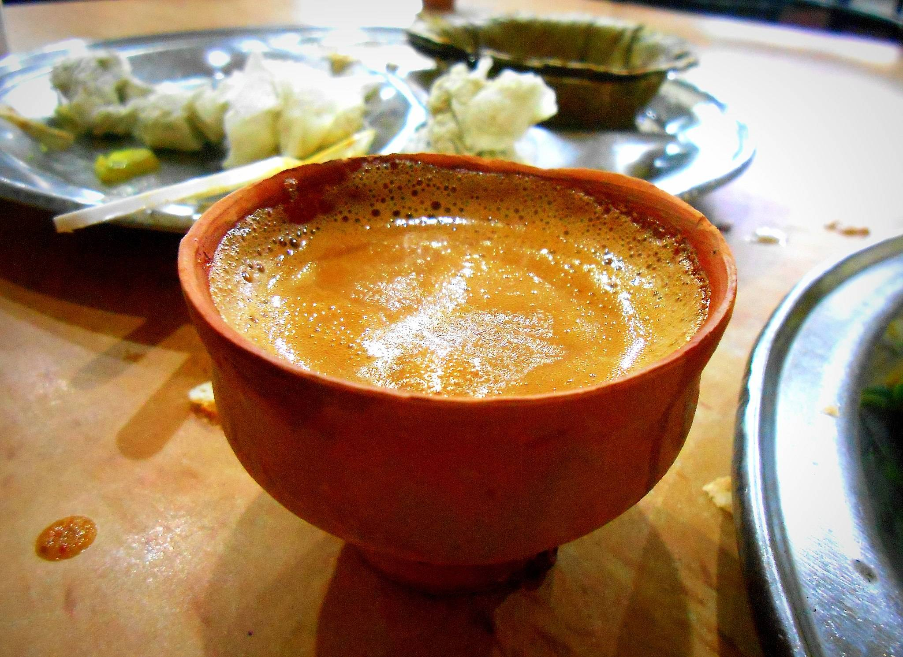

# Cha (Doodh Cha)

*Bangladeshi roadside milk tea: black tea boiled hard with water, full-fat milk, crushed cardamom and a heavy spoon of sugar (or condensed milk), poured from glass to glass to build the foam.*

**Serves:** 4

**Prep Time:** 5 minutes

**Cook Time:** 12 minutes

## Overview
Cha is the unofficial national drink of Bangladesh, served from clay or glass cups at every roadside stall, every train station, every office desk, every street corner. The default Bangladeshi tea is doodh cha (milk tea), a thick, sweet, intensely milky brew flavoured with crushed green cardamom; it bears very little resemblance to a Western cup of tea, sitting closer to a hot chocolate in body and sweetness. The technique is straightforward but the proportions are what set it apart: water and milk in roughly equal parts boiled together with tea leaves, sugar lavishly added (or condensed milk taking sugar's place entirely), the cardamom crushed and dropped in for the last minute. Some vendors then pour it dramatically from glass to glass at arm's length to build foam, a piece of theatre worth practising.

## Ingredients

- 500 ml water
- 500 ml full-fat milk
- 4 teaspoons loose-leaf black tea (Assam or Bangladeshi Sylhet leaf for preference)
- 6 green cardamom pods, lightly crushed
- 4 tablespoons caster sugar (or 4 tablespoons sweetened condensed milk)
- Optional: 1 small piece (2 cm) cinnamon stick
- Optional: 2 cm fresh ginger, sliced
- Optional: a pinch of ground black pepper

## Method

### Stage 1 - Boil the water with the spices
1. Bring the 500 ml water to a hard boil in a saucepan.
2. Add the crushed cardamom (and cinnamon and ginger if using).
3. Boil 2 minutes; the water turns lightly perfumed.

### Stage 2 - Add the tea
1. Tip the loose tea leaves into the boiling spiced water.
2. Boil 3 to 4 minutes; the water should turn deep mahogany.

### Stage 3 - Add the milk and sugar
1. Pour in the milk; bring back to a simmer (do not let it boil over; the milk will rise fast).
2. As it threatens to rise, lift the pan or stir down with a long spoon.
3. Add the sugar (or condensed milk); stir to dissolve.
4. Reduce to a low simmer; cook for 4 minutes more, letting the colour deepen and the tea thicken slightly.
5. If using, sprinkle a pinch of black pepper at the very end.

### Stage 4 - Pour and serve
1. Strain through a fine sieve into glasses or small clay cups.
2. For the proper Dhaka roadside theatrics, pour the strained tea back and forth between two jugs from arm's height a few times before serving; this builds a thin head of foam and aerates the tea.
3. Serve very hot.

## Notes
- **Boil hard, do not steep.** Western tea is steeped at temperature; Bangladeshi cha is boiled with the leaves, then boiled again with the milk. This breaks the tannins and gives the thick, robust body.
- **Full-fat milk only.** Skimmed milk produces a thin, sad cha; the dish depends on full-fat dairy.
- **Loose leaf is better than bags.** Bangladeshi black tea (CTC grade from the Sylhet region) is what stalls use; failing that, strong Assam loose leaf.
- **Cardamom is the signature spice.** A roadside cha vendor will always have crushed cardamom in the pot; ginger and cinnamon are optional add-ons.
- **Sweet by default.** This is not English tea; under-sweetening reads as a mistake. Three to four tsp per glass is the right level.

## Variations
- **Condensed milk cha (memsahib cha):** replace the sugar and most of the milk with 200 ml sweetened condensed milk; thicker, richer, the Sylheti diaspora favourite.
- **Lal cha (red tea):** skip the milk entirely; boil the tea hard with sugar, ginger and a squeeze of lime; the simpler village version.
- **Masala cha:** add 1 tsp grated ginger, 4 cloves and 6 black peppercorns to the water in Stage 1 for a fuller masala build.
- **Saffron cha:** add a pinch of saffron threads in Stage 2 for the special-occasion version.
- **Iced cha:** brew double-strength; cool; pour over ice with extra condensed milk for the summer version.

## Storage
- Best made fresh; reheats poorly (the milk skin sets)
- Refrigerate up to 24 hours; reheat very gently and stir hard to break the skin
- Do not freeze
