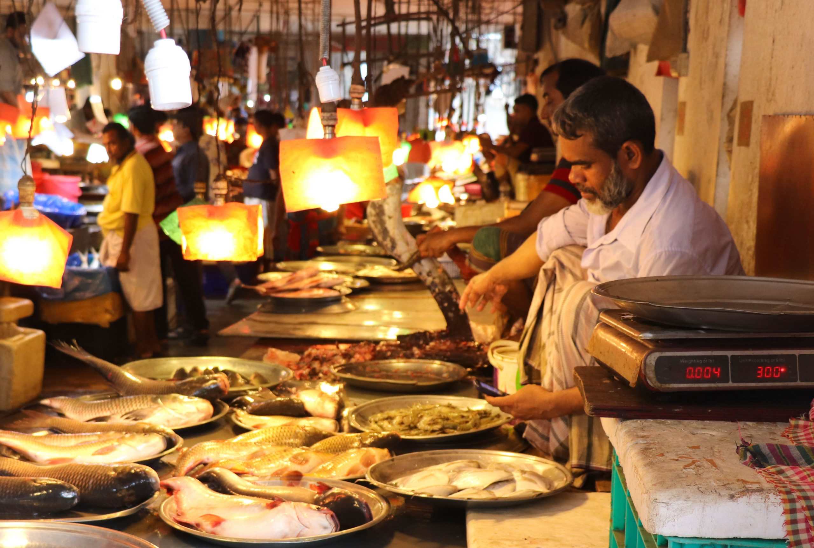

# Drinks of Bangladesh

Cha (milky cardamom-and-condensed-milk tea) is the unofficial national drink, brewed strong by the thousand glasses a day at every roadside stall and clay-cup vendor across the country. Borhani, the savoury yogurt-mint-cumin cooler, is the required partner to a plate of kacchi biryani at every Dhaka wedding. The cooling yogurt-drink tradition runs through summer (salted lassi, doi-er ghol) when the heat lands hard. Sugarcane juice from streetside crushers, lemon sherbet, green-mango aam panna, all soft and non-alcoholic; Bangladesh is a Muslim-majority country where alcohol is rare on the menu, so the tea and soft-drink culture has grown into something deep and varied.
