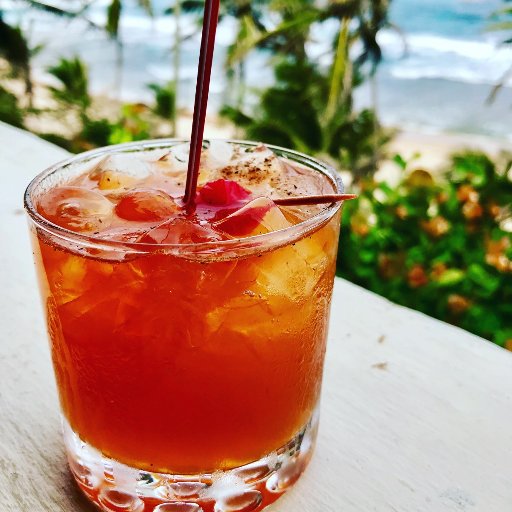

# Bajan Rum Punch

*Barbados's national cocktail, mixed by the legendary Bajan rhyme "one of sour, two of sweet, three of strong, four of weak": lime juice, simple syrup, dark Bajan rum and water, with Angostura bitters and fresh nutmeg on top.*

**Serves:** 4 (one batch in a pitcher)

**Prep Time:** 10 minutes

**Cook Time:** None

## Overview
Bajan rum punch is one of the most-recognised Caribbean drinks and Barbados's national cocktail: the drink of every Bajan beach bar, rum shop, hotel pool and family Sunday lunch. The legendary ratio is the Bajan grandmother's rhyme "one of sour, two of sweet, three of strong, four of weak": translating to lime juice, simple syrup, dark rum and water in 1:2:3:4 by volume. The rum is non-negotiable: aged dark Bajan rum (Mount Gay Eclipse, Mount Gay XO, Cockspur Old Gold or Foursquare 12-year) has the molasses depth and slight oak-aging notes to stand up to the citrus and sugar. Light or white rum gives a drink that lacks the canonical amber colour and body. Finished with a few generous dashes of Angostura bitters (the bracing spicy edge) and a generous grating of fresh nutmeg over the top of each glass: freshly grated, never pre-ground. Served over crushed ice in tall glasses with a slice of lime, sipped on a hot Bajan afternoon.

## Ingredients

### The Bajan rum punch (1 batch in a 750 ml pitcher; serves 4)
- 180 ml aged dark Bajan rum (Mount Gay Eclipse, Mount Gay XO, Cockspur Old Gold, Foursquare 12-year, or any quality aged dark Caribbean rum)
- 60 ml fresh lime juice (about 4 small key limes, or 3 regular limes)
- 120 ml simple syrup (1:1 sugar:water; or 60 g brown sugar dissolved in 60 ml hot water)
- 240 ml cold water
- 6-8 dashes Angostura bitters (the canonical Bajan addition)
- Optional: 30 ml falernum (Bajan-invented sweet lime-ginger-clove-almond syrup; sold at Bajan / Caribbean shops)

### To finish (per glass)
- 1 slice of fresh lime
- A generous grating of fresh nutmeg (whole nutmeg, grated on a Microplane)
- A small mint sprig (optional)
- Crushed ice (canonical) OR large ice cubes

### Equipment
- A pitcher (750 ml)
- 4 tall highball glasses
- A microplane for the nutmeg
- A jigger for measuring

## Method

### Stage 1 - Make the simple syrup (if not already made)
1. Combine equal parts sugar and water in a small saucepan (60 g sugar + 60 ml water for this batch).
2. Warm over medium heat, stirring, till the sugar fully dissolves.
3. Cool to room temperature.
4. (Or use a brown-sugar syrup for extra depth: 60 g muscovado dissolved in 60 ml hot water.)

### Stage 2 - Build the punch in the pitcher
1. Pour the rum into the pitcher.
2. Add the fresh lime juice.
3. Add the simple syrup.
4. Add the water.
5. Add the Angostura bitters.
6. (Optional: add the 30 ml falernum for the upmarket Bajan variant.)
7. Stir gently with a long spoon for 20 seconds.

### Stage 3 - Taste and adjust
1. Taste; the rum punch should be balanced - rum-forward, sweet-tart, with the bitters giving a peppery edge.
2. Adjust: more lime if too sweet; more sugar if too sour; more rum for a stiffer drink; more water for lighter.

### Stage 4 - Serve over ice
1. Fill 4 tall highball glasses with crushed ice (or large ice cubes).
2. Pour the rum punch over the ice; each glass gets about 150-180 ml.

### Stage 5 - Garnish
1. Float a slice of fresh lime on top of each glass.
2. Grate a generous pinch of fresh nutmeg over the top of each (about 4-5 passes on a Microplane).
3. Add a small mint sprig (optional).

### Stage 6 - Serve immediately
1. Hand to the diner.
2. Drink slowly over ice; the ice slowly dilutes the punch as you sip.
3. Best enjoyed on a hot Bajan afternoon.

## Notes
- **Aged dark Bajan rum:** Mount Gay Eclipse is the canonical Bajan workhorse. Mount Gay XO or Foursquare 12-year are the premium choices. Never use white rum (lacks the canonical depth) or spiced rum (overpowers the lime and nutmeg).
- **Fresh lime juice:** always; never bottled. The bright aromatic oils are essential.
- **Angostura bitters:** the canonical Bajan addition. Don't skip - the small dash transforms the drink.
- **Fresh nutmeg on top:** non-negotiable. Grated whole nutmeg has a vivid aromatic warmth that pre-ground supermarket nutmeg has lost.
- **The 1:2:3:4 ratio:** memorise the Bajan rhyme - "one of sour, two of sweet, three of strong, four of weak". This applies whether you're making one drink or a pitcher for a party.
- **Falernum is optional but very canonical:** the lime-ginger-clove-almond syrup invented in Barbados is the upmarket Bajan addition.

## Variations
**Single-serving rum punch (for one):** 45 ml rum + 15 ml lime juice + 30 ml simple syrup + 60 ml water + 2 dashes bitters + ice + nutmeg + lime slice.
**Party-batch rum punch (serves 16):** quadruple all ingredients; make in a 3-litre pitcher.
**Cockspur Old Gold rum punch:** the same recipe with Cockspur instead of Mount Gay - slightly drier, more sherry-like profile.
**Stronger rum punch:** use a 4:2:3:3 ratio (more strong, less weak) - the "rum-shop strong" variant.
**Lighter rum punch:** use a 1:2:3:6 ratio (more water) - for daytime drinking.
**Rum punch with falernum:** the upmarket Bajan variant; falernum gives lime-ginger-clove-almond depth.
**Tropical rum punch:** add 60 ml fresh pineapple juice + 30 ml fresh orange juice; reduce the water - the modern tourist variant.
**Sorrel rum punch (Christmas variant):** swap the water for chilled sorrel (hibiscus tea) - the festive variant.
**Non-alcoholic rum punch (mocktail):** swap the rum for cold brewed black tea + 30 ml ginger ale - acceptable for the designated driver but lacks the canonical character.
**Falernum + rum punch + soda:** add 60 ml soda water at the end - the spritzed variant.

## Serving
At a Bajan beach bar at sunset (the canonical setting) · at a Bajan hotel pool · at a Bajan rum-shop · at a Bajan wedding cocktail hour · at a Bajan Independence Day (30 November) celebration · at a Bajan family Sunday lunch · at a Bajan Christmas Eve dinner · at home as the Caribbean-themed party drink · paired with Bajan fish cakes, conkies, or just a plate of fresh tropical fruit.

## Storage
- The pre-mixed rum punch (without ice) refrigerates 1 week.
- The pitcher of mixed punch on the table at a party keeps about 4 hours before the ice has diluted it too much.
- Don't freeze (the alcohol prevents proper freezing).
- The rum, simple syrup, and bitters all keep indefinitely sealed.
- Whole nutmeg keeps indefinitely in a sealed jar; freshly grated dramatically better than pre-ground.
- A "rum-punch syrup" of 4 parts simple syrup + 2 parts fresh lime + several dashes of bitters can be made ahead and refrigerated; mix with rum and water to order.
